# CO冲刺背诵手册

## U1 计算机系统概述

### 记忆类

- **冯诺依曼结构中，数据采用二进制表示的原因？**

> - 二进制的运算规则简单
> - 制造两个稳态的器件比较容易
> - 便于使用逻辑门实现算术运算

### 程序驱动方式：

- **控制流**驱动：指令->数据
- **数据流**驱动：数据->指令

### 几类基础程序：

- **汇编程序：**$汇编\Rightarrow 机器$
- **编译程序：**$高级\Rightarrow 机器/汇编$
- **解释程序：**$将语句逐条翻译成机器指令，并立即执行$
- **链接程序：**$多个目标文件和库函数合并\Rightarrow 一个可执行文件$

### 计算机性能指标：

$CPU周期=1/主频$

$CPI（Clock\ Per\ Instruction）：执行一条指令所需的时钟周期数$

$CPU执行时间（CPU运行占用时间）=\frac{CPU运行所需周期数}{主频}=\frac{指令条数*CPI}{主频}$

<div STYLE="page-break-after: always;"></div>

## U2 数据表示和运算

### 各种数的表示范围

- **原码**

  $纯整数：-(2^n-1)≤x≤2^n-1\ （关于原点对称）$ 

  $纯小数：-(1-2^{-n})≤x≤1-2^{-n} （关于原点对称）$

- **反码**：由原码转换而来，相比原码转补码，少去了一个+1操作。

- **补码**

  $纯整数：-2^n≤x≤2^n-1\ （原码-0在补码中用来表示-2^n）$ 

  $纯小数：-1≤x≤1-2^{-n} （原码-0.0……0在补码中表示-1）$
  
- **移码**：由真值+偏置值转换而来

### 模四补码（变形补码）

**概念：**除了**运算时**符号位需要占用2位，其余都与常归的模二补码相同

**细节特点：**

- **运算时**（运算部件中）需要占用**2**个符号位，**存储时**仅占用1个符号位（因为正确的模四补码双符号位都是相同的）

- 相比模二补码，更容易判断出**<u>加减运算</u>**时的溢出情况

  > 模四补码双符号位的含义
  >
  > 00：正数
  >
  > 11：负数
  >
  > 01：**上溢**
  >
  > 10：**下溢**
  >
  > **记忆技巧：**
  >
  > 只要两个符号位不相同就表示溢出，第一位符号位还兼具了表示溢出方向的功能
  >
  > 0为正数，运算结果为正数，只能由于上溢造成
  >
  > 1为负数，预算结果位负数，只能由于下溢造成

### 移位运算

- **算术移位：**

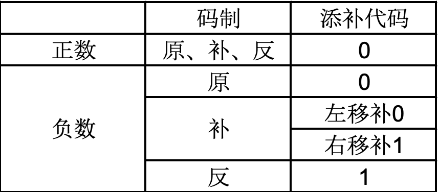
$$
记忆口诀：原码都是0\\
补码左移补0，右移补符\\
反码正0负1\\
$$

> $重要！！！$
>
> $如果遇到一个'减负数'与'右移'同时发生的情况$
>
> $就需要先求负补码，再右移，这样才能保证向0舍入$
>
> $例：$
>
> $int\ a\ =23;$
>
> $int\ b\ =-75;$
>
> $	求a-b/2的机器数？$
>
> $答：$
>
> $[a]_补=00010111，[b]_补=10110101，[-b]_补=01001011$
>
> $[(-b)/2]_补=00100101$
>
> $[a-b/2]_补=[a]_补+[(-b)/2]_补=\begin{matrix}
> &00010111 \\
> &00100101  &+\\
> &——————\\
> &00111100
> \end{matrix}$

- **逻辑移位：**将操作数视为无符号，一律补0

- **循环移位：**

<div>
    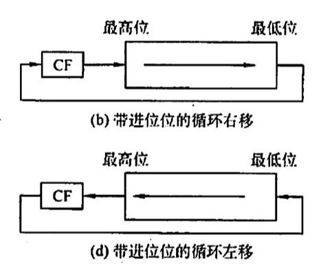
    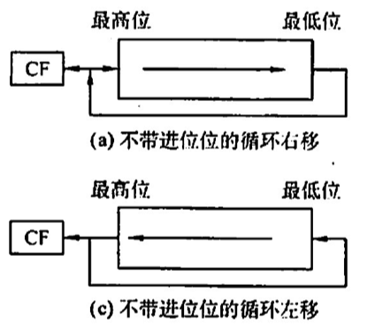
</div>

### ☆求补运算的使用【重要】

#### 负16进制补码快速$\Rightarrow$原码

正数补码=原码，所以不多说

**负数2进制补码：**用常归方法即可

**负数16进制补码：**求补运算，说白了就是求这个数的一个互补值，使得这个数最**<u>高位能够进1位且其他位都为0</u>**，这种运算就称之为“求补运算”

> $例：求带符号补码FCA358H的真值？$
>
> 使用求补运算相当求让FCA358H加上一个数使其=10000000H
>
> $FCA358H$+
>
> $035CA8H$
>
> $=10000000H$
>
> 此时我们求出来的是FCA358H的补数，由于FCA358H显然是负数，**<u>所以在转为真值的时候一定要记得加上负号！！</u>**
>
> 同时，将**有符号**补数转为原码时也要保持符号一致性，所以最后FCA358H的原码为：835CA8H
>
> <div>
> 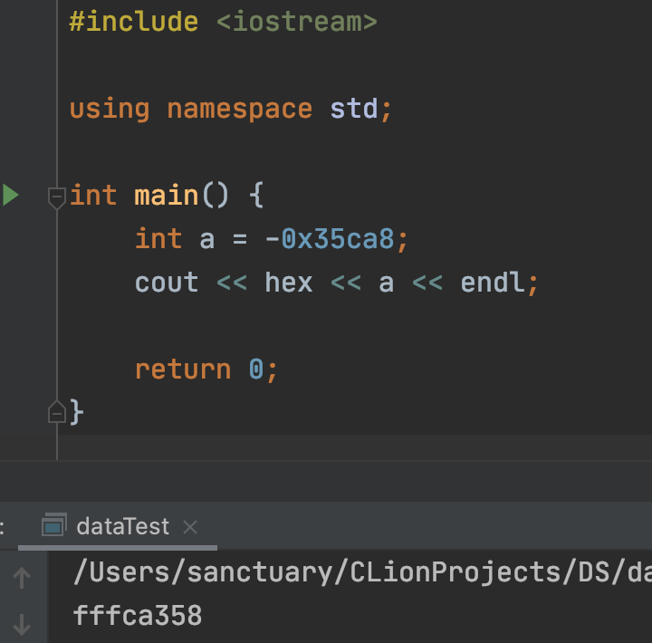
> </div>

#### 负16进制原码快速$\Rightarrow$补码

相当于让1000……H减去该数本身

> $例：求-002BH的补码$
>
> $10000H$-
>
> $\ 002BH$
>
> $=FFD5H$


### 定点数的运算及运算部件

#### 补码加减运算部件

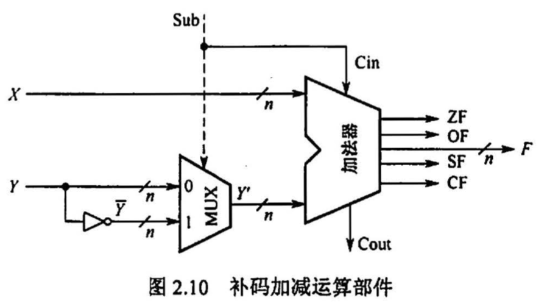

#### 并行进位加法器

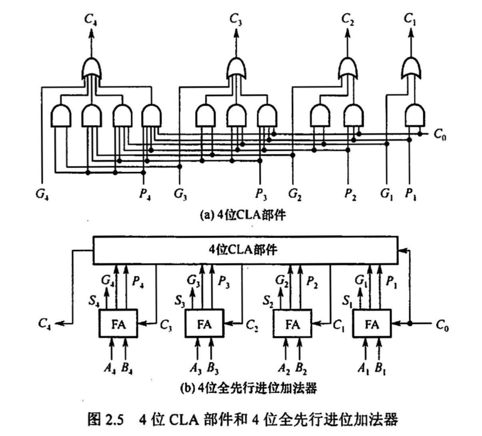

**进位$C_i$的产生原理:**

从单个加法器来看，已知$A_i$和$B_i$为两个二进制输入端，$C_{i-1}$为低位运算器传来的进位信息。

根据分析，我们可以得出二进制加法运算只有两种情况会产生进位

1. $A_i$和$B_i$均为1时，会**向高位产生**进位，用逻辑表达式写为：$C_i=A_iB_i$

2. $A_i$和$B_i$其中有一个为1，且低位的进位$C_{i-1}$也为1，此时也会因为低位的进位而把**进位信息向高位传递**，用逻辑表达式写为：$C_i=(A_i \oplus B_i)C_{i-1}$，

因此也将$G_i$称为**“进位产生函数”**，将$P_i$称为**“进位传递函数”**

令：
$$
G_i=A_iB_i \\ P_i=A_i \oplus B_i
$$
得到：
$$
C_i=G_i+P_iC_{i-1}
$$


#### 无符号乘法

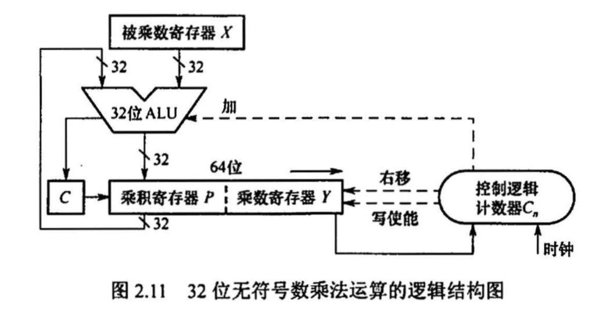

$符号位与数值位分开运算，符号位由一个异或门产生（两个操作数取绝对值进行运算）$

$C_n计数器表示需要循环的次数，有几位数据进行运算，C_n的初始值就为多少，每右移一次，C_n-1$

$通过不断右移，来实现错位相加$

$注意：由于是对无符号数进行乘法运算，所以C、P、Y三者的内容同时进行逻辑右移$

$运算逻辑：$

| 比较结果  | 执行操作          |
| --------- | ----------------- |
| $Y末位=1$ | $(P)+X，逻辑右移$ |
| $Y末位=0$ | $逻辑右移$        |

> - 之所以需要C来存储进位信息，是因为P与X相加是有可能产生进位的，需要将进位信息一同右移至P中
>
> - 共进行N次右移操作（因为数据总共只有N位）

#### 补码一位乘法（Booth）

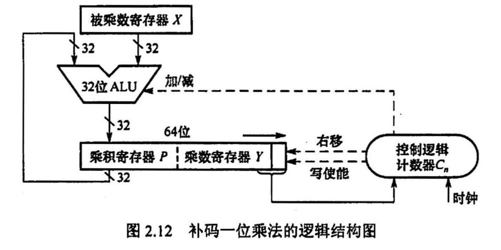

**$符号位和数值位一起参与运算，无专门进位位$**

$Y右边的一小格子为辅助位，初始值=0$

$注意：对补码进行乘法运算需要进行算术右移$

$运算逻辑：$

| 比较结果      | 执行操作                                    |
| ------------- | ------------------------------------------- |
| $Y-辅助位=1$  | $(P)+[x]_补，算术右移$                      |
| $Y-辅助位=0$  | $直接算术右移$                              |
| $Y-辅助位=-1$ | $(P)+[-x]_补(控制逻辑发出减指令)，算术右移$ |

> - N位数据（不含符号位）最进行N+1次加法运算，N次右移（**<u>最后一次运算仅做加法，不右移</u>**）
> - 乘积为2N+1位（**那1位是符号位**）

#### 阵列乘法器【补充】

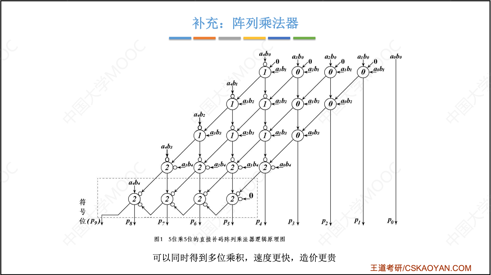

$阵列乘法器特性：$

- $可并行算出2n位乘积$
- $不需要进行多轮的加法、移位运算，因此阵列乘法器中无移位器$
- $运算速度比一位乘法器快得多(通常一个时钟周期就能够出结果)$

#### 除法运算部件

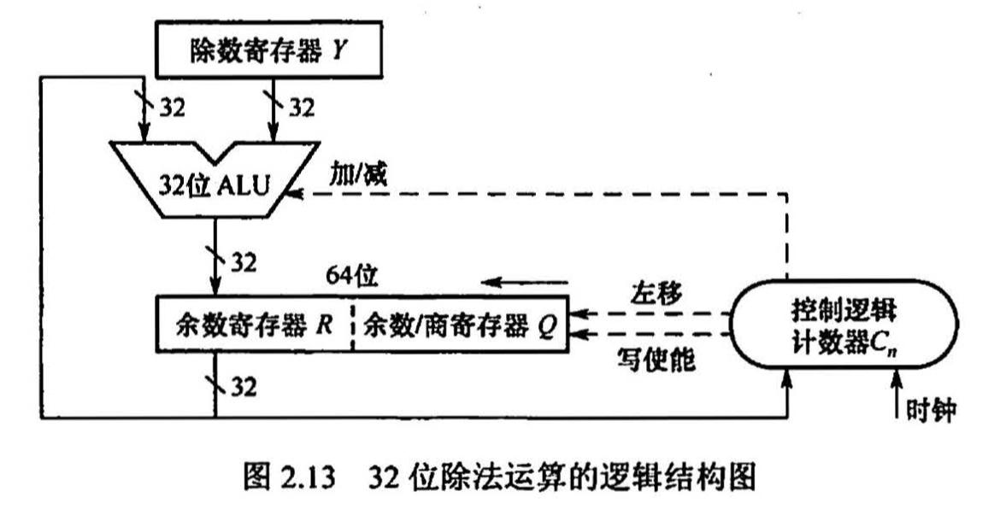

$注意：除法运算器用的是左移操作，不是右移！$

**运算不同数据类型的差异：**

- 无符号定点**整数**除法运算：$初始时在高n位拓展0$
- 无符号定点**小数**除法运算：$初始时在低n位拓展0$

**溢出判断：**

- 无符号**定点整数**相除，结果不可能溢出，无需判断

- 无符号**定点小数**相除，记过可能溢出，需要通过最高位商来判断

  $最高位商1说明被除数>除数,溢出$

  $最高位商0说明被除数<除数，不溢出$

  > 补充：带符号定点整数除法也是有可能溢出的，当$\frac{补码最小负数}{-1}$时，会发生溢出，因为补码的负数比正数能够多表示一个数字。

### 普通浮点数

- **格式**（具体占多少位视题目而定）

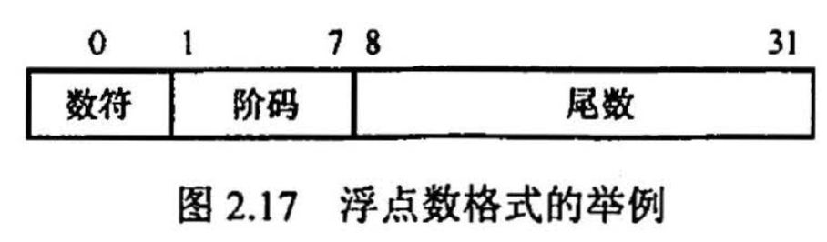

**注意：**题中告诉你阶码和位数的位数后，<u>**一定要留意他们还有符号位**</u>，看清楚各占多少位，是否可能最终会溢出

- **规格化后的格式**（以基数2位例）

$正浮点数：0.1xx……$

$负浮点数：1.1xx……$

- **左归与右归**

  $左归：尾数左移，阶码-1$

  $右归：尾数右移，阶码+1$

- **不同基数浮点数的规格化判断**

  当浮点数的基数为N时，（用原码表示）小数点后$log_2N$位**不全为0**的浮点数表示**正确规格化**

（用补码表示同理）

> eg.
>
> - 浮点数基数为4，尾数用原码表示，则以下（C）是规格化小数
>
> ```c
> A 1.001101
> B 0.001101
> C 1.011011  //C的小数点后两位中存在不为0的数
> D 0.000010
> ```

- **不同基数对浮点数的影响**

通常浮点数被表示为$N=S*r^j\ (S:尾数；r:基数；j:阶码)$

因此可以发现，当$S$与$j$的长度及格式相同时，**基数越大，N所能表示的范围越大**

但这也会带来一个问题，当基数变大后，**尾数的的变化步长也会增大**

> 例如在**以2为基数**的二进制浮点数中，阶码每增加1，尾数需要**向右位移1位**。
>
> 而在同样的条件下**以4为基数**的二进制浮点数中，阶码每增加1，尾数需要**向右移2位**，**<u>这也间接说明了大基数的浮点数的尾数是跳着移动的，而这些被跳过的二进制位状态都是他们无法表示的。</u>**
>
> 因此可以得出结论，当$S$与$j$的长度及格式相同时，**基数越大，N所能表示的精度越低。**

其实也可以从另一个角度来理解：**<u>同样规格划分的浮点数，能表示的不同状态个数是一定的，表示的范围大，就说明数据的离散程度更大，说明数据的精度更低。</u>**

**总结：**同等条件下，基数越大，能表示的范围越大，精度越低。

### IEEE754 浮点数

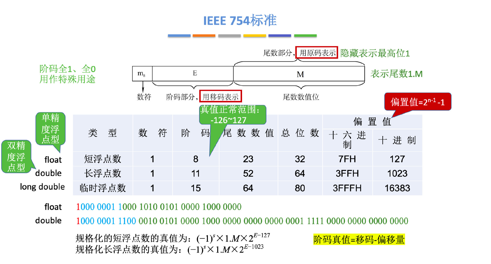


- **非规格化表示**

>在float型浮点数的阶码中，由于偏置值为127，所以阶码中
>
>$[阶码：-128]_真=全1$
>
>$[阶码：-127]_真=全0$
>
>| 阶码 | 尾数   | 含义                                            |
>| ---- | ------ | ----------------------------------------------- |
>| 全0  | $\ne0$ | $0.M*2^{-126}$（非规格化小数，隐含位1不存在了） |
>| 全0  | 0      | $\pm0$                                          |
>| 全1  | $\ne0$ | $NaN$                                           |
>| 全1  | 0      | $\pm\infty$                                     |

### 溢出判断

- **加减法**

  $有符号数：OF=C_{最高位}\oplus C_{次高位}  = A_{\mathrm{s}}\cdot B_{\mathrm{s}}\cdot  \overline{S_{\mathrm{s}}}+\overline{A_{\mathrm{s}}}\cdot  \overline{B_{\mathrm{s}}}\cdot  S_{\mathrm{s}}$

  $(A_s、B_s为输入数字的符号，S_s为输出结果符号。)$

  $无符号数：CF=Sub \oplus Cout$

- **乘法**

  $无符号乘法:高n位全为0不溢出，否则溢出$

  $有符号乘法：高n+1位全为0/1不溢出，否则溢出$

- **除法**

  $除法只有一种情况可能溢出：\frac{补码最大负数}{-1}(因为补码负数比正数多表示一个数)$


<div STYLE="page-break-after: always;"></div>

## U3 存储系统

### 易错点

- DRAM刷新**只占用一个存储周期**

- ROM就是ROM，RAM就是RAM，U盘也是（EEP）ROM只读存储器（这里的**只读**只是约定俗成的名字而已，并不是真的只读）

- DRAM默认采用**地址复用技术**，就是地址线减半，但是**片选线**会变为（**<u>行通选+列通选共2根</u>**）

- 频率带宽中1KB=**1000**B，只有设计存储容量时，才会使用1024

- $带宽=位宽*频率$

- **主存-辅存-Cache之间的数据调动**☆

	> 主存-Cache：**由硬件自动**完成，对**所有**程序员透明
	>
	> 主存-辅存：**OS+硬件共同完成**，对**应用程序员**透明

- **磁盘读写是串行的**

	> 不能在同一时刻**又读又写**， 不能在同一时刻读或写**两组数据**

- **Cache指令与数据分离的目的？**

	> 减少流水线的指令冲突

- **flash闪存的存储元？**

	> 双层浮空栅MOS管
	
- **DRAM完整的刷新过程需要占用几个存储周期？**

	> **仅占用一个存储周期**
	> 因为刷新的本质并没和其他任何部件交互数据
	> 仅仅只是用集成在自身的刷新放大器将数据**取出，再放回**
	
- **多路组相联模式，组号位数的计算**

  > - 组号的位数是由**“组数”（一共有多少组）决定**的，而**不是由“路数”决定**的。

- 计算TLB访存次数的时候一定要注意：**缺页中断后，会重新访问TLB**

### 知识点补充

- **相联存储器的寻址方式？**

  > **内容**指定方式与**地址**指定方式相结合

- **磁盘属于哪种存储器：**

  > 直接存取存储器（DAM），速度介于RAM和SAM之间

- **计算机存储系统指的是？**

  > Cache+主存储器+外存储器

- **DRAM与SRAM的存储元**

  > DRAM：栅极电容
  >
  > SRAM：双稳态触发器

- **DRAM的刷新时长**

  > DRAM刷新的本质就是：从RAM中读出数据，经过刷新放大器（**<u>集成在DRAM内部</u>**）放大，写回RAM
  >
  > 所以整个过程都在RAM内部进行，仅占用**<u>一个存储周期</u>**

- **虚拟存储器最底层的原理：**

  > 程序局部性原理
  >
  > $例题：$
  >
  > 【王道P140】
  >
  > <div>
  > 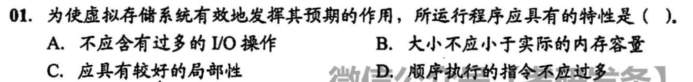
  > </div>
  >
  > $解析：$
  >
  > 这题很容易错选B，实际上由于现代操作系统都是多道程序设计，所以准确来说，应该是所有正在运行的程序大小加起来>实际内存。
  >
  > C肯定对

### 存储器

#### SRAM与DRAM对比

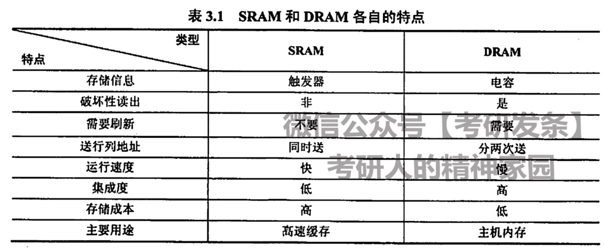

#### SRAM引脚结构

**引脚包含：**

- 数据线
- 地址线
- 读写控制线：可能为1根，可能为2根
- 片选线：1根

#### DRAM引脚结构

**引脚包含：**

- 数据线：由于采用了”地址线复用技术“，相比SRAM地址线数量减半
- 地址线
- 读写控制线：可能为1根，可能为2根
- 行通选线：1根
- 列通选线：1根
- ~~片选线~~：相比于**SRAM**，DRAM并没有独立的片选线，**片选线的功能由行通选线代替完成**

**线路逻辑：**

DRAM的基本单元：**COMS晶体管**，一个DRAM单元称之为一个cell

一个块DRAM芯片，由许多个规格相同的**cell阵列**构成，<u>单个cell的数据位数，决定了整个DRAM芯片的位数</u>。

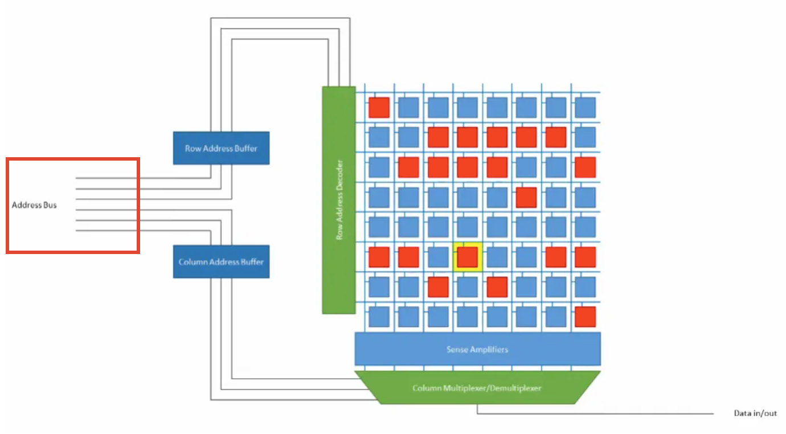

为了能够定位到cell阵列中的任意一个cell，需要通过**<u>行地址线</u>**和**<u>列地址线</u>**来选择某个cell，上图中，cell阵列的行和列外面都接入了**<u>地址译码器</u>**，以减少地址线的个数。

所以计算一块DRAM芯片的所需的最少地址线数量只需用下面公式：

$最少地址线数量=log_2行数+log_2列数$

$上图中，一个8*8的cell阵列共需要3+3=6根地址线$


**☆地址线复用技术：**

为了进一步减少地址线数量，线代DRAM通常采用“地址复用技术”，行和列共用一组地址线，**<u>行地址与列地址分两次传送</u>**，此时最少地址线数量应该如下计算

$最少地址线数量=log_2max\{行数,列数\}$

**<u>如下图所示，当cell阵列是个方阵时，行数=列数，所以看起来就会有地址线减半的效果</u>**

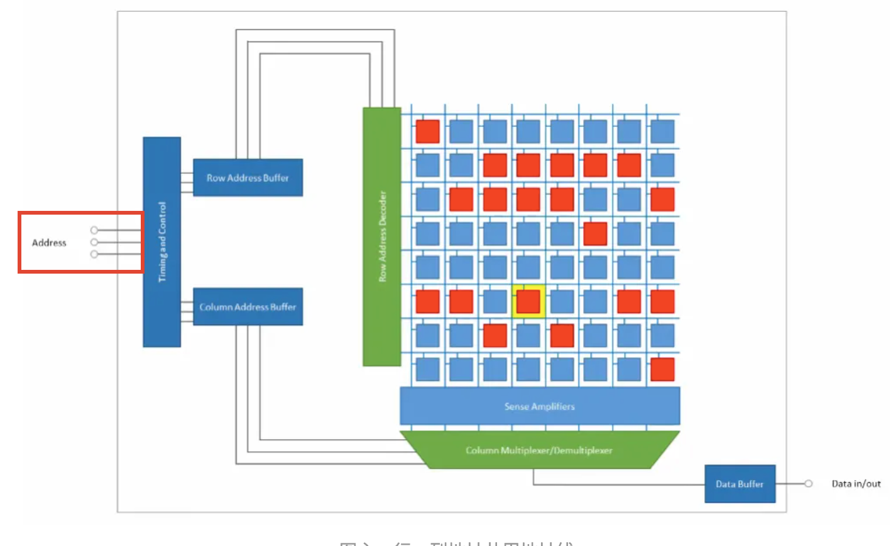

**总结：**

>对于容量为$N*x\ bit$ 的**DRAM**芯片引脚数计算公式为：
>$$
>地址线数量=\frac{1}{2}\log_2 N
>$$
>
>$$
>数据线数量=x
>$$
>
>$$
>总引脚数=地址线+数据线+读写控制线+行通选+列通选（片选线由行通选代替）
>$$
>


> $例题$
>
> 【18年T17】
>
> <div>
> 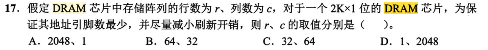
> </div>
> 
>
> $解析：$
>
> $已知DRAM大小为2K*1bit$
>
> $所以cell单元数=2048 => 即r*c=2048$
>
> $DRAM默认采用地址线复用技术，所以为了尽量减少地址线数量，应该让c和r尽可能相差较小$
>
> $所以AD排除$
>
> $又由于DRAM按行刷新，为了使刷新速度尽可能快，所以应该让行数r尽量小，所以选C$
>
> 【14年T15】
>
> <div>
> 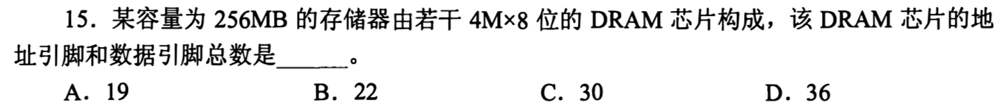
> </div>
> 
>
> $解析：$
>
> 注意：408中只要让你算DRAM引脚，**默认启用地址复用**
>
> 牢记DRAM数据线数量和存储器总大小无关！！，那是片选线该干的事情
>
> $由于采用地址复用，所以行=列=\sqrt{4M}=2K$
>
> $所以地址线=log_2 2K=11$
>
> $数据线=8(DRAM芯片有几位，数据线就有几根)$
>
> $引脚总数=地址线+数据线=11+8=19$（其他题目没说就不用算）


#### DRAM刷新方式

- 集中刷新：**<u>存在</u>**“死时间”
- 分散刷新：**<u>不存在</u>**“死时间”
- 异步刷新：**<u>缩短但无法消除</u>**“死时间”

#### 408中描述的交叉编址

- 顺序编址：高位交叉编址
- 交叉编址：低位交叉编址

#### 双端口存储器

- 具有**两套独立**的读/写口

- 具有**各自的地址寄存器**和译码电路

- 两端口同时读，**不会产生冲突**

#### 数据交换单位

| 设备         | 交换单位 |
| ------------ | -------- |
| $主存-Cache$ | $块$     |
| $CPU-其他$   | $字$     |

#### ☆字、位同时拓展情况下的芯片地址计算

做这种题的核心注意点：**搞清楚芯片排列的结构**⚠️

- 如果题目没说编址方式，<u>**默认高位为片选线**</u>
- 核心需要搞清楚片选位数和片内地址位数

$例题$

> 【10年 T15】
>
> <div>
> 
> </div>
> 
>
> $解析：$
>
> $首先根据总大小8K*8位得知地址总长度为13位(408的题目默认按字节编址)$
>
> $共需8片2K*4位的芯片，每两片组成一行2K*8位的行，共4行,所以片选线需要2位$（片选线选的就是行）
>
> 所以13位地址中的的高2位为片选地址，剩余低11位为片内地址
>
> 0B1FH=0 1011 0001 1111B ，由于求的是最小地址，相当于把低11位全部抹零
>
> 0 1000 0000 0000B = 0800H
>
> 选C

#### ☆低位交叉存储带宽计算

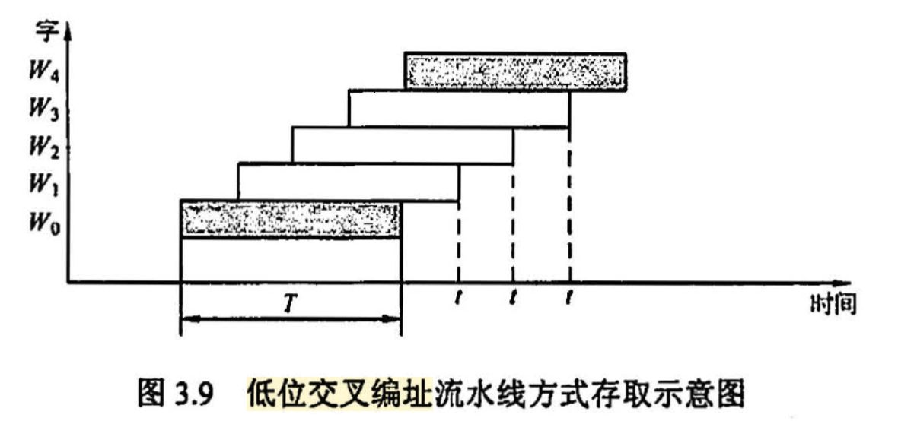

$首先需要搞清楚题目问你的是宏观的还是微观的？（通常问最大带宽都是宏观的）$

$1、如果是微观的，就按照常规流水线方式计算$

$2、如果是宏观的，就把头尾砍掉，平均就是每\frac{1}{n}个周期能够读取出一个数据$

$切记题目里如果告诉你每个体的存储周期，就是T$

$注：这里每次读取的数据量由存储字长/存储总线带宽决定$

$存储器最大带宽=\frac{1S}{T_{存储}/n}*存储字长，n：n体低位交叉存储$

#### MAR位数的确定

- 只有一个原则，那就是：保证能够访问到整个地址空间，**和现用存储器大小无关！！**

$例题$

> 【11年 T15】
>
> <div>
> 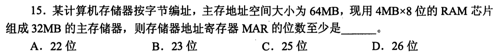
> </div>
> 
>
> $解析：$
>
> 直接看主存空间64MB，字节编址，共需26位表示，所以选D  

### Cache

#### Cache结构

> **Cache = ①有效位+②脏位（可选）+③算法替换位（可选）+④Tag+⑤Cache行**
>
> **标记阵列=①+②+③+④**
>
> **☆注：Tag不包括Cache行号或组号**

#### Cache写策略

**命中时：**

- 全写法：Cache与主存块中的数据**<u>实时同步更新</u>** (常搭配非写分配使用)
- 写回法：等到Cache中块被调出的时候，**<u>再写回主存</u>** （常搭配写分配使用）

**未命中时：**

- 写分配法：先将主存数据调入Cache中，再修改
- 非写分配法：跳过Cache，直接修改主存数据

$例题：$

> 【CO P123】
>
> <div>
> 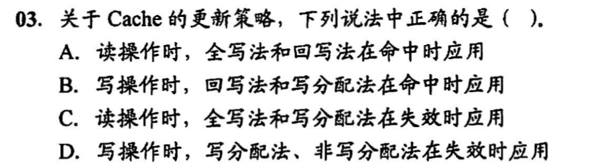
> </div>
> 
>
>
> $解析：$
>
> 首先这四种方法都是Cache的写分配策略，和读操作无关，AC排除
>
> 写分配法应该Cache miss时使用，B排除
>
> D正确✅

#### **☆快速口算不同映射方式下的地址结构**

**核心：**首先算出直接映射的结构，再转为其他两种映射

① 确定地址总长度：根据“**总地址空间大小**”得出

② 确定Tag及Cache区地址：根据**“Cache总大小”**可得知Cache区地址，总长度-Cache区地址长度=Tag长度

③ 确定块内地址长度：根据“**Cache块**”大小得知：Cache区地址-块内地址=Cache行号

**转全相联映射：**除了块内，剩余全是Tag

**转组相联映射：**先根据**<u>组数=Cache块数/路数</u>**得到**组号**（此时组号肯定比原先的行号短），然后多出的部分归Tag所有


#### ☆带Cache命中率的程序总执行时间计算

$例题：$

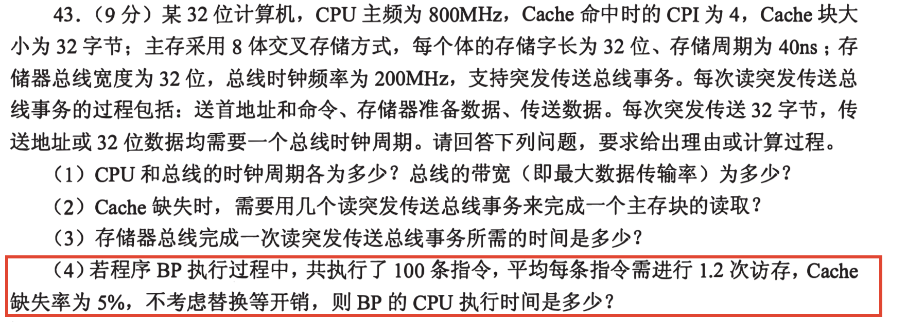

> $解析：$
>
> $首先需要知道，带Cache情况下$
>
> $程序总执行时间=纯Cache命中所需时间+Cache未命中时额外的开销$
>
> $\therefore 总时间=命中时CPI*总指令数*时钟周期+总访存次数*缺失率*缺失开销$
>
> 注：解决这类题的核心就是要知道：Cache缺失后，除了访存之外，还会将数据调入Cache，**额外重新访问一次Cache**，所以直接使用总指令数*命中CPI。

#### TLB、Page、Cache命中情况

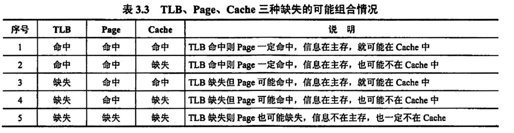

> PS：TLB相当于是Page的副本，所以如果TLB命中就相当于Page命中了，**只不过不需要再去查Page了**
>

<div STYLE="page-break-after: always;"></div>

## U4 指令系统

### 记忆内容

- **指令系统是？**

> 一台机器硬件能执行的**指令全体**
>
> 是计算机的软硬件界面（软件的最底层就是指令，硬件是由指令驱动的）

### 指令长度计算☆

- 切记不能直接把不同地址数的指令直接相加然后算出OP字段，这样是❌错的
- ✅正确方法：先算出地址数最多的指令条数所需OP字段，然后计算指令少的，不够再补，最后别忘了**<u>向上取整至编址单位的整数倍</u>**

> 【17年T16】
>
> <div>
> 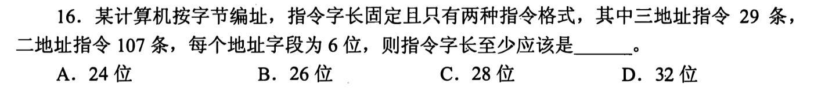
> </div>
> 
>
> $解析：$
>
> **首先计算三地址指令所需OP字段长度：**
>
> $三地址指令29条，最少需要5位$
>
> $5位最多能表示32条，32-29=6$
>
> $表示5位OP中剩余6种情况未被使用$
>
> **接下来计算二地址指令是否够用：**
>
> $每个地址字段长6位，二地址比三地址少占用6位$
>
> $所以目前最多还能表示：6*2^6=192条二地址指令>107条，够用。$
>
> $所以指令字长最少仅需5+6*3=23位即可。$
>
> **<u>⚠️重点：千万别忘了，最后还需要向上取整为编址单位的整数倍！！！</u>**
>
> $由于使用字节编址，所以字长应为8bit的整数倍，所以向上取整为24位，选A$


### 基址寻址 与 变址寻址

- 基址寻址：（以程序**起始地址**为起点寻址），有利于**多道程序设计**
- 变址寻址：由用户决定起始地址，**有利于解决循环问题，及数组遍历**


### AT&T与Intel指令格式

|            | AT&T                            | Intel                             |
| ---------- | ------------------------------- | --------------------------------- |
| 大小写     | 仅支持**小写**                  | 大小写均可                        |
| 操作数定义 | 先源后目    **从左到右**        | 先目后源   **从右到左**           |
| 前缀       | %：寄存器    $：立即数          | /                                 |
| 寻址       | （）                            | []                                |
| 偏移量     | 偏移量(基址,变址,比例因子)      | [edx+eax*scale+offset]            |
| 数据长度   | b:byte    w:word   l:long(双字) | byte ptr    word ptr    dword ptr |
|            |                                 | 注：word 统一表示16bit            |

### 机器级代码表示☆

#### 函数调用的切换过程

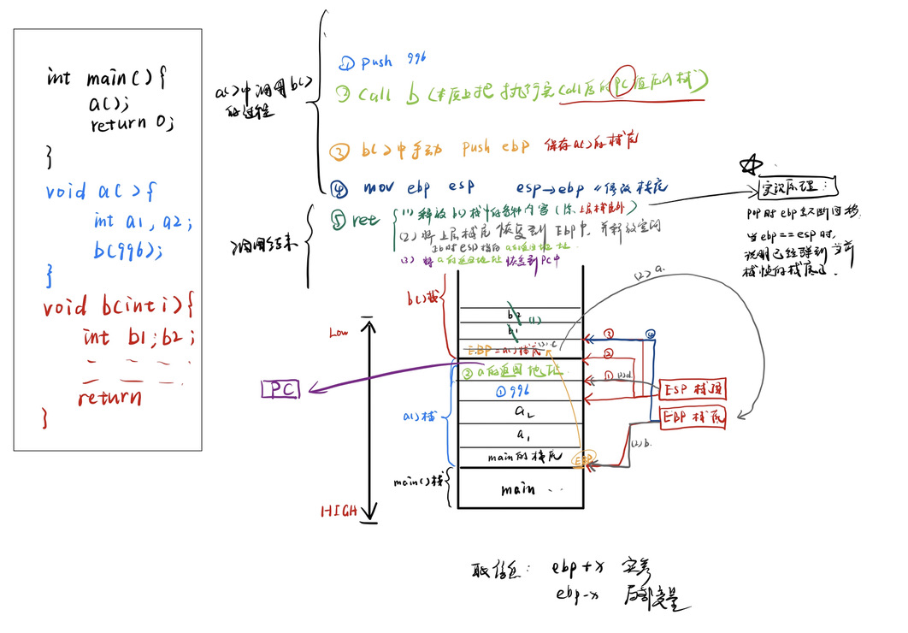

**call指令的作用：**

- 将PC的**旧值保存压栈**（保存在函数栈帧顶部）
- **设置PC的新值**，让PC指向即将要调用的函数

**ret指令的作用：**

- 从函数栈帧顶部**找到旧PC值**，**并将其恢复**到PC

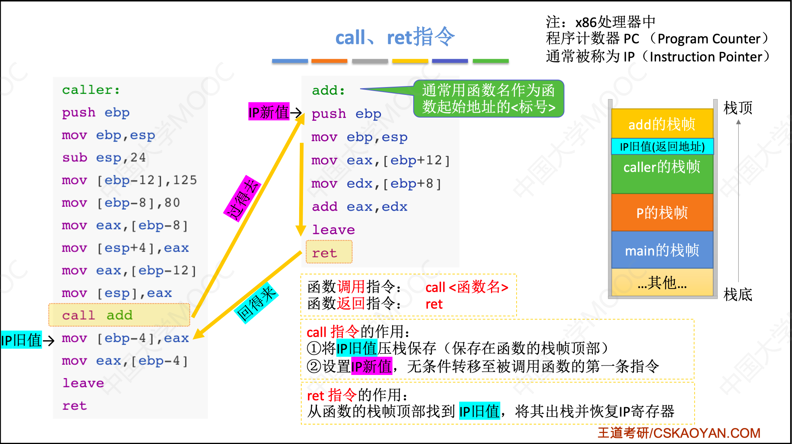

#### 如何访问栈帧

**方法一：**Push/Pop

- Push：先让ebp-4，在将元素压入（因为函数调用栈高地址为栈底，低地址为栈顶）

- Pop：先将栈顶元素写回寄存器，再让ebp+4

**方法二：mov结合add/sub指令**

通过add和sub指令对ebp指针进行修改，然后用mov指令来移动数据

#### 如何切换栈帧

切换栈帧的本质实际上就是**<u>不断更新ebp和esp的值</u>**来确保**当前“<u>标记栈范围</u>”确实是当前的函数对应栈帧**

> ebp和esp所囊括的栈区域称为：标记栈范围

栈帧的切换操作分为两类：**函数调用时**（进帧）和**函数返回时**（退帧）

**1、函数调用时**

在调用新的函数后（执行call后），PC值会指向即将调用函数的第一条指令，此时“标记栈范围”仍然处于原先的函数处，所以需要两条固定的指令来更新栈指针

```assembly
push ebp			;保存栈底旧值（退栈的时候备用）
mov ebp,esp		;更新栈底值，让其指向新栈帧的栈底

;这两行指令也可以等价于enter
```


**2、函数返回时**

在函数即将准备返回时（即将执行ret指令），我们首先要将**<u>“标记栈范围”恢复为上一级栈帧的范围</u>**，因此我们同样需要用两条固定的指令来更新栈指针

```assembly
mov esp ebp		;让栈顶指针直接指向当前栈的栈底（因为栈底存的就是ebp的旧值）
pop ebp				;将ebp的旧值出栈，并恢复至ebp

;这两行指令等价于leave
```

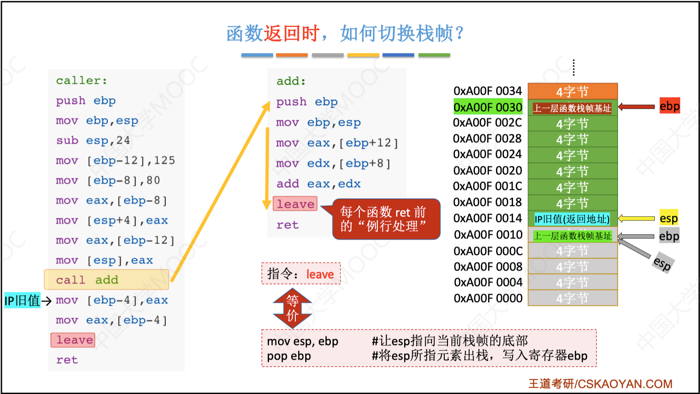

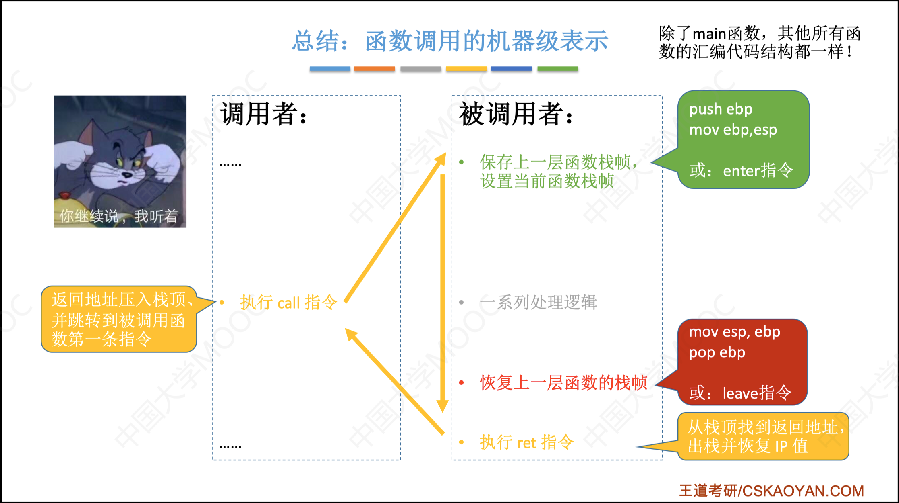

#### 一个栈帧可能包含的内容

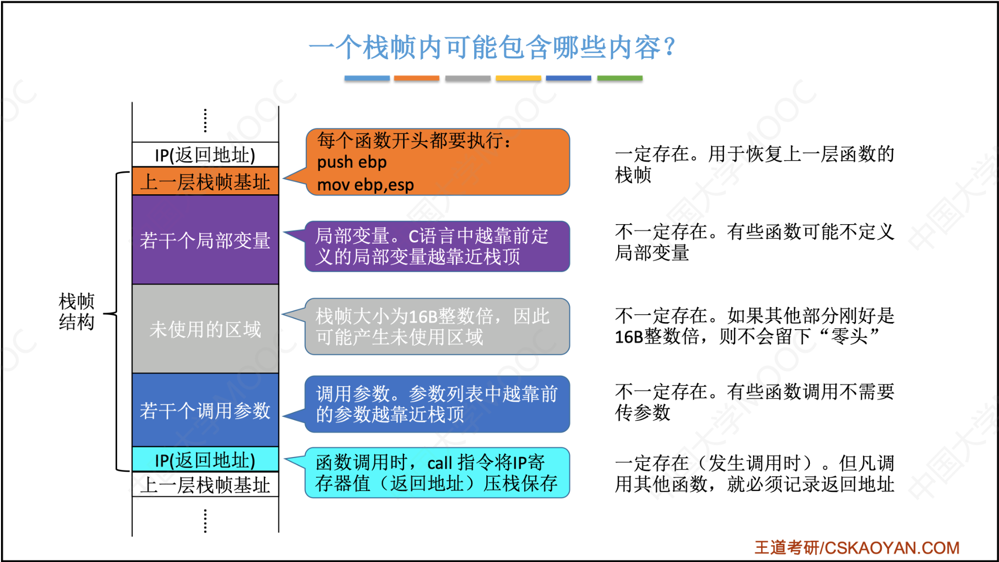

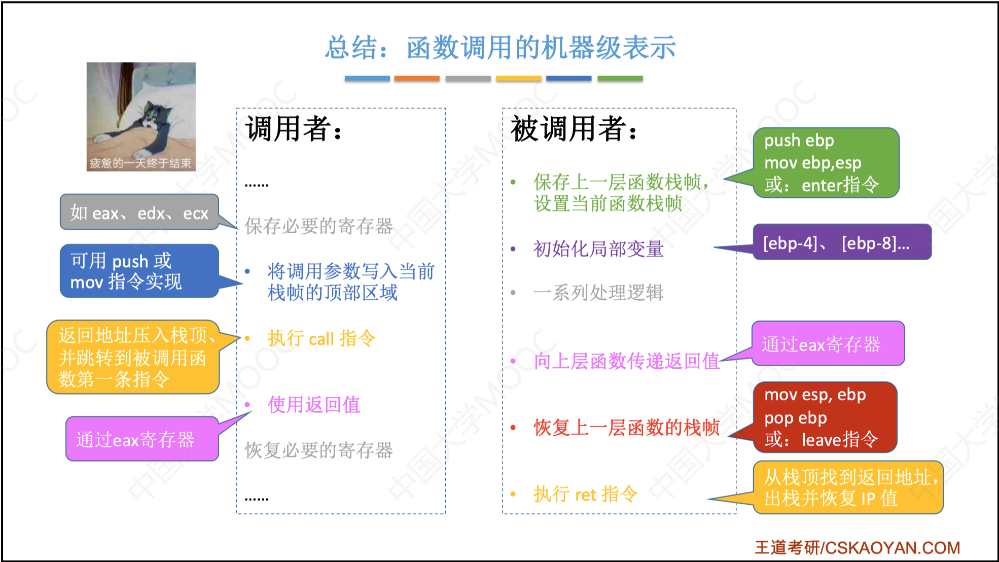


#### ☆指令跳转类大题踩分点 

$例题：$

<div>
  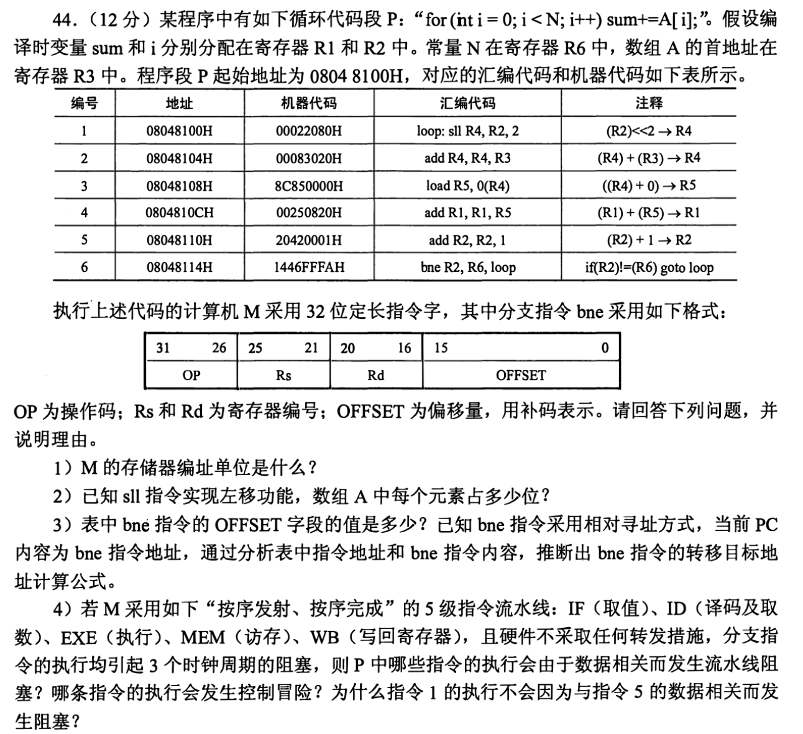
</div>


$解答：$

**（1）编址单位计算：**

- 首先求得指令字长
- 观察相邻指令之间地址之差
- $编址单位=\frac{指令字长}{地址之差}$

> 答题模板：
>
> 已知指令字长=4B
>
> 观察表发现相邻指令之间地址之差为4
>
> 相当于4B代表4个**地址单位**，所以1个地址单位=1B，所以是按字节编址。

**（2）根据左移求单个数组元素大小：**

- 将左移翻译为乘法，得到**数据间隔单位**
- 间隔单位即为数组元素大小

> 答题模板：
>
> 二进制中左移2位相当于*4，由该条件可知，数组中数据间隔为4个地址单位，又因为按字节编址，所以每个元素占4B

**（3）根据OFFSET推导转移目标地址：**

- 首先计算出OFFSET字段真值（符号别漏了）
- 计算取完跳转指令后PC值，与跳转的目标地址**相减**得到<u>偏移量</u>
- 所以OFFSET字段的1位=$\frac{偏移量}{OFFSET}=n$个真实地址单位
- 所以$真实地址=(PC)+'1'+OFFSET*n$

> 答题模板：
>
> 由题目可知，OFFSET字段真值=-6（十进制），系统执行到该跳转指令时，PC+4=08048118H，跳转的目标地址是08048110H，相差18H=24（十进制）个地址单元，所以OFFSET的1位=-24/-6=4位，所以真实地址=$(PC)+4+OFFSET*4$


### 指令流水线

#### 性能指标

**吞吐率：**单位时间内完成的指令数量

​	$TP=\frac{n}{(k+n-1)\bigtriangleup t}【k：流水线段数，n：任务数，\bigtriangleup t：一段所需时钟周期$

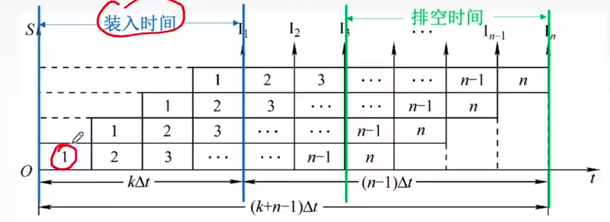

**加速比：**引入流水线后比没引入快了多少倍

$S=\frac{T_0}{T_1}=\frac{nk\bigtriangleup t}{(k+n-1)\bigtriangleup t}【T_0:未引入流水线的时间，T_1:引入流水线后的时间】$

**效率：**流水线的设备利用率

$效率=红色面积/蓝色面积$

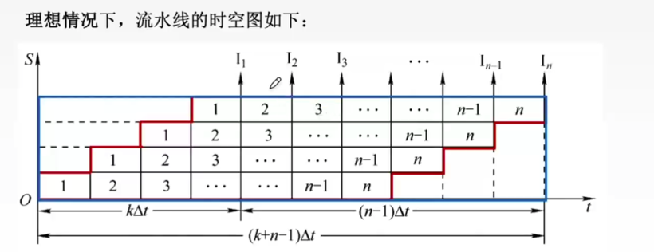

- 装入时间：**第一条**指令从开始到结束

- 排空时间：**最后一条**指令从开始到结束

#### 五段式指令流水线☆

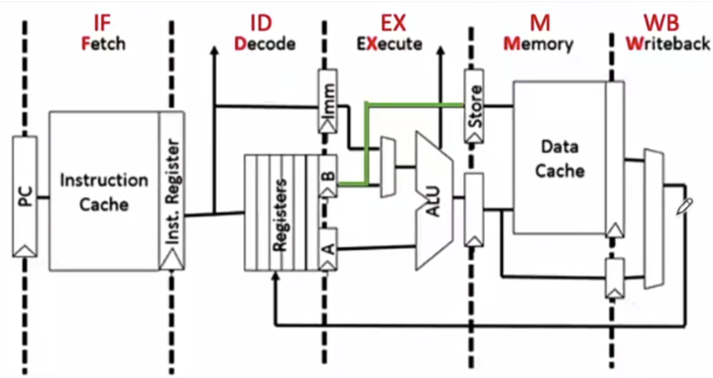


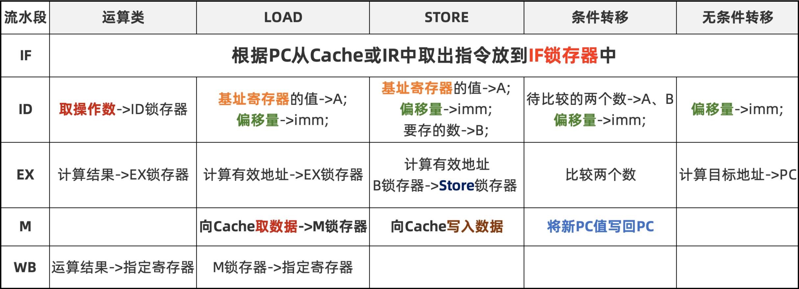

> 注意：在LOAD指令中同样要进行一次**加法运算**，因为RISC中默认采用基址寻址（需要相加计算真实地址）

#### 高级流水线技术

**超标量技术（空分复用）：**每个时钟周期内**并行发射多条**不同指令，在该技术下CPI<1

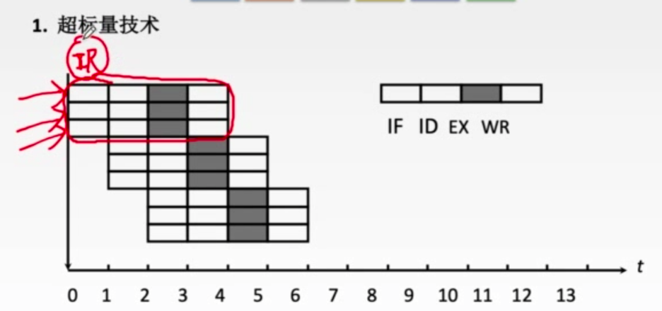

- **要求：**

> - 要配置多个功能部件
> - 能在同一个时钟周期内发射多条指令
> - 指令顺序不能改变（支持**乱序发射**的处理机除外）
> - 配合**<u>动态调度技术</u>**提高并行性**（乱序发射+乱序完成：以减少指令之间原有的冲突）**

- **例题：**

> 【17年T17】
>
> <div>
> 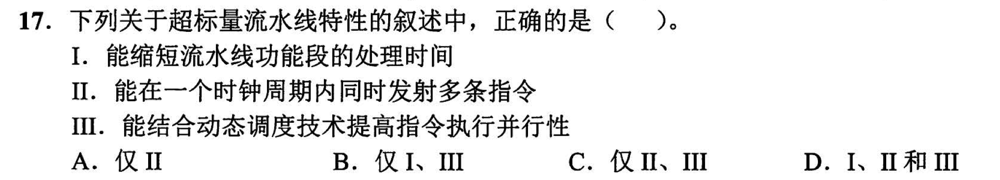
> </div>
> 
>
>
> $答案：本质是以空间换时间，并没有缩短功能段的时间，C$


**超流水技术（时分复用）：**

将一个时钟周期内**的操作**再分段。**注意： **在该技术下并没有提高CPI，CPI依然=1，但是clock被缩短了。

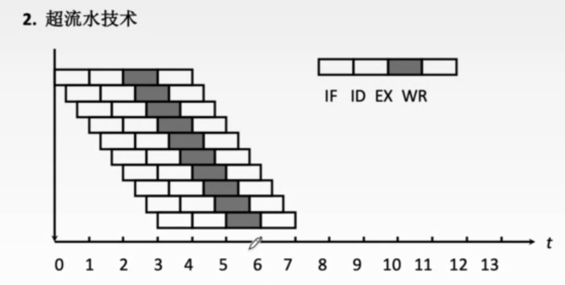

- **要求：**

> - 在一个时钟周期内，一个部件可能**被多次使用**
> - 指令顺序不能改变


**超长指令字技术(静态多发射技术):**

编译器发现某几个指令具有潜在的并行性，于是将多条能够并行的指令**合并成一条超长指令字**

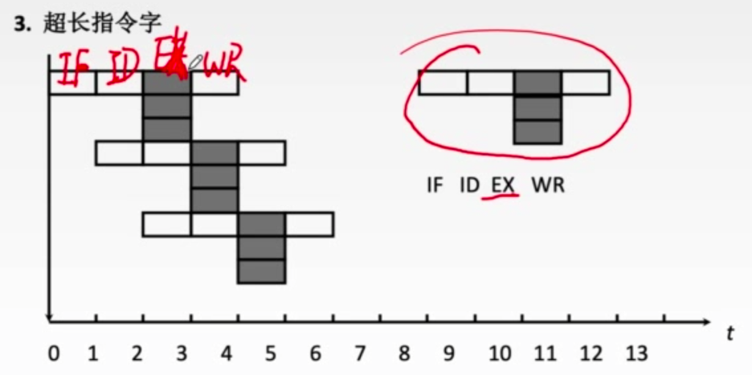

<div STYLE="page-break-after: always;"></div>

## U5 中央处理器

### CPU基本结构

#### 从功能角度分类：

| 运算器           | 控制器   | 数据通路             |
| ---------------- | -------- | -------------------- |
| ALU              | PC       | 内部通路（内部总线） |
| ACC              | PSW      | 专用通路             |
| SR移位器、暂存器 | MDR、MAR |                      |
| Rx、SP           | ID、IR   |                      |
| CT计数器         | 时序系统 |                      |

#### 从用户可见角度分类：

- 用户可见

> PC、PSW（部分可见）、Rx、**基址**寄存器

- 对用户透明

> MDR、MAR、ID、IR、SR移位器、**暂存**寄存器

### 微程序结构

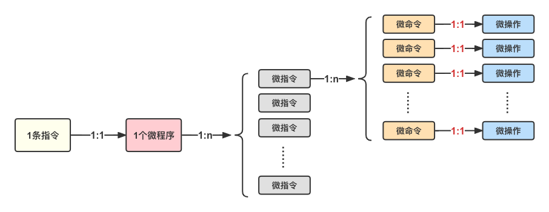

> **牢记：指令 > 命令**

### 微程序控制器组件（待续）

**结构图：**

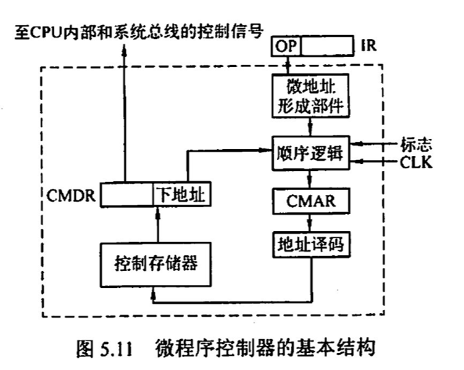

#### 与CPU外部组件的区分

**MDR与CMDR区别：**

> - MAR用于存放主存地址
> - CMAR存放CM地址

**IR与CMDR(μIR)**

> - CMDR用于存放从**CM**中读出的**微指令**
>
> - IR用于存放从主存中读出的指令

**MM(主存储器)与CM(控制存储器)的区别：**

|          | MM主存     | CM控存      |
| -------- | ---------- | ----------- |
| 位置     | CPU外      | CPU**内部** |
| 存放内容 | 程序与数据 | 微程序      |
| 实现介质 | RAM+ROM    | ROM         |

### 各种周期的基本概念

- **时钟周期/节拍：**CPU操作的最基本单位
- **机器周期：**指令周期中<u>某个阶段</u>所花费的时间

- **指令周期：**从主存中**<u>取出并执行</u>**一条指令的时间

> 一个**指令周期**中包含若干机器周期，一个**机器周期**由若干个**时钟周期**构成

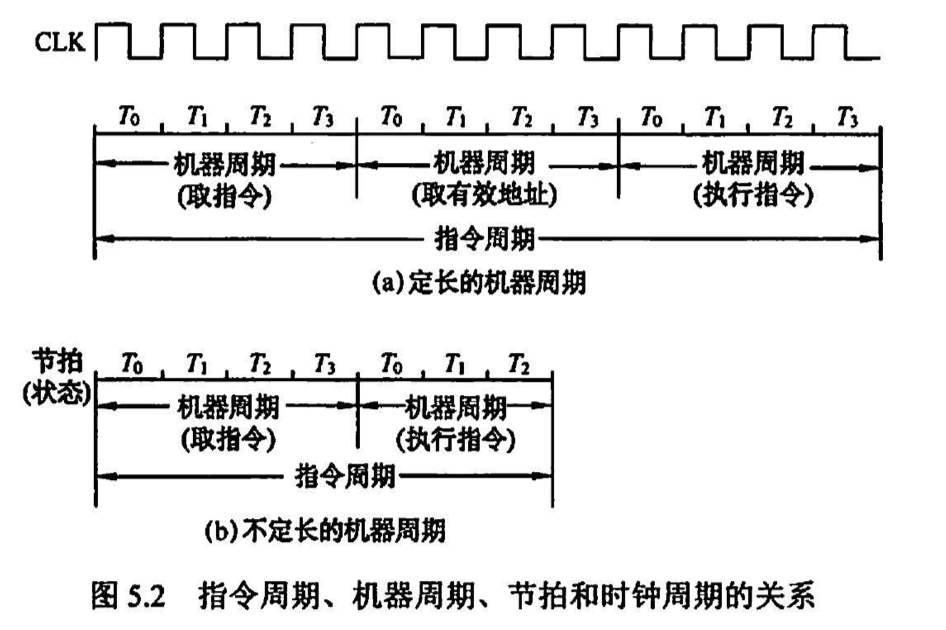

### 微指令编码方式 

#### 直接编码：

1位代表一个微操作命令

#### 字段直接编码：

将微指令分为若干个字段，每段经过译码之后发出控制信号

<div>
  
</div>

**分段原则：**

- 互斥性命令 放 同一段中
- 相容性命令 放 不同段中
- **<u>每段留出一个状态位表示“无信号”</u>**

#### 字段间接编码（隐式编码）：

每个字段所对应的命令，需要由另一个字段中的某些微命令来解释

<div>
  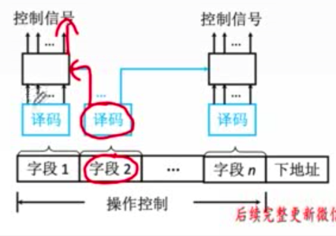
</div>


#### 总结

|          | 直接编码             | 字段直接编码                   | 隐式编码           |
| -------- | -------------------- | ------------------------------ | ------------------ |
| **特点** | 1位=1个微操作        | 一段=多个微操作                | 一段由另一段解释   |
| **优点** | 简单、直观、执行高效 | 能够缩短指令字长               | 进一步缩短指令字长 |
| **缺点** | 指令字段过长         | 需要**译码**，执行相对**缓慢** | 削弱了并行能力     |


### 微指令格式

#### 水平型：

一条微指令可定义**多个并行**的基本操作

<div>
  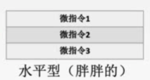
  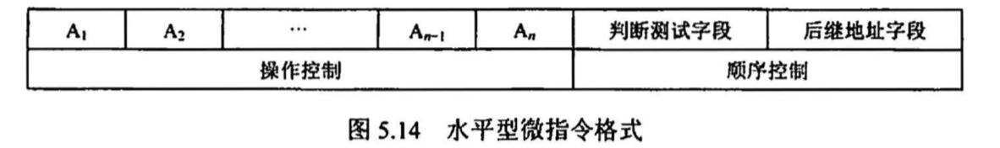
</div>


#### 垂直型：

一条微指令只能定义**一种**基本操作

<div>
  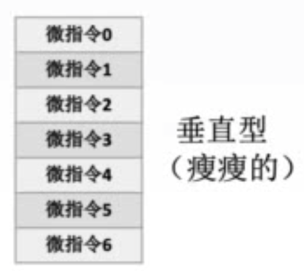
  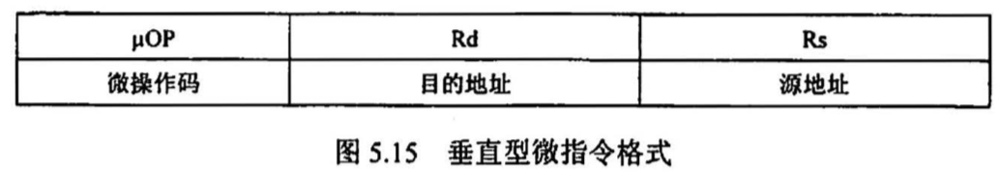
</div>


#### 混合型：

前两者折中

#### 总结：

|          | 水平型             | 垂直型               |
| -------- | ------------------ | -------------------- |
| **特点** | 一指令对多操作     | 一指令对一操作       |
| **优点** | 微程序短，执行高效 | 微指令短，易于编写   |
| **缺点** | 微指令长，编写麻烦 | 微程序长，执行效率低 |

##### 

### 两种制器对比


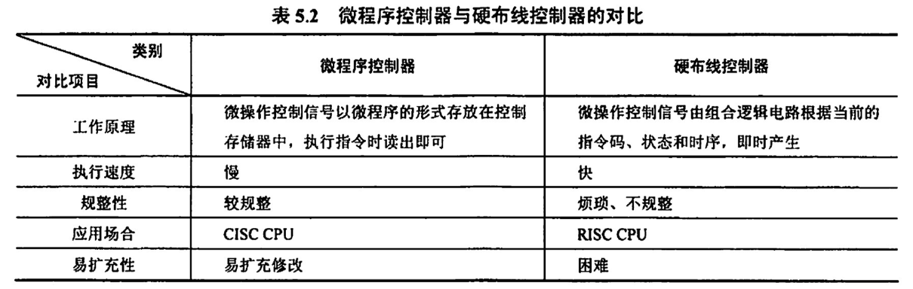

### 数据通路功能 和 基本结构

#### 数据通路

- 数据通路 = 路径 + 路径上的部件

**数据通路中的部件包含：**

> - ALU
>
> - Rx
>
> - PSW
>
> - Cache
>
> - MMU（内存管理单元）
>
> - 浮点运算逻辑
>
> - **异常和中断处理逻辑**☆
> - **组合逻辑电路+时序逻辑电路**

$例题：$

> <div>
> 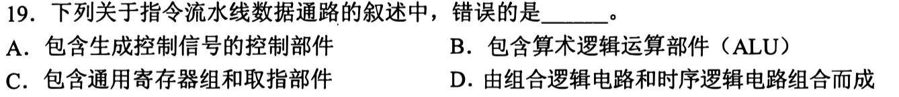
> </div>
> 
>
> $解析：$
>
> $控制部件是对数据通路生成控制信号的，不包含在数据通路中；选A$

### 多处理器概念

#### 指令流&数据流

**指令流**

> - 单指令流：每条指令只能处理**特定的一两个**数据
> - 多指令流：每条指令可同时处理**<u>很多个具有相同特征</u>**的数据

**数据流**

> - 单数据流：指令序列**只能并发**，**不能并行**
> - 多数据流：指令序列**支持并行**

#### SISD、SIMD、MIMD基本概念

**SISD（单指令流 单数据流）**

**特点：**不支持数据级并行

**硬件：**单CPU+单主存（若采用**指令流水线**技术，需采用**多模交叉存储器**）


**SIMD（单指令流 多数据流）**

**特点：**多个单元执行**同一条**命令，**不同**数据

**硬件：**1CU+多(ALU+局部存储器+主存)

<div>
  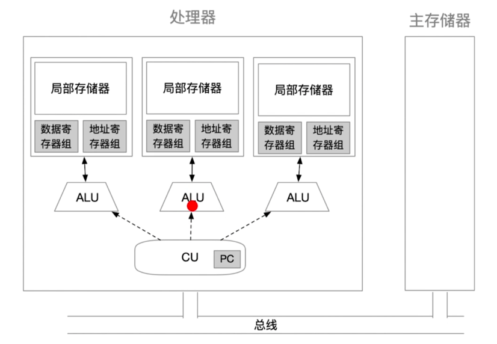
</div>

**使用场景：**显卡渲染、重复for循环等


**MISD（多指令流 单数据流）**

**特点：**多个单元执行**同一条**命令，**同一个**数据【现实中不存在，纯属浪费】


**MIMD（多指令流 多数据流）**

**特点：**多个执行单元执行**不同的**命令，**不同**的数据。是一种**线程级**并行，甚至**线程级以上**的并技术

进一步可分类为：

- **共享存储多处理器系统（SMP）**【$\approx 多核处理器 $】

  **特征：**各个处理器之间，可以通过LOAD/STORE指令访问**<u>同一个主存</u>**，以及**LLC**（Last-Level Cache）

  **硬件：**多处理器+**1存储**（处理器<u>共用同一个物理地址</u>）

  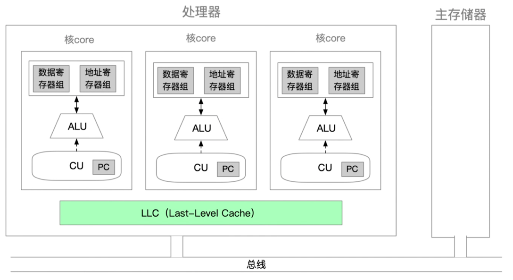

  **从访存方式的角度又可划分为：**

  > **UMA 统一访存多处理器：**
  >
  > $每个处理器对所有存储单元访问的时间都是一致的。（与处理器提出访问哪个字无关）$
  >
  > **NUMA 非统一访存多处理器：**
  >
  > $取决于哪个处理器提出访问 以及访问哪个字？$
  >
  > $主存被分割并分配给同一机器上不同的处理器或内存控制器$

- **多计算机系统（分布式）**

  **特征：**由**多台独立的**计算机构成（计算机之间仅能通过**“消息传递”**的方式来传递数据）

#### <u>向量处理机</u>（SIMD）思想的进阶应用

**特点：**

- 专门用于处理**“向量”**，一条指令的处理对象是**“向量”**
- 常用于超级计算机中，处理科学研究中的巨大运算量

**硬件组成：**

- 多个处理单元，多组**向量寄存器**
- 主存采用 **<u>支持多端口同时读取的多模交叉存储器</u>**
- <u>主存大小限制了解题规模</u>，因此要有**大容量**的集中的处理器


### 硬件多线程概述

#### 细粒度多线程

- 多个线程之间轮流交叉执行
- 可乱序并行

#### 粗粒度多线程

- 仅在遇到较大开销阻塞时才切换线程。（eg：Cache缺失等）
- 所以当流水线阻塞时必须<u>**清除原有流水线，并重载流水线**</u>，**开销比细粒度更大**

#### 同时多线程（SMT）

- 前两种技术的变体
- 在实现指令级并行的同时，实现线程级并行（在同一个周期中向**多个不同**线程发射**多条指令**）

|                  | 细粒度多线程                             | 粗粒度多线程                                                 | 同时多线程（SMT）                    |
| ---------------- | ---------------------------------------- | ------------------------------------------------------------ | ------------------------------------ |
| **发射指令**     | 轮流交替发射（每个时钟周期发射一个线程） | 连续几个周期发射同一线程的指令，**流水线阻塞时**，切换到另一个线程 | 一个时钟周期内，同时发射多个线程指令 |
| **线程切换频率** | 每个始终周期切换一次                     | 只有流水线阻塞时才会切换线程                                 | NULL                                 |
| **线程切换代价** | 低                                       | 高，需要重载流水线                                           | NULL                                 |
| **并行性**       | 指令级并行，线程间**<u>不并行</u>**      | 指令级并行，线程间**<u>不并行</u>**                          | 指令级并行+**<u>线程级并行</u>**     |


<div STYLE="page-break-after: always;"></div>

## U6 总线

### 易错点

- **总线同步：**

	> 同步/半同步总线均是统一时钟信号
	
- **如何充分利用CPU性能？**

  > 采用多总线

- **总线之间必须使用桥接器连接吗？**

  > 是的，因为不同总线之间的速度不同，桥接器起到的就是一个缓冲的作用

### 总线性能指标

#### 对应关系：

> 总线**时钟周期**<=>总线**时钟频率**
>
> 总线**传输周期**（总线周期）<=>总线**工作频率**

#### 总线带宽计算：

$总线带宽=宽度*总线\textbf{工作}频率$

$总线工作频率=总线频率/n$

$n:总线传输一次所需要的总线周期$

### 总线定时

#### 同步定时

- 全局采用一个**统一**的时钟信号（包括半同步）

| 优点         | 缺点                                                   |
| :----------- | :----------------------------------------------------- |
| 传输速率高   | 属于**强制性**同步，不能有进行有效性检查，**可靠性低** |
| 控制逻辑简单 |                                                        |


#### 异步定时

- 双方**没有固定的时钟**，完全通过**“握手”信号**来同步
- **每次**握手的过程完成**一次**通信，通常会交换**多位**数据【21年T19】


**分类：**

- 不互锁方式

- 半互锁方式

- 全互锁方式

<div>
  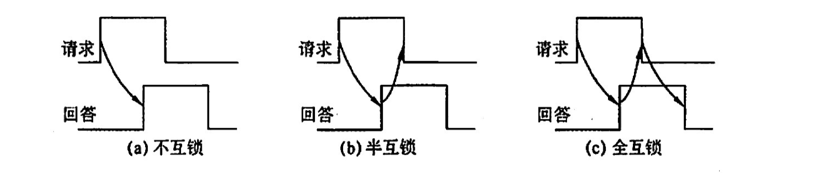
</div>

| 优点                 | 缺点                                   |
| -------------------- | -------------------------------------- |
| 总线**周期长度可变** | 控制方式较为复杂，**速度比同步定时慢** |

### 总线仲裁【补充】

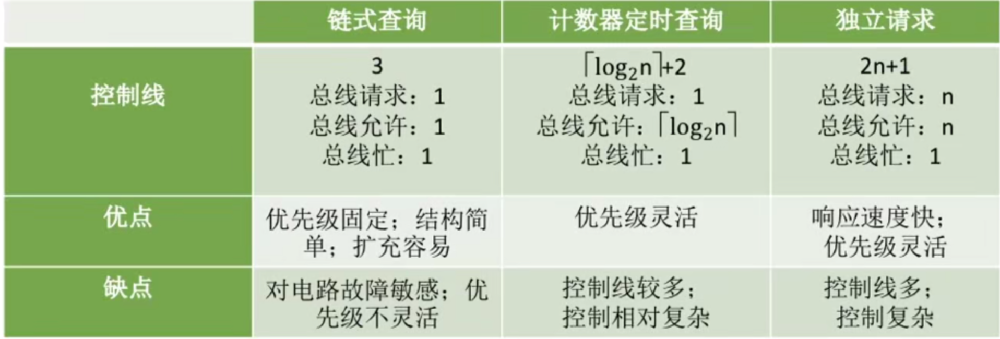

$例题：$

> 【CO P305】
>
> <div>
> 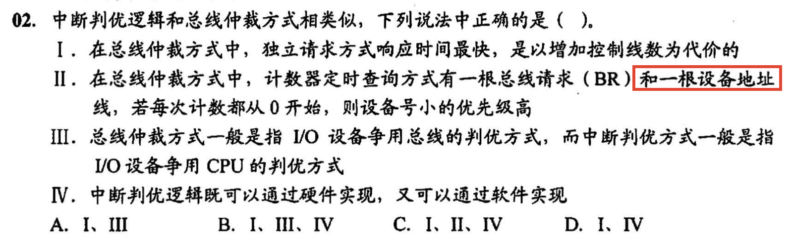
> </div>
> 
>
> II.在**计数器定时方式下**一根地设备地址线显然是不够的，错误
>
> B

<div STYLE="page-break-after: always;"></div>

## U7 I/O系统

### 易错点

- **IO总线中传送的信息包括？**

  > IO接口中的**命令字**
  >
  > IO接口中的**状态字**
  >
  > 中断**类型号**

- **程序员如何访问的设备？**

	> 使用**逻辑地址**通过**系统调用**来访问
	>

- **检测DMA请求一般在什么时候？**

	> 一般在CPU每次**访完存之后**,因为此时总线空闲，很适合检测DMAC是否需要争用总线，如果有恰好把空闲的总线让出去
	
- **使用DMA方式的硬性要求**

  > 带有DMA**接口**

- **DMA中断是否需要保护现场？**

  > 传送过程中不需要，**<u>传送完一块数据后需要</u>**（因为传送完后发送的是DAM中断，通常中断都是要保护现场的）

- **中断触发器的置0是由什么完成的？**

  > **中断隐指令**
  >
  > （中断触发器不是由单一的一条指令完成操作的，而是需要由一整套硬件操作完成）

- **CPU与DMAC两者，谁的优先级更高**

  > DMA属于输入设备，通常更高

- **在异步串行通信方式中，默认隐含1位起始位**

  > $例题：$
  >
  > 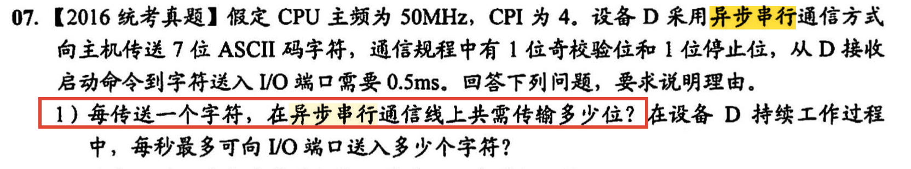
  >
  > $解析：$
  >
  > $需要传送的数据有：7位ASCII+1位奇校验位+1位停止位+1位隐含起始位=10位$

- **DMA传送单位：**

  > 虽然说DMA设备都是以“**块**”为传送单位，但这说的是与主机之间的传送单位，DMA设备**<u>与DMA接口之间依然是以“字”为传送单位</u>**（本质上就是往DMA接口中一个字一个字充入数据，充满一个“块”大小后，再传送给主机，所以从主机视角看上去就好像是一块一块传输的。）

- **☆DMA处理时间占比**

  > 其实题目问你CPU用于DMA处理的时间占比，本质上就是在问你DMA<u>**预处理**+**后处理**</u>的时间占比
  >
  > $因为在DMA方式下，除了预处理和后处理时，CPU都在干自己的事情，是不耗费时间的。$
  
- **DMA传送前由谁设置传送参数？**

  > 驱动程序

- **常见中断优先级排序**

  > 机器故障>**访管>外部**>程序性>重新启动

- **判断中断类型的时候注意判别中断的发起者☆**

  > 通常判断一个中断的类型时，不光要看操作的内容，还要看操作的发起者。
  >
  > $例题：$
  >
  > 【CO P306】
  >
  > <div>
  > 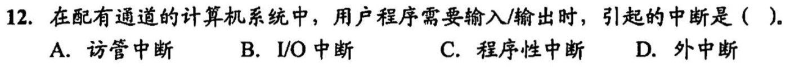
  > </div>
  > 
  >
  > $解析：$
  >
  > 题干说**用户程序**需要输入/输入，的确是要进行IO操作，但是请注意，这个动作的发起者是**<u>用户程序</u>**本身（**<u>也就是说是CPU主动去请求这个IO操作</u>**），那自然就要进入核心态，所以是**访管中断**。选A
  >
  > ⚠️**IO中断：**只有**<u>外部IO设备主动发出</u>**的中断才能称之为IO中断，注意区分动作发起者。

- **【易错】DMA不属于程序控制方式**??

  > DMA方式靠的是硬件电路实现的，所以不需要程序的干预
  >
  > $例题：$
  >
  > 【CO P307】
  >
  > <div>
  > 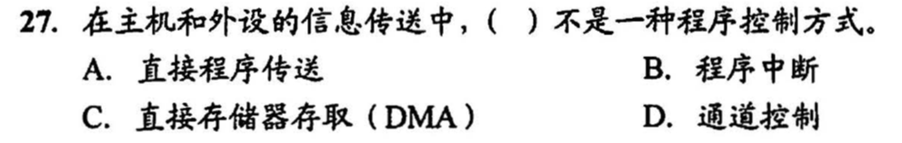
  > </div>
  > 
  >
  > $解析:$
  >
  > DMA是纯硬件实现的选C
  >
  > 易错项：D通道虽然也是一种硬件（低配CPU），但通道的执行依赖于**通道程序**，而**通道程序**是存放在主存中的，还是需要通过CPU指令将**通道程序**发送给通道，所以通道也是一种软件控制方式。

- **进入“中断响应周期”，CPU一定处于开中断**✅

  > 这句话正确，因为如果是**不可屏蔽中断，压根就没有中断响应周期！！！**
  >
  > 能进入“中断响应周期”的，一定是**<u>可屏蔽中断</u>**，且未被屏蔽（**处于开中断状态**）☆
  >
  > $例题：$
  >
  > 【CO P309】
  >
  > <div>
  > 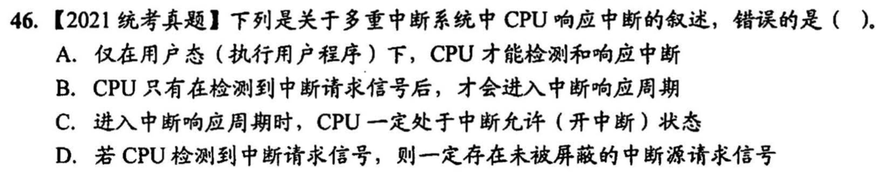
  > </div>
  > 
  >
  > A错误❌：如果在核心态下不能响应紧急中断，岂不是完蛋了？
  >
  > B显然对
  >
  > C正确：这里注意不可屏蔽中断压根就没有中断响应周期
  >
  > D正确：**被屏蔽的中断CPU是检测不到的**


### 记忆内容

- 可屏蔽中断：**INTR**；不可屏蔽中断：**NMI**
- 在程序中断I/O方式中， CPU和打印机直接交换， 打印字符直接传输到打印机的 I/O端口，**<u>不会涉及主存地址，</u>**而 CPU和打印机通过I/O端口中**状态口**和**控制口**来实现交互。
- **内中断（Exception）无法屏蔽！！只有外部中断才能被屏蔽**

### I/O接口

> IO接口存在的意义：由于主机与IO设备之间读写速度差异过大，IO接口用于缓解两者速度矛盾
>
> 通常IO接口又称为“设备**控制器**”或“IO**适配器**”
>
> $例题：$
>
> <div>
> 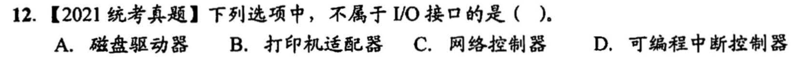
> </div>
> 
>
> 直接排除带**控制器/适配器**的，选A
>
> 磁盘驱动器指的就是硬盘，不属于外部IO设备，是计算机存储系统的一部分

#### IO接口与IO端口的关系

- **IO接口：**通常指的是CPU与IO设备之间用于连接交换信息的一块硬件电路。
- **IO端口：**通常指的是IO接口硬件电路中的部分**<u>寄存器</u>**。

**IO接口基本结构：**

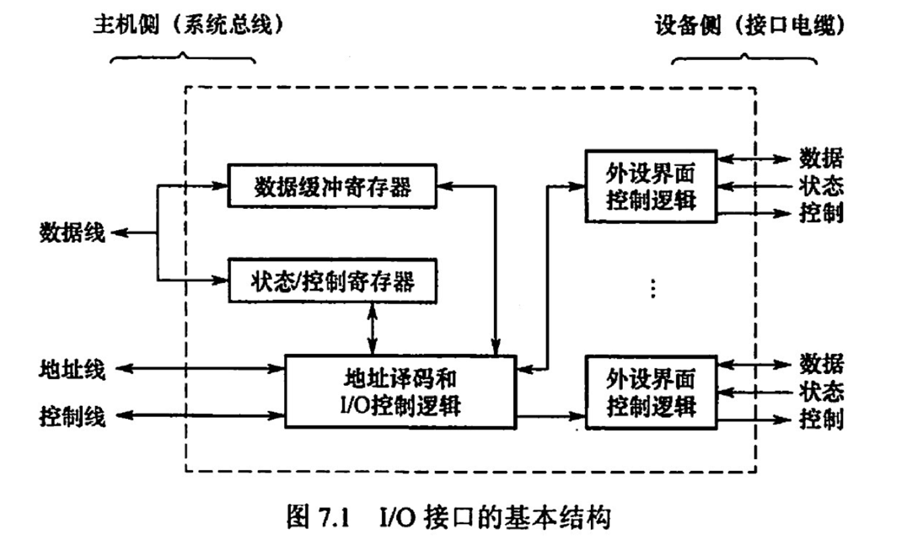

#### IO接口分类

**按数据传送方式（外设和接口一侧）**

- 并行接口：一字节或多个位同时传送
- 串行接口：一位一位的传送

**按控制方式划分**

- 程序查询接口

- 中断接口

- DMA接口

**按可编程性划分**

- 可编程
- 不可编程

#### IO端口编址

|                           | 统一编址                                     | 独立编址                                             |
| ------------------------- | -------------------------------------------- | ---------------------------------------------------- |
| **特点**                  | 与主存共同编址，**CPU可直接访问**            | 又称**IO映射**方式，需要专门的**IO指令**来访问IO端口 |
| **优点**                  | **灵活方便**，具有较大编址空间               | 明显区别与普通指令，**编程含义清晰，易于理解**       |
| **缺点**                  | **占用主存空间**，且主存编址的IO**速度较慢** | 专用IO指令种类较少，**增加操作的复杂性**             |
| **与普通存储单元的区分☆** | 通过不同的**地址码**区分                     | 通过不同的**指令**区分                               |

$例题：$

> 【CO P295】
>
> <div>
> 
> </div>
> 
>
> A
>
> <div>
> 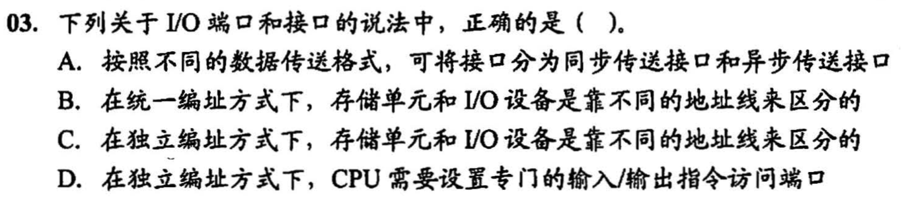
> </div>
> 
>
> BC错，注意地址码≠地址线
>
> A错误，根据**数据传送方式**分为**并行接口**与**串行接口**
>
> D

### 中断判优

#### 分类：

- 响应优先级：响应优先级由硬件电路（**硬件排队器**）决定，无法更改
- 处理优先级：可以由中断屏蔽技术（**中断屏蔽字**）改变动态调整，以实现多重中断

#### 中断屏蔽字

- 中断屏蔽字：表示中断的权限，所以某个中断源所拥有的的屏蔽字越多（1越多），表示权限越高，优先级也就越高

> $如下图所示：D能够屏蔽所有其他中断，而B仅能屏蔽自己，所以D的权限最高，B的权限最低$
>
> 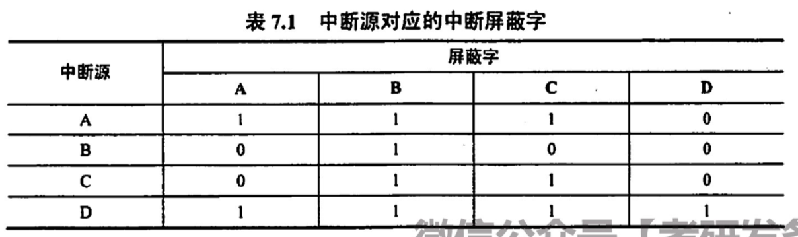


### 中断处理过程：多级中断

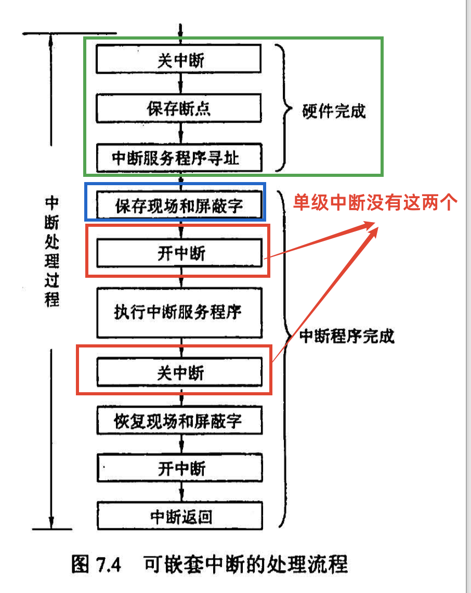

一整个从中断**<u>开始到结束</u>**的过程称为：**中断处理过程**

其中前三步**<u>中断隐指令</u>**干的事情称为：**中断响应过程**


#### 引出中断服务程序—识别中断源【补充】

在中断隐指令引出中断服务程序的过程中，首先会先识别中断源。

在计算机中，中断源分为两种，对应的识别方法也不同：

- 向量中断：**硬件识别方式**

  > 每个向量型中断都会被指定一个**中断类型号**，硬件机构会直接根据中断类型号去查询**中断向量表**，从而得到中断服务程序的地址

- 非向量中断：**软件查询方式**

  > CPU会设置一个**异常状态寄存**器，用于记录异常原因，当遇到非向量型异常时，OS会使用一个统一的**异常查询程序**，**<u>按照优先级顺序查询异常状态寄存器</u>**，先查到的异常先处理。

  

### DMA方式中断

#### DMA传送过程

**预处理：**

- CPU完成一些必要工作
- 测试状态
- 启动设备等
- ☆**然后继续做自己的事情**，DMA设备准备好了之后，会主动<u>向DMC</u>发出**DMA请求**，然后<u>DMC会向CPU</u>发出**<u>总线请求</u>**（**通常这两个也合称为DMA请求**）

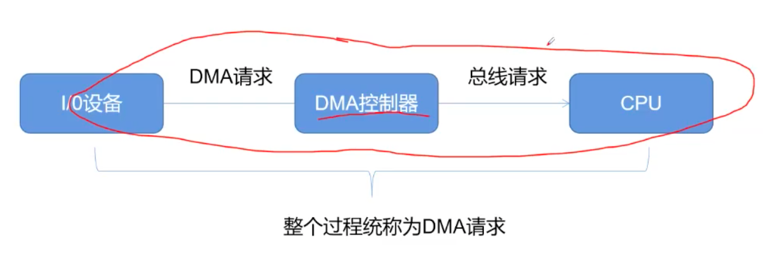

$例题：$

> 【CO P306】
>
> <div>
> 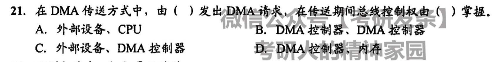
> </div>
> 
>
> $解析：$
>
> 题中的DMA请求，指的就是外部IO设备发送给DMAC的请求，所以选C


**数据传送**

**后处理：**

- 数据传送满一个块后，DMC向CPU发出**中断请求**

- CPU执行中断程序

- - 校验数据
  - 测试传送过程
  - 决定是否继续使用DMA传送等等

#### DMA传送方式-周期挪用（窃取）

 <div>
   
 </div>

$注：这里的周期指的是【主存的存取周期】$

**三种情况：**

- CPU本来就不访存：不存在冲突
- CPU正在访存：**CPU优先**
- CPU与DMA**同时申请访存**：**IO访存优先**

$例题：$

> 【CO P306】
>
> <div>
> 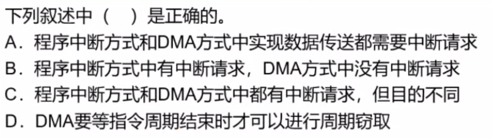
> </div>
> 
>
> A错误，DMA在**数据传送**期间不需要中断请求
>
> B错误，在完整的DMA过程中，DMA后处理阶段是需要发送中断请求来通知CPU一块数据已经充满
>
> C正确✅
>
> D错误，DMA周期窃取指的是**<u>主存的存取周期</u>**结束时，可窃取。（意思就是只要主存空闲就能窃取，和指令周期无关）

#### ☆DMA请求 与 DMA**中断**请求

DMA请求：发生DMA请求表示我们要**向主存传送**一个字的数据

DMA**中断**请求：表示一整块的数据**已经传送完成**

#### 程序中断 与 DMA中断 对比

<div>
  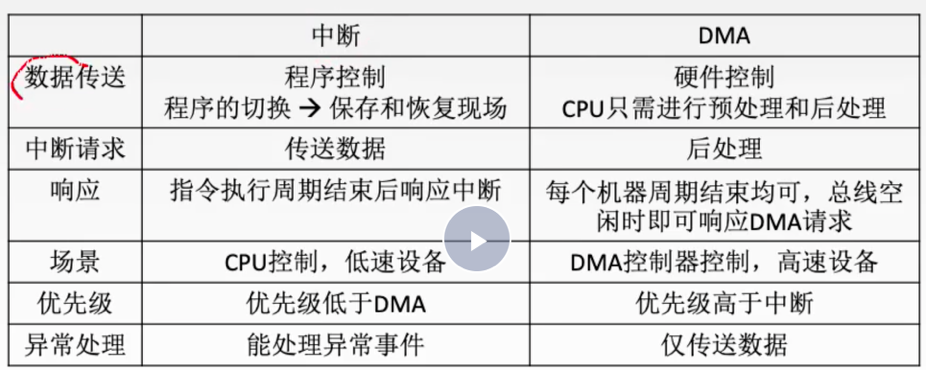
</div>

#### **从磁盘读数据到内存的完整DMA过程☆**

$①\ 初始化DMA控制器；启动磁盘$

$②\ 从磁盘传输一块数据到内存缓冲区$

$③\ DMAC发出中断请求$

$④\ 执行”DMA结束“中断服务程序$


### IO类大题计算思路☆

#### 最长查询时间间隔的计算

**这类题的解题核心就是：**$之所以要不断查询数据，就是要看一下数据缓冲区是否被充满，如果充满了要马上取走数据，防止数据被覆盖。$

所以，**<u>最长查询时间间隔=数据缓冲区被充满数据的时间</u>**，与其他条件无关！！

#### CPU用于I/O的时间占比计算

① 首先计算1s内需要响应中断的次数（也就是缓冲区被充满的次数）

$1s内响应中断的次数=\frac{数据传输速率}{缓冲区大小}$

② 计算出1s内响应完所有的中断共需多少时钟周期

$响应所有中断所耗费的时钟周期=总中断次数*每次中断所耗费周期$

③ 计算占比

$占比=\frac{响应中断总耗费周期}{时钟频率}*100\%$（因为时钟频率表示的就是CPU1s内所能提供的最大周期数量）

#### 判断设备是否适用某种IO方式

① 计算出1s内响应中断次数

② 计算出1s内响应中断耗费的总时间

③ 判断响应所有中断耗费的时间**<u>是否超出CPU频率</u>**，如果超出CPU频率，说明该CPU不能满足该种IO方式的开销。

$例题：$

> 【18年T43】
>
> <div>
> 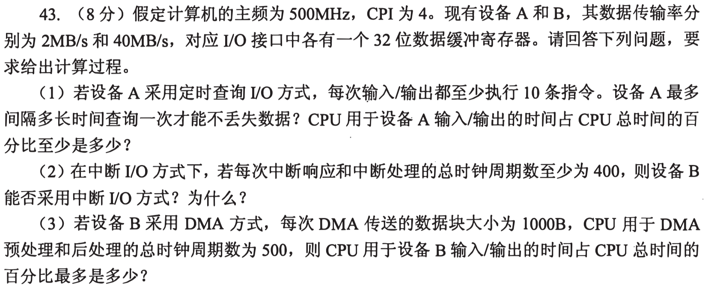
> </div>
> 
>
> $解析：$
>
> (1):
>
> $最长间隔时间=缓冲区被充满的时间=\frac{4B}{2Mbps}=2*10^{-6}s=2\mu s$
>
> $1s内设备A需要响应\frac{2MBps}{4B}=0.5*10^{6}次中断$
>
> $响应中断所耗费总时间=0.5*10^{6}*10*4(CPI)=20*10^6个时钟周期$
>
> $所以CPU用于中断的时间占比为：\frac{20*10^6}{500MHz}*100\%=4\%$
>
> (2):
>
> $1s内设备A需要响应\frac{40MBps}{4B}=10*10^{6}次中断$
>
> $响应中断所耗费总时间=10*10^{6}*400=4000*10^6个时钟周期$
>
> $超出CPU每秒所能提供的最大周期数：500*10^6，所以设备B不适合使用该种IO方式$
>
> (3):
>
> $1s内设备A需要响应\frac{40MBps}{1000B}=4*10^{4}次中断$
>
> $响应中断所耗费总时间=4*10^{4}*500=20*10^6个时钟周期$
>
> $所以CPU用于中断的时间占比为：\frac{20*10^6}{500MHz}*100\%=4\%$
> 

# OS冲刺背诵手册

## U1系统概述

### 记忆内容

- **系统调用**的目的？

  > 直接目的是**请求系统服务**，在该过程中还会间接**申请系统资源**
  >
  > <div>
  >   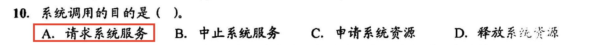
  > </div>

- **特权指令/广义指令：**用户态下**调用**，核心态下**执行**

- **常见特权指令**

  > - 对**IO**设备操作相关
  > - 有关访问**程序状态**的指令
  > - 存储**特殊寄存器**相关

### OS Boot

#### 引导流程

-  激活CPU：读取BIOS中的boot程序，执行BIOS的第一条指令
-  硬件自检
-  加载Boot Device
-  加载MBR：MBR的作用是告诉CPU应该去**哪个主分区**寻找OS
-  扫描硬盘分区表，加载**活动分区**
-  加载PBR：**<u>活动分区</u>**的第一个扇区称为PBR，目的是寻找并启动该分区下的**<u>启动管理器</u>**
-  加载**启动管理器**：启动管理器就是活动分区中负责引导整个OS启动的程序
- 加载OS

### 程序运行的内存映像

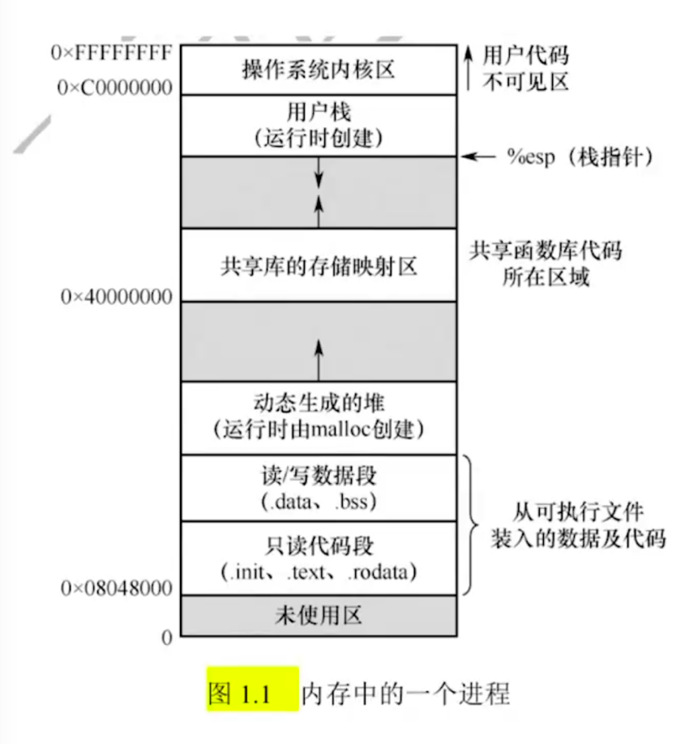

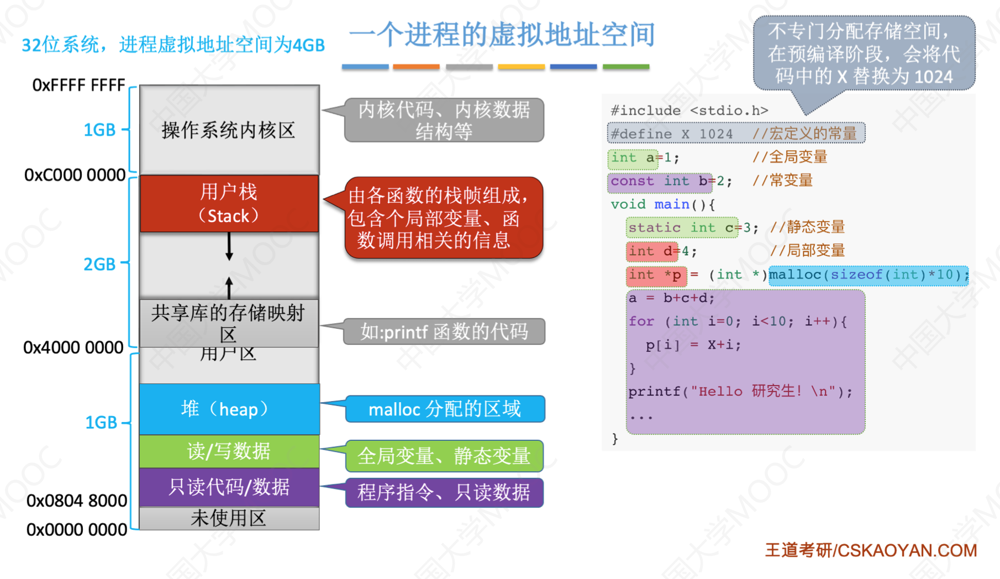

#### 内存映像几大要素

- **代码段（read only）：**存放二进制代码（<u>可被多个进程共享</u>）、const常量
- **数据段：**静态变量、全局变量

>  **代码段**与**数据段**合称为：**<u>正文段</u>**

- **堆：**动态分配的变量
- **栈：**实现函数调用，临时/局部变量（包括**<u>未赋值</u>**）
- **系统内核区：**PCB（普通进程<u>无法访问</u>）
- **共享存储区：**动态加载的共享库（dll等）

### 时钟中断【补充】

$时钟中断：指的就是时间片到$

-  系统每隔一段时间向CPU发送一个“时钟中断”，从而实现分时
- 当CPU收到时钟中断信号后，转而执行“**时钟中断服务程序**”

#### 时钟中断会做的事情(三个修改)

- **修改**内核中时钟**变量的值**
- **修改**当前进程在时间片内的**剩余执行时间**
- **修改**当前进程占用CPU时间（**总占用时间**）

#### 置时钟指令

$修改时钟内容，核心态下运行$

### 中断类

#### 中断处理和子程序调用的区别

**中断处理：**

- **保存PC**

- **保存PSW**：其中一个作用是标记CPU状态（目态/管态）因为执行完中断需要返回中断前的状态，所以需要保存PSW（eg 嵌套中断）

**子程序调用：**

- 仅仅保存**程序断点（PC）**


#### “送中断向量”和“初始化中断向量表”的区别

- **中断向量表：**内存中专门用于存放所有类型的中断向量的区域，一般在开机的时候由OS初始化

- **送中断向量：**指的是**中断隐指令**根据中断类型**<u>选择对应的中断向量送给PC</u>**，让PC接下来能够执行对应的中断服务程序。

#### 执行系统调用的过程

① 执行陷入（trap）指令

② 传递系统调用参数

③ 执行相应服务程序

④ 返回用户态

### 补充内容：

- OS与用户通信接口通常包含哪些？

  > shell
  >
  > 命令解释器
  >
  > 广义指令

<div STYLE="page-break-after: always;"></div>

## U2进程与线程

### 记忆内容

- **创建一个新进程需要做的事**

  > - **申请一个空白PCB**
  > - **初始化PCB必要信息**：进程标志信息、进程优先级、处理机状态信息等
  
- **进程的封闭性：**

  > 进程封闭性指的是，进程执行结果只和本身有关（无论进程以什么速度或顺序执行，都不会影响结果）
  >
  > $例题：$
  >
  > <div>
  > 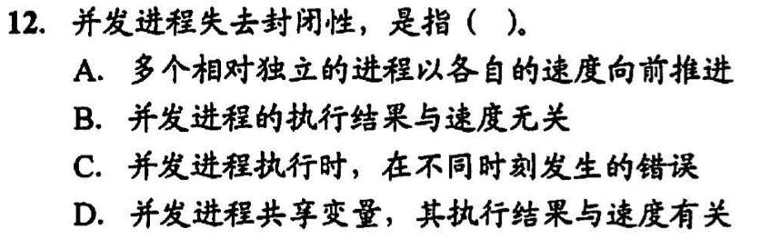
  > </div>
  >
  >
  > $解析：$
  >
  > 进程失去封闭性也就意味着，进程的执行结果受外界因素的影响。 选D

- **UNIX属于什么操作系统？**

  > 分时操作系统

- **无中断，不并发**

  > **没有中断，就没有多道程序设计**
  >
  > **中断是非常非常重要的技术**

- **pip文件存放位置？**

  > 主存（所以管道大小与磁盘大小无关）

- **OS通过什么控制进程？**

  > 操作系统是通过**PCB**来对进程进行**控制和管理的**

- **分时操作系统的时间片可调吗？**

  >不可调整

- 中断结束后是否有可能引发**调度**？

  > 有可能.
  >
  > 因为中断结束后OS**同样会检测时间片轮**，如果刚好轮到自己，那就会**直接调度上处理机**运行
  
- **实现互斥必须遵循的原则？**

  > - **空闲让进**
  > - **忙则等待**
  > - **有限等待**
  > - 让权等待（非必须，别忘了，所有硬件互斥方法都没法实现让权等待）

### 各种关系

#### 临界区与临界资源之间的关系

- **临界区：**访问临界资源的**代码段**
- **临界资源：**一次仅允许一个进程使用的**资源**

#### 临界资源与共享资源的区别

> 他们之间的区别就在于**一段时间内能否被多个进程访问**
>
> **临界资源：**一次只供一个进程使用（eg. 缓冲区、队列）
>
> **共享资源：**一次可以供多个进程使用（eg. 共享区代码、磁盘）

#### 并发进程之间的关系

- 没有必然的关系，只有时间上的**偶然**重合（异步性）
- 所以他们之间可能**是相关的**，也可能**是无关的**


#### 进程与线程的关系

|          | 进程                                  | 线程                                        |
| -------- | ------------------------------------- | ------------------------------------------- |
| 基本单位 | <u>永远</u>是“**资源**分配”的基本单位 | 引入线程后，线程作为“**CPU调度**”的基本单位 |
| 资源     | 拥有资源，同下                        | 没有独立资源，可访问**父进程**的资源        |
| 独立性   | 拥有**独立的**地址空间                | 共享**所属进程**资源                        |

#### 父子进程的关系

- 父子进程可并发执行
- ☆子进程**独享**一块虚拟地址空间（补充：父子进程可以共享一部分资源，但**<u>不能共享虚拟地址空间</u>**）
- 父子进程拥有不同的PCB

#### 进程与作业之间的区别

- **作业：**以用户的角度出发，**由用户提交，以用户任务为基本单位**
- **进程：**以OS角度出发，**由OS生成，是OS资源分配**和**独立运行**的基本单位

### 进程通信

#### 共享存储

在通信的进程间存在一块可直接访问的**共享空间，**通过对这片空间R/W进行信息交换

**特点与实现方式：**

> - 需使用互斥工具
> - **低级方式：**基于数据结构（包括文件）
> - **高级方式：**基于存储区

#### 消息传递

数据交换以<u>格式化的Message</u>为单位，需要使用OS提供的“**发送信息**”和“**接收信息**”两个原语进行通信

**实现方式：**

> - **直接通信方式：**发送方直接给接收方发送消息，并将它挂到进程的接收消息缓冲队列上，接收方从队列中取得消息
> - **间接通信方式：**两个进程之间通过“信箱”来中转信息

#### 管道通信(Pip)

> **管道：**连接两个进程之间的一个共享文件（又名pipe文件），数据在管道中以**字符流**的形式传输

**特性：**

> - 只存在于**内存**中（磁盘速度太慢了，也达不到进程通信的要求）
> - 半双工（若要实现全双工，需要两条管道）
> - 只要管道**没满**，就能**继续写**；只要管道**没空**，就能**继续读**
> - **破坏性读出：**管道读取数据是<u>**一次性操作**</u>，数据一旦被读取，立马释放空间存入新的数据

**管道基本功能：**

> - 确定对方的存在
> - 同步
> - 互斥

**读写者数量要求⭐️：**

> 同一时间，管道可以拥有**多个写进程**，但**只能有一个读进程**
>
> （因为管道的本质就是缓冲区，是破坏性读出，一旦多个进程一起读，会把别的进程数据给破坏了。而写操作并不会破坏管道内原有的数据，所以允许多个进程同时写。）


### 进程调度

#### 调度性能指标

$周转时间=作业完成时间-提交时间$

$平均周转时间=周转时间加权平均$

$带权周转时间=\frac{周转时间}{实际运行时间}$

$平均带权周转时间=带权周转时间的加权平均$

响应时间：从用户**提交请求**到系统**产生响应**所需的时间

> 注意：**<u>进程切换和调度的时间</u>**，表示系统在每次上处理机**<u>运行前</u>**所需要耗费的时间
>
> $例题：$
>
> 【18年T24】
>
> <div>
> 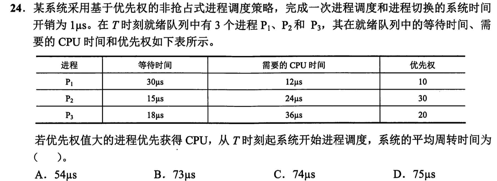
> </div>
>
>
> $解析：$
>
> 注意题中说：$完成一次进程调度和调度和切换的时间为1\mu s$，表示进程**每次上机执行前**都要花费$1\mu s$的时间
>
> 如图所示
>
> 
>
> 经过计算，平均周转时间$=\frac{(25+15)+(62+18)+(75+13)}{3}=75$


#### 三级调度

- 高级/作业调度
- 中级/内存调度
- 低级/进程调度：**频率最快、最基本、不可或缺**

#### 进程切换的代价

- 重新保存/恢复**PTR**
- **TLB**全失效
- **Cache**全失效
- 运行初期**缺页率较高**


$$
红字全是进程切换时需要保存/恢复的内容
$$


#### 各种调度算法的特性

- **FCFS：**不利于<u>短作业</u>
- **SJF：**最短平均周转时间，长作业可能饥饿
- **高响应比优先：**$响应比=\frac{等待时间+要求服务时间}{要求服务时间}(倒三角)$，满足<u>短作业</u>优先（总体兼顾），且不会发生饥饿

> 注意：
>
> I/O密集型作业=长作业
>
> CPU密集型=短作业

> 例题
>
> <div>
>   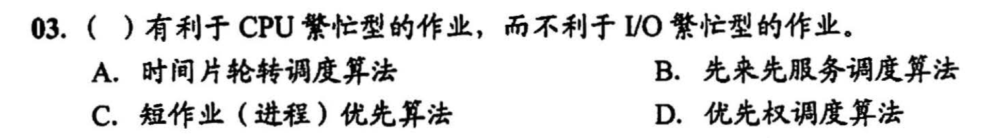
> </div>
>
> 答：
>
> I/O繁忙型=短作业，而FCFS不利于短作业，选B

### 同步与互斥

#### 软件实现临界区互斥

| 算法                     | 优点         | 缺点                 |
| ------------------------ | ------------ | -------------------- |
| **单标志法**             |              | 违背**空闲让进**     |
| **双标志先检查**         | 空闲让进     | 违背**忙则等待**     |
| **双标志后检查**         |              | 可能导致**饥饿**     |
| **Peterson’s Algorithm** | 不会导致饥饿 | 无法实现**让权等待** |

#### 硬件实现临界区互斥

> ⚠️**首先牢记：**所有硬件方法均不能实现让权等待
>
> $例题：$
>
> 【18年T32】
>
> <div>
> 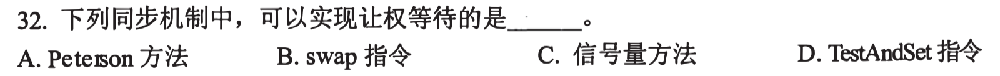
> </div>
>
>
> $由上述结论，可以直接排除BD$
>
> $皮特森算法也无法满足让权等待$
>
> $所以答案选C$


**中断屏蔽法：**（又称低级方法/元方法）

```c
……
关中断;
临界区;
开中断;
……
```

缺点：

- **限制了**处理机的**交替执行程序能力**，会导致**处理效率降低**。
- 将**关中断权限交给用户**是一种很**危险**的做法


**TSL（Test and Set Lock）：**

```c++
bool TSL(bool &lock){
	bool old;
  old=lock;
  lock=true;
  return old;
}

do{
  ……
  while(TSL(&lock));		//lock=true表示资源正在被占用
  临界区;
  lock=false;						//解锁资源
  ……
}
```

TSL做的事情其实就是表明自己想用资源的意愿，并且返回当前资源的状态（是否被人使用）

当别人用完资源后（lock=false），TestAndSet**会立马检测到资源空闲，于是将lock重新设为true（锁住资源）**，并向上层报告资源当前可供自己使用

**☆408考点：**

- 使用TSL实现互斥的进程，**不会进入阻塞态**，因为TSL实现阻塞的本质是让进程<u>不断执行空的while循环</u>。
- 进入“等待”状态的进程，**不会主动放弃CPU**，因为上一条已经说了，进程**不会进入阻塞态**，自然也就无法主动放弃CPU。
- TSL不满足**”让权等待“**，因为让全等待指的是：进程无法访问临界区时，**<u>主动放弃CPU</u>**，显然他不满足。

【16年T27】

> <div>
> 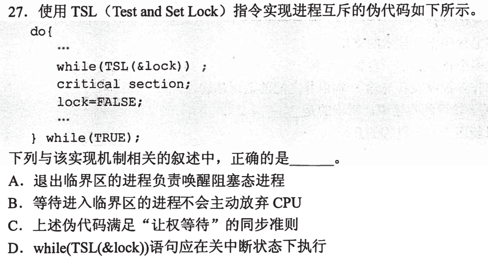
> </div>
>
>
> $答案：B$


#### 前驱图

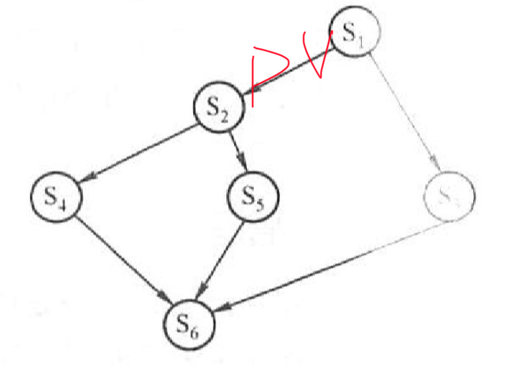

- 关键：**前V后P**
- 注意：用作前驱关系的信号量**初值为0**

#### 管程

**背景：**管程是在**<u>程序设计语言</u>**中被引入的，是一种高级的同步机制

**特点：**

- 管程把对共享资源的操作**封装**起来
- 每次仅允许**一个进程**进入管程☆

**条件变量：**

- **x.wait：**x条件**不满足时**，**将自己插入**x条件的**等待队列**，并释放管程，允许其他进程使用该管程（**让其他人先用**）
- **x.signal：**x条件满足时，**唤醒一个**因x条件而阻塞的**进程**

**与PV操作相比：**

|                    | 管程                                           | PV                                 |
| ------------------ | ---------------------------------------------- | ---------------------------------- |
| **主要功能**       | 进程的阻塞/唤醒，**但仅限于”排队等待“**        | 进程的阻塞/唤醒                    |
| **剩余资源的表示** | 用**共享数据结构**记录                         | **信号量的值**反应了资源**剩余数** |
| **灵活性**         | 管程是**被**进程**调用的**，**无法创建和撤销** | 自由编写                           |

**易错点：**

- 管程的wait() 和 signal()操作**不会**对条件变量进行检查，这个条件变量仅用于实现管程内部队列的排队功能（并不像信号量那样代表实际的资源数量）

### ☆死锁

#### 死锁的预防

- 打破循环等待：**给系统资源编号**（‘循环编号’）
- 打破请求并保持：**预先静态分配**（‘保持静态’）
- 打破剥夺
- 打破互斥：一般**无法打破**

#### 死锁避免

**银行家算法：**

- 数据结构

> Available：剩余可用
>
> Max：最大需求
>
> Allocation：目前已分配
>
> Need：剩余需求

- $注：银行家算法无法检测出是否处于死锁状态$

**系统安全状态：**

$进入不安全状态，未必会发生死锁$
$但是发生死锁，一定是在不安全状态$

#### 死锁检测和解除

**资源分配图**

- 如果能够消除所有的边，说明资源分配图可完全简化

- 如果不能消除所有的边，则说明发生死锁

- **孤点：**表示没有任何一条边与该点相连

- **包含**

  >**大圆圈：**进程
  >
  >**框：**一类资源
  >
  >**框中的一个圆：**一类资源中的一个资源
  >
  >**资源->进程的边：**分配边
  >
  >**进程->资源的边：**请求边
  >
  ><div>
  >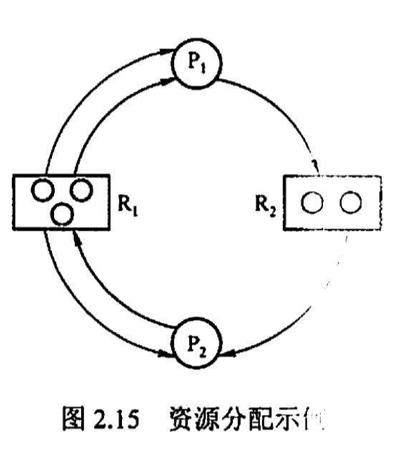
  ></div>


**死锁定理**：

​	就是通过**优化<u>资源分配图</u>**来检测死锁

**死锁解除：**

- 撤销进程法
- 资源剥夺法
- 进程**回退法**

### PV-读写者问题

读写者问题中 ，通常写者直接是互斥访问的，而读者之间是不互斥访问的。想要实现这个核心逻辑就是为读者分配一个count计数器，并利用if判断确保后来的读者跳过P()互斥操作。

#### 读优先

```c
//读者优先
Semaphore lock=1;   //读者与写者之间的互斥锁
Semaphore m=1;      //count的互斥锁
int count=0;        //读者计数器
Reader(){
    P(m);
    if(count==0) P(lock);   //第一个读者负责上锁
    count++;
    V(m);
    //reading……
    P(m);
    count--;
    if(count==0) V(lock);    //最后一个读者负责解锁
    V(m);
}

Writer(){
    P(lock);
    //writing……
    V(lock);
}
```


#### 平衡读写

实际上要实现“平衡读写”，只需要在读优先的基础上加一个queue信号量来实现“排队”操作。queue信号量的使用精髓在于：**<u>干任何事情前首先排队，在真正读写之前，通知队列中的下一个进程</u>**。

```c
//读写平衡
Semaphore lock=1;   //读者与写者之间的互斥锁
Semaphore queue=1;  //相当于一个排队的队列作用（用于实现读写平衡）
Semaphore m=1;      //count的互斥锁
int count=0;        //读者计数器
Reader(){
    P(queue);               //先排队
    P(m);
    if(count==0) P(lock);   //第一个读者负责上锁
    count++;
    V(m);
    P(queue);               //真正读之前通知队列中的下一个进程
    //reading……
    P(m);
    count--;
    if(count==0) V(lock);    //最后一个读者负责解锁
    V(m);
}

Writer(){
    P(queue);   //排队
    P(lock);
    P(queue)    //真正写之前通知队列中的下一个进程
    //writing……
    V(lock);
}
```


#### 写优先

写优先的实现相对复杂，他的实现原理如下：

- 先将**<u>写者改造为读者</u>**（加上自己单独的count计数器），<u>此时写者之间也不互斥</u>

- 因此要在写操作的前后加上一对PV恢复写互斥

- 接下来就是通过读写者之间**<u>互相给对方上锁</u>**，来实现读写者之间的互斥。

- 若此时再给读者套一对**<u>”检测PV“</u>**，则读者的优先级会更低，从而实现写优先

  $注："检测PV"的精髓在于：真正读写之前要先解锁（准确说是给同伴解锁），否则会影响到原有的同步顺序$


```c
//写优先
Semaphore Wlock=1;   //用于给写者上锁
Semaphore Rlock=1;   //用于给读者上锁
Semaphore Wm=1;      //Wcount的互斥锁
Semaphore Rm=1;      //Rcount的互斥锁
int Wcount=0;        //写者计数器
int Rcount=0;        //读者计数器
Reader(){
    P(Rlock);       //”检测PV“：此时如果发现已经被写者上锁，则会卡住（实现了写优先）
    P(Rm);
    if(Rcount==0) P(Wlock);   //第一个读者给写者上锁
    Rcount++;
    V(Rm);
    V(Rlock);       //若是自己上的锁，则在读之前要先给其他同伴解锁（实现了读者不互斥）
    //reading……
    P(Rm);
    Rcount--;
    if(Rcount==0) V(lock);    //最后一个读者给写者解锁
    V(Rm);
}

Writer(){
    P(Wm);
    if(Wcount==0) P(Rlock);  //第一个写者给读者上锁（写优先的关键）
    Wcount++;
    V(Wm);

    P(Wlock);   //这对Wlock是用于实现写者之间的互斥（很容易遗忘）
    //writing……
    V(Wlock);
    
    P(Wm);
    Wcount--;
    if(Wcount==0) V(Rlock);     //最后一个写着负责为读者解锁
    V(Wm);
}
```


<div STYLE="page-break-after: always;"></div>

## U3内存管理

### 记忆内容

- 虚拟内存管理中，逻辑地址在**“链接”**阶段生成

- **影响请求分页系统有效（平均）访存时间的是？**

  > - 缺页率
  > - 磁盘读写时间
  > - 内存访问时间
  > - 执行缺页处理程序的CPU时间

- **☆发生<u>缺页</u>时，操作系统是不会检查是否越界的**

  > 因为“**缺页**”只有可能在查询页表的时候发现，此时我们使用的已经是转换完成的物理地址了，所以一定不会越界。
  >
  > **“越界检查”**这个步骤是在$VA\rightarrow PA$的过程中就已经完成了。
  >
  > $例题：$
  >
  > 【13年T30】
  >
  > <div>
  >   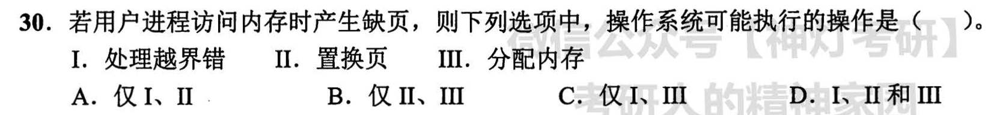
  > </div>
  >
  > $答案：B$

### 动态分区算法特点总结

| 算法     | 首次适应                      | 最佳适应                        | 最坏适应                    | 邻近适应                        |
| -------- | ----------------------------- | ------------------------------- | --------------------------- | ------------------------------- |
| **特点** | 每次从头找                    | 从小往大找                      | 从大往小找                  | 继续向下找                      |
| **优点** | **<u>综合性能ok</u>**，开销小 | 会有更多**<u>大分区被保留</u>** | **<u>内部碎片少</u>**       | 开销小                          |
| **缺点** |                               | 产生**<u>内部碎片</u>**，开销大 | **<u>大分区很快被用完</u>** | **<u>高地址大分区很快用完</u>** |

### 虚拟内存管理

#### 基本概念

**虚拟存储器的特征：**

> - 多次性：作业分多次调入内存
> - 对换性：作业无需常驻内存，允许**多次换入换出**
> - 虚拟性：**<u>逻辑上</u>**扩充主存【最主要目标】

**实现方式：**

> - 请求**分页**管理
> - 请求**分段**管理
> - 请求**段页式**管理

注意：**<u>无论以上哪种实现方式，都需要硬件支持</u>**！

所需硬件：

> - 一定量的**内外存**
> - 页/段表机制
> - (缺页)中断机构
> - 地址变换机构

#### 内存分配策略

**概念：**

> - **固定分配：**分配给一个进程的页框数是**定死的**
> - **可变分配：**分配给一个进程的页框数**可变**
> - **全局置换：**缺页时，从**<u>主存</u>**分配更多页框
> - **局部置换：**缺页时，从**<u>驻留集内部</u>**替换

由上述各2种不同的**置换**和**分配**策略的规则组合，产生了3种不同的内存分配策略

- **固定分配 局部置换**
- **可变分配 局部置换**
- **可变分配 全局置换**

#### 磁盘文件区与对换区

|                | 文件区               | 对换区                 |
| -------------- | -------------------- | ---------------------- |
| **存放内容：** | 文件数据             | 对换页面               |
| **存储结构：** | **离散**分配（文件） | **连续**分配（字符流） |
| **读写速度：** | 低速                 | 高速                   |

### CLOCK置换算法

#### 简单CLOCK

- **首轮：**找<u>访问位=0</u>的，并置0
- **后续：**同首轮

#### 改进型CLOCK

在简单CLOCK的基础上增加为**<访问，修改>**（先访问再修改）

- **首轮：**找**(0,0)**
- **二轮：**找找**(0,1)**且将<u>**访问位**</u>置0
- **三轮：**找**(0,0)**
- **四轮：**找**(0,1)**，⚠️经过前三轮，这一轮必能找到

### 抖动和工作集

#### **抖动/颠簸：**

刚换入的页面又要换出，刚刚换出的页面又要调入

> 抖动会导致大量时间用于IO，导致排队进程急剧增加，恶性循环，从而导致系统性能接近于0

#### 工作集 与 驻留集：

- **驻留集：预先**给进程分配的物理块

- **工作集：**进程**实际访问**页面的集合

> ☆注：**<u>工作集窗口</u>**包含重复！！！，但**<u>工作集</u>** **不包含重复**⚠️

通常工作集<=驻留集

**例题：**

> <div>
> 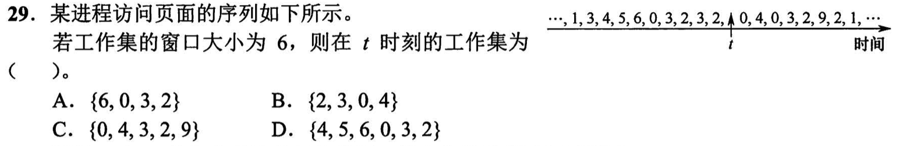
> </div>
> 
>
> $解析：$
>
> $解题核心：要知道工作集窗口是可以包含重复的，但工作集是不包含重复的$
>
> $本题工作集窗口=6，从t往前数6个元素：\{6,0,3,2,3,2\}$
>
> $去除重复后得到工作集：\{6,0,3,2 \}$

### 内存映射文件

- 该技术能够将磁盘文件的内容**映射**到虚拟内存的某个区域

- 使得用户对该区域的读写就仿佛在读写主存一样，**<u>大大减少了IO次数</u>，** **便于进程之间共享数据。**

- **只有当close调用关闭文件时**，才会将页面页面写回磁盘，并解除映射，**（当然OS也有可能会定期检查是否需要写回磁盘）**

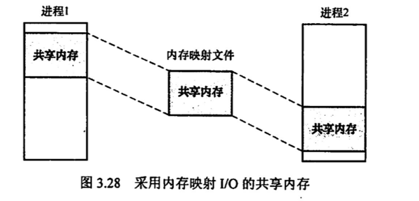

<div STYLE="page-break-after: always;"></div>

## U4文件管理

### 记忆内容

- 可用于文件系统**管理空闲磁盘块**的数据结构有哪些？

> - 位图
> - 空闲磁盘块链
> - FAT文件分配表（主要功能用于**<u>记录文件分配信息</u>**，兼职管理空闲盘块）

- **文件访问控制信息（ACL）的合理存储位置？**

> FCB


### 文件共享

#### 硬链接

共享该文件的**所有用户**都直接指向真实文件的**索引节点**

#### 软链接

只有文件主能够指向真实文件的索引结点。而其他共享用户都是自己**先创建一个新的**索引结点，该索引结点**指向LINK文件**，<u>新索引结点的Count数与真实文件索引结点Count无关！！</u>。

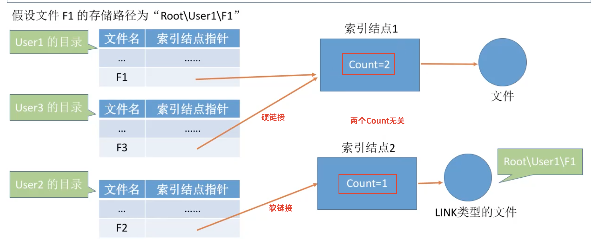

#### open与read系统调用

- 先open后read

- **open(文件名，路径)：return fd**

- **read(文件描述符fd，缓冲区首址buf，读取字节数)**

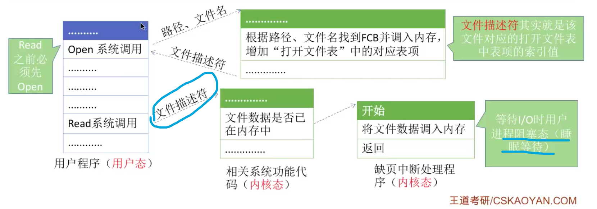

<div STYLE="page-break-after: always;"></div>

## U5IO管理

### 记忆内容

- 不会产生磁臂黏着的算法：FCFS

- IO软件结构层次：用户、无关、驱动、中断
- **IO层次**

> <div>
> 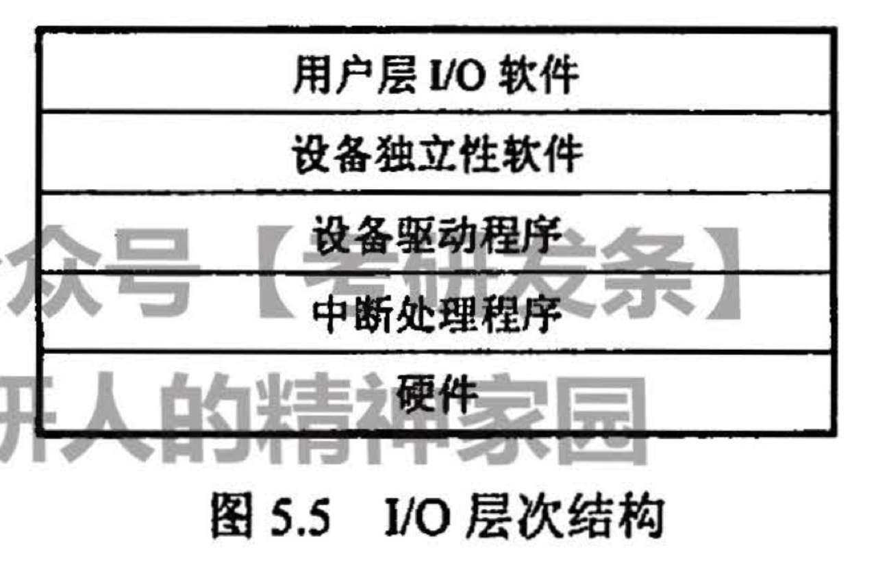
> </div>
>
> **牢记：**中断处理程序与**硬件**直接打交道

- **在内存中设置磁盘缓冲区的目的：**

  > 减少IO次数
  
- **管理缓冲区中首要考虑的问题是？**

  > 进程与缓冲区之间的**同步**。
  >
  > （因为不管缓冲区大小、数量如何，你都得遵循缓冲区**<u>未空可读，未满可写</u>**的**同步原则**）

- **缓冲技术的缓冲池所在位置？**

  > 主存

- **每台设备在系统中都有一个独立的编号，称为？**

  > 绝对号

- **光盘读写特性？**

  > 可随机读，但<u>**不可**</u>随机写
  
- **初始化中断向量表是由OS完成的吗？**

  > 是的，这一步操作仅仅只是<u>**初始化**</u>存放中断向量的那张表而已，并非**中断服务寻址**（硬件完成）

### 磁盘管理

#### 磁盘的地址结构

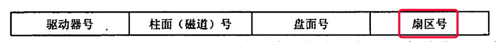

#### 簇号与磁盘地址的转换

$柱面(磁道)号=簇号/单磁道簇数/单柱面磁道数$

$盘面号=簇号/单磁道簇数\%单柱面磁道数$

$扇区号=簇号*单簇包含扇区数\%单柱面扇区数$

$例题：$

> 【2019年T44】
>
> <div>
> 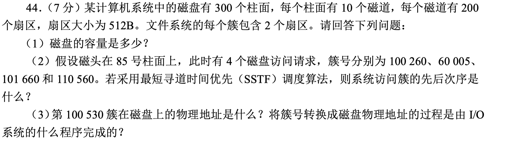
> </div>
>
>
> $解析：$
>
> **(1):**
>
> $磁盘容量=总扇区数*单位扇区大小=300*10*200*512B=3*10^5KB$
>
> **(2):**
>
> $分别利用公式计算4组簇号的磁道号：$
>
> $100260:磁道号=100260/100/10=100$
>
> $60005:磁道号=60005/100/10=60$
>
> $101660:磁道号=101660/100/10=101$
>
> $110560:磁道号=110560/100/10=110$
>
> $由于当前所在磁道为85，根据SSTF算法，磁道访问顺序为$：
>
> $100260、101660、110560、60005$
>
> **(3):**
>
> $磁道号=100530/100/10=100$
>
> $盘面号=100530/100\%10=5$
>
> $簇号=100530*2\%(100*2)=60$
>
> $由驱动程序完成$


#### 磁盘的初始化工作

**低级格式化（物理）：**

> - 划分扇区
> - 确定扇区所需数据结构：包括扇区**校验码**等
>
> （低格通常采用特殊的数据结构来填充扇区）

**磁盘分区：**

> - 将磁盘的若干柱面划分为一个分区

**高级格式化（逻辑）：**

> - 建立**文件系统**：包括根目录等
> - 对**空闲盘块信息**初始化（位示图、空闲分区表等）

$例题：$

> 【17年T29】
>
> <div>
> 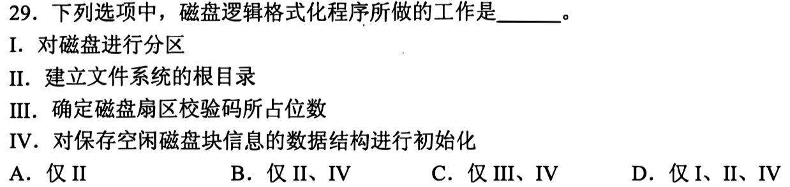
> </div>
>
> $答案：B$
>
> $I属于分区，分区和格式化是两件不同的事情$
>
> $III是低级格式化干的事情$


#### 磁盘调度算法

$首先注意：408中的SCAN=LOOK；C-SCAN=C-LOOK$

- **SCAN/LOOK：**来回都干活
- **C-SCAN/C-LOOK：**只在一个方向干活

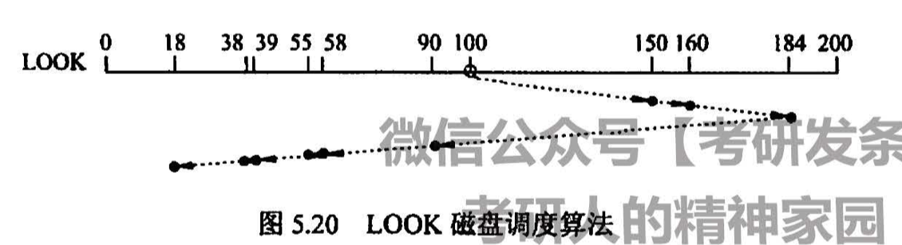

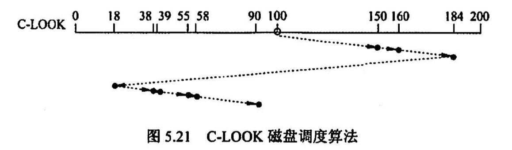

### 固态硬盘SSD

#### 原理

基于闪存FlashMemory技术属于电可擦除ROM(EEPROM)

#### 组成

**闪存翻译层：**负责翻译逻辑块号，找到对应的页（Page）

> 注意：在传统机械硬盘中，读写以“块”为基本单位，而在SSD中的“页”就相当于HDD中的块。

**存储介质：**多个闪存芯片（Flash Chip），每个Chip包含多个块（Block），每个Block包含多个Page

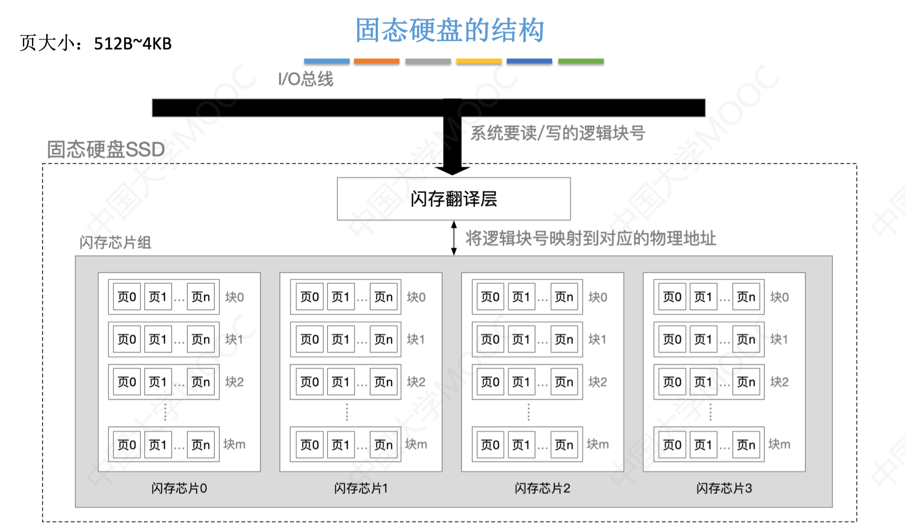

#### 读写特性

- 以Page为单位**读取**
- 以Block为单位**擦除**
- 读快写慢，如果要写入的页已经有数据，则需要先将块内其他复制到新的块中，再写入该新块

#### 磨损均衡技术（Wear Leveling）

**思想：**把“擦除”平均分布在各个块中，以提升使用寿命

- **动态磨损均衡：**写入数据时触发，**<u>优先选择擦除次数少</u>**的块
- **静态磨损均衡： **SSD在后台自己检测，判别。把**读多写少**的数据放到老旧的块中。让新块承担写任务。

### 缓冲区

#### **单缓冲**

处理平均时间：max(C,T)+M

#### **双缓冲**

处理平均时间：max(T,C+M)

#### 缓冲池

**三种队列**

- 空缓冲队列
- 输入队列
- 输出队列

**四种缓冲区**

- hin：收容输入
- hout：收容输出
- sin：提取输入
- sout：提取输出

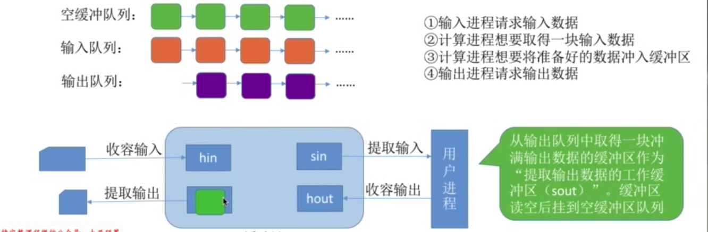

#### 磁盘高速缓存【补充】

**工作原理：**从**主存**中划出一片空间来存储磁盘中读出的块信息

（所以从**逻辑上**来看磁盘高速缓存是**<u>磁盘</u>**，但是**物理上**来看是<u>**驻留在主存当中的盘块**</u>）

**高速缓存在内存中的两种形式：**

- 在内存中单独开辟空间
- 把未利用的空间作为缓冲池

#### 高速缓存与缓冲区对比

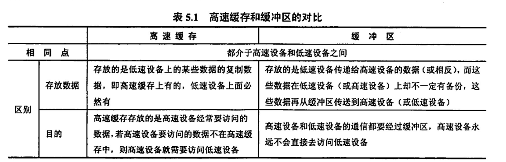

### IO接口

状态端口和控制端口可以共用一个寄存器

> 状态端口：用来存放IO设备状态
>
> 控制端口：用来存放控制命令
>
> 在一次完整的读写过程中，由于CPU会先查询状态，（当设备空闲时）才会向IO接口发出控制命令，**<u>且在本次操作结束前都不会再使用到设备的状态信息</u>**，所以两个端口的使用时间互不冲突，可以共用一个寄存器

### SPOOLing技术

#### **组成：**


#### 组件管理程序：

- **预输入程序：**管理输入缓冲区
- **缓输出程序：**管理输出缓冲区
- **井管理程序：**管理输入/输出井

#### 特点：

> - 提高IO速度
> - 将**独占设备**改成了**共享设备**
> - 实现了**虚拟设备**的功能（每个用户都认为自己独占了设备）
> - 由**OS**控制**设备**与**I/O井**之间的数据传送（因为SPOOLing的**内部实现细节是对用户透明**的，也正是如此，才会让用户觉得自己在独占设备）

#### 要求：

> - 需要**外存**支持
> - 需要**多道程序设计**支持


# NC冲刺背诵手册

## 常见失分点

1. 警惕**广播地址**：广播地址不占用主机数


## U1 网络体系结构

#### 记忆内容

- OSI模型与TCP/IP层次差异

  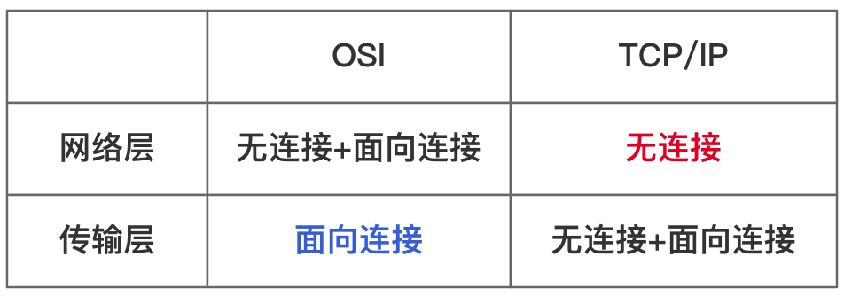

- 通信子网与资源子网

  - 通信子网：下三层
  - 资源子网：上三层

- 网络最核心功能：数据通信

- 点对点与广播式划分的依据：点对点网络采用**存储转发**技术

- 协议的组成：语法、语义、同步

- 应用层SAP：用户界面

#### ☆分组交换的时延

<div>
  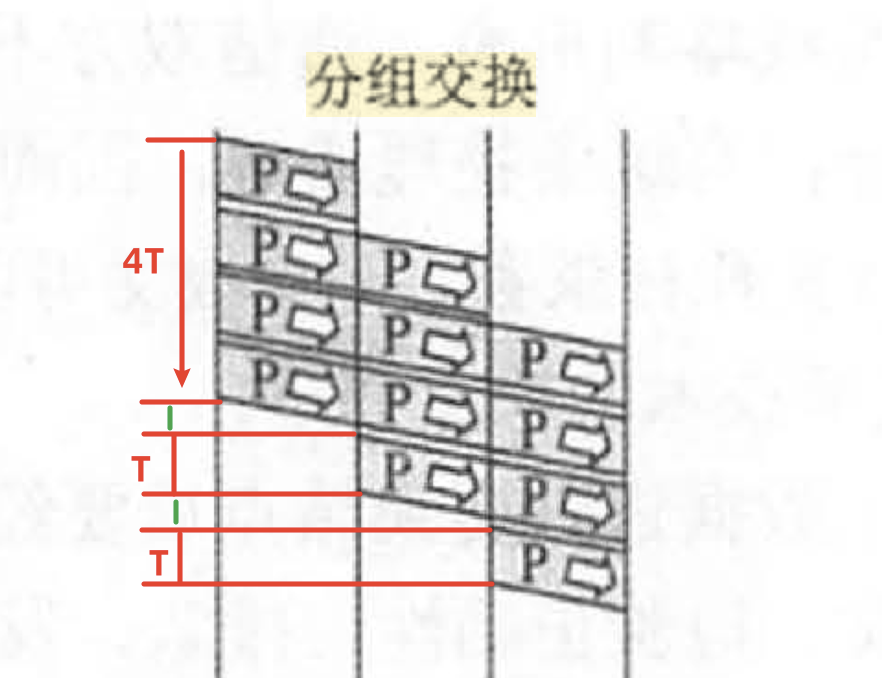
</div>


分组交换的时延与途径**路由器数量**密切相关。

根据上图可以发现，<u>**每经过一个路由器**</u>，就会**<u>多出一段发送时延与传播时延</u>**

$假设共有x个报文段，途径k个路由器（也就是k+1段链路），发送时延=T_发，传播时延=T_传。则：$

$总发送时延=(x+k)T_发$

$总传播时延=(k+1)T_传$

**例题**

> 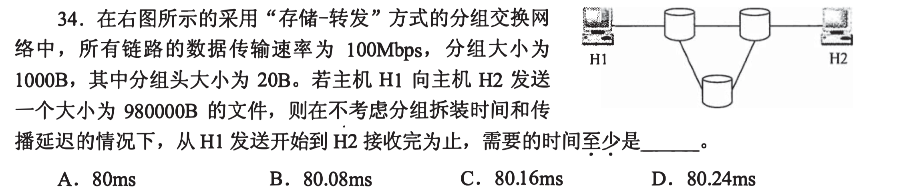
>
> $分析：$
>
> $由于题目问的是至少时间，所以选择路由器少的链路，也就是上面那条$
>
> $题目要求忽略传播时延与分组拆装时延,所以仅考虑总发送时延$
>
> 
>
> $解析：$
>
> $已知经过2个路由(3段链路)$
>
> $先计算单个分组的发送时延，T_发=\frac{1000B}{100Mbps}=\frac{8000b}{100Mbps}=0.08ms$
>
> $然后计算分组数，每个分组实际数据大小=1000B-20B=980B$
>
> $共有\frac{980000B}{980B}=1000组$
>
> $\therefore 总发送时延=(1000+2)*T_发=1002*0.08ms=80.16ms,选C$


<div STYLE="page-break-after: always;"></div>

## U2 物理层

### 记忆内容

- **虚电路转发方式特点？**

  > - 可以确保数据有序到达
  > - 需要提前建立连接，但是**无需预分配带宽☆**（因为“虚”就虚在虚电路的线路结点**并非独占**）
  > - **建立**虚电路时，需要路由选择
  > - 根据虚电路号（VCID）进行转发


- **关于”以太网“的物理层特性**

  > **曼彻斯特编码：** **每个比特需要2个信号周期**（2个Baud）来表示，相当于**每个Baud携带0.5bit信息**


### 各种特性

- **机械特性**：接口、形状、引脚
- **电气特性**：**电压范围**、抗阻
- **功能特性**：高低电平的具体含义
- **规程特性**：规程和时序

### 通信方式

- **单工**：单向通信
- **半双工**：双向但不能同时通信（对讲机）
- **全双工**：双向同时通信

### 奈氏准则

$理想低通极限传输速率=2Wlog_2V\ \ \ (V表示有几种码元)$

### 香农公式

$信道的极限传输速率=Wlog_2(1+\frac{S}{N})$

$信噪比=10log_{10}\frac{S}{N}(单位:db)$

$注意：若一个码元携带n比特信息，则MBaud码元传输速率为:M*n\ bit/s！！$

### 编码与调制

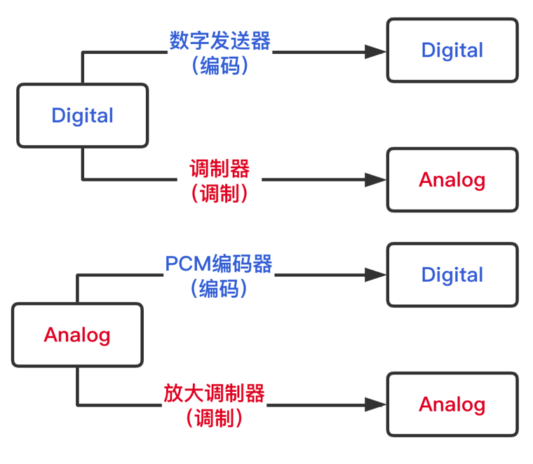

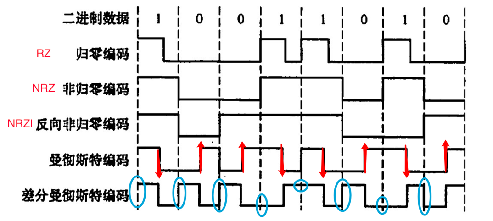

### 数据交换方式（特点）

#### 电路交换

- 独占线路
- 传播时延最小，实时性强 （*适用于实时性要求较高的场景*）
- **不纠错**
- **一个结点挂了，整条线路就废了**

#### 报文交换

- 将数据切分为报文
- 报文大小无限制（因此传输时延**不固定**）
- 要求通信节点有一定的交换空间

#### 分组交换

- 将报文切分为**分组**
- 分组大小有上限（传输时延相对稳定）
- **线路利用率高**
- 需要额外的信息开销

#### 分组交换的两种实现方式：

**数据报服务：**

- 无需建立连接
- 每个分组独立进行路由选择与转发（因此每个分组都要包含**完整的发送端、接收端地址**）
- 不保证数据可靠性（可靠性由主机负责）
- **数据不一定有序**
- **结点发生故障：立刻寻址切换新结点**（*适用于故障率较高的网络*）

**虚电路服务：**

- 通信三阶段：1、虚电路建立  2、数据传输  3、虚电路释放
- 仅在建立电路阶段时候用**目的地址**（后续使用**虚电路号**）
- **保证分组有序到达**
- **结点发生故障：重新建立一条新的虚电路**（时间开销还是挺大的，所以**不适用**于故障率高的网络）

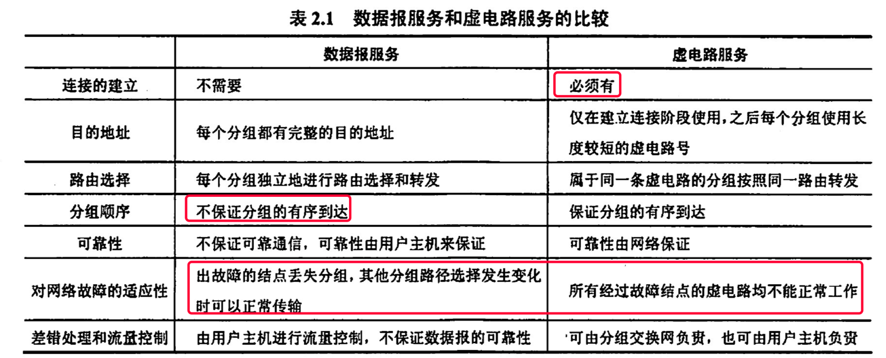

### 传输介质

**同轴电缆**

- 50Ω同轴电缆：基带**数字**信号

- 75Ω同轴电缆：宽带**模拟**信号（有线电视）

### 物理层设备

#### 中继器（转发器）

**主要功能：**再生（整型并放大）**数字**信号

**5-4-3原则：**

- 最多5段介质
- 用4个中继器相连
- 最多3段可以挂PC

**与放大器的区别：**☆**（放宽中基）**

- 放大器放大的是**模拟信号（直接放大）（宽带传输）**

- 中继器放大的是**数字信号（整形后再生）（基带传输）**

#### 集线器（Hub）

**本质：**多端口的中继器

**重要性质：**

- 无法分割冲突域
- Hub只能在**半双工**模式下工作

<u>408中默认Hub传输速率为**100Mbps！！！**</u>☆


<div STYLE="page-break-after: always;"></div>

## U3 数链层

### 记忆内容

- $以太网帧首部+尾部=18B；数据部分46B-1500B$ 

- **当同一个局域网，两个设备使用<u>相同的MAC地址</u>，会发生什么？**

  > 两个设备**都不能正常通信**
  >
  > 在这种互斥情况下，**通常双方都是无法正常工作的**，好比是局域网内两个电脑用同一个IP，都不能正常上网


- 交换机泛洪发送：除**发出端口**外的**所有端口**

- **划分子网的好处？**

  >  减小**广播域**的大小


- **IP数据报可以在哪些地方分片？**

  > 路由器分片，目的主机重组

- **NAT端口转发、丢弃规则？**

  > 如果表中**找不到，直接丢弃**
  >
  > NAT转换表由管理员**手工添加**

- **AS分区的好处？**

  >  使得**洪泛**交换信息的**范围缩小**，每次洪泛不需要对整个AS洪泛

- **BGP交换的内容？**

  >按时间划分：
  >
  >**首次**交换整个路由表，随后每次更新**有变化的部分**
  >
  >可达信息：到达某个网络所经过的**路径**

- **各种互连/互联问题集合**

  > - 路由器互联：下三层**可不同**
  > - 异构网络：下两层**可不同**
  > - 网段互联：本层和下层相同
  > - 集线器两端互联：全一样

- **对正确收到的帧进行确认的MAC协议是？**

  > **CSMA/CA**
  >
  > 由于CSMA/CA是采用**碰撞避免**的，所以一定要利用ACK确认机制来告知对方自己已经正确收到

### 海明码

#### **基本概念：**

- 码距：两个码字之间**内容不相同的位数**的**个数**
- 一个集合的码距：该集合中任意两个数据码距的**最小值**

#### （海明距）码距要求：

- 检d位错：d+1
- 纠d位错：2d+1

#### ①确定校验位数

$海明不等式：2^r≥m+r+1$

$r:校验码位数$

$m：原数据长度$

> 常见校验位
>
> 2-4位：3位校验
>
> 5-11位：4位校验

#### ②确定校验位的值

这个首先要看是**奇校验**还是**偶校验**（默认偶）

先将完整的带校验位的数据平铺写好，下标从右1往左标

第k位校验码，从第k位开始，画k隔k，数1的个数，最后加上校验位满足1的个数=奇/偶 即可

#### ③检错

同样把所有校验位画k隔k看是否满足奇/偶校验

最后把所有出错校验位的下标相加=出错位的下标

### 流量控制与可靠传输☆

#### 窗口大小：

- $停止等待：发1收1$
- $GBN:发1\sim 2^n-1,收1(默认)，大前提\  收+发≤2^n$
- $SR：1<发=收≤2^{n-1}$

> 注意：计算窗口编号比特数的时候，除了计算发送窗口大小，千万不要忘了**还要考虑接收窗口的大小！！**
>
> 【2015年T35】
>
> <div>
>   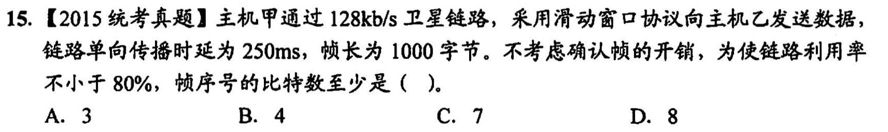
> </div>
>
> 解：
>
> 设发送窗口大小为n，根据题目列出等式：
>
> $\frac{n*8000bit/128kbps}{8000bit/128kbps+2*250ms} \ge 80\% ，解得n\ge7.2$
>
> 因为问的是最少比特数，所以考虑接收窗口大小为1，则有
>
> $2^x\ge 7.2+1，解得x=4$
>
> 选B

#### 超时重传细节：

- GBN：超时后，只要是**<u>已发出，且未收到确认的帧</u>**，都得重传 
- SR：超时后，**<u>仅超时的那个帧</u>**需要重传

注意⚠️：滑动窗口编号的范围只和**编号比特数大小**相关，与发送窗口大小**无关！！**

$例题：(主要看2、3小问)$

> 【2017年T47】
>
> <div>
> 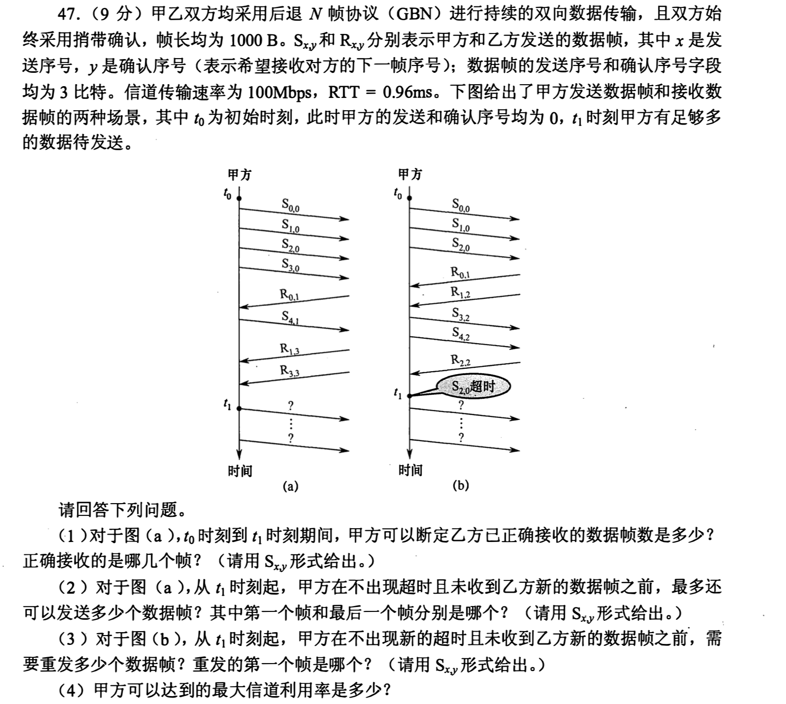
> </div>
> 
>
> $解析：$
>
> $(1):$
>
> $观察图a发现对方最后发来的是R_{3,3}，但由于不是按序发来的，所以被丢弃，所以最终有效帧为R_{1,3}$
>
> $表示3号帧之前的都已收到，所以乙方正确接收的3个帧为：S_{0,0}、S_{1,0}、S_{2,0}$
>
> $(2):$
>
> $做这种题首先需要知道发送窗口的大小以及帧编号的表示范围$
>
> $已知题中采用GBN协议，且发送序号为3bit，总窗口大小=2^3=8$
>
> $GBN协议中默认发送窗口=2^n-1；接收窗口=1，所以本题中发送窗口大小为7，编号范围为0-7$
>
> **<u>（这里可千万不要以为发送窗口是7，编号就是0-6了，和发送窗口大小无关！！）</u>**
>
> $已知目前已发送出去的是：S_{0,0}、S_{1,0}、S_{2,0}、S_{3,0}、S_{4,0}，其中前三个已被正确接收$
>
> $所以窗口向后滑动，由下图可知剩余5个帧可发送，且期望收到乙方的下一个帧序号为2$
>
> $所以第一个为S_{5,2}，最后一个为S_{1,2}$
>
> <div>
> 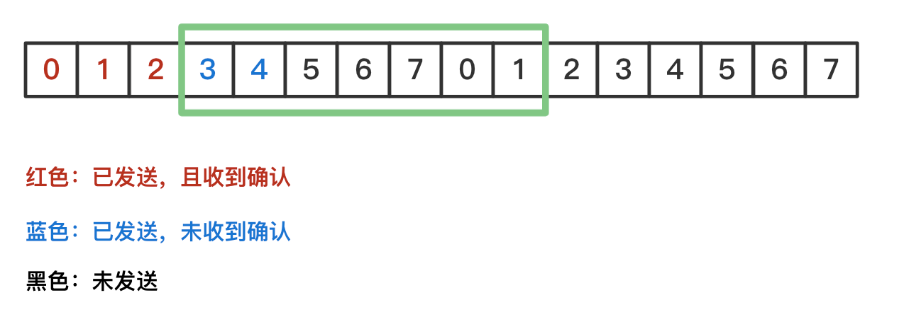
> </div>
>
>
> $(3):$
>
> $由图b可知，S_{2,0}超时时，已发出且未收到确认的帧有：S_{2,0}、S_{3,2}、S_{4,2},所以需要重传3个帧$
>
> $重发的第一个帧为S_{2,3}$
>
> $(4):$
>
> $最大信号利用率=\frac{7个帧发送的时间}{1个帧的往返全部时间}=\frac{7*1000B/100Mbps}{\frac{1000B}{100Mbps}*2+0.96ms}*100\%=50\%$


### 常见计算☆

- **有效数据传输速率：**

  在**一个周期内**能够发送的**有效数据大小**
  $$
  通常=\frac{有效数据长度}{T_D+RTT+T_A}\\
  T_D:第一个帧的发送时间\\
  T_A:接收第一个ACK的时间
  $$

- **信道利用率：**

  从发送第一个帧，到收到第一个确认所耗费的时间中，**真正用于数据发送的时间**占比
  $$
  信道利用率=\frac{数据发送时间}{T_D+RTT+T_A}\\
  T_D:第一个帧的发送时间\\
  T_A:接收第一个ACK的时间
  $$

- **变长信道利用率计算☆**


> 分析：
>
> 很显这是一道变长的数据帧的题目，所以首先需要先根据要求确定数据帧的长度。
>
> 题目要求使得信道利用率达到最高，所以应该先列出帧长与信道利用率之间的关系，再确定帧长。
>
> 解：
>
> $信道利用率=\frac{传输n个帧的时间}{传输1个帧的周期}$
>
> 一个帧通常要经过4个周期，分别是：**发送端**发送时延+<u>**发送端**传播时延+**接收端**发送时延</u>+**接收端**传播时延(两个传播时延就是RTT)
>
> 设数据帧长度为$x,x\in[128,512]$，共发送$n$个帧，则可得出
>
> $传输n个帧的时间=\frac{x*8}{16kbps}*n\ \ \ (*)$
>
> $1个帧的传输周期=\frac{x*8}{16kbps}*2+RTT\ \ \ (**)$（因为接收方采用数据帧等长确认）
>
> 为了让信道利用率最大，所以假设信道利用率=100%=1
>
> $\frac{(*)}{(**)}=信道利用率=1$，化简后得到$n$与$x$之间的关系为：$x=\frac{540ms*2kbps}{n-1}$
>
> **<u>已知，发送的帧数越多，信道利用率越高</u>**，所以让$n$尽可能大，$x$就应该取最小 $\therefore x=128B$
>
> $x=128代入求得n\approx 10$
>
> $又2^3≤10≤2^4，所以至少应该要4bit作为编号$


### CSMA总结

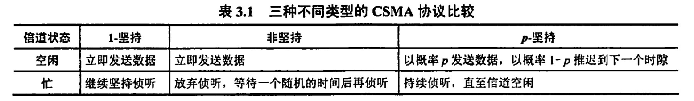

### CSMA/CD

- $最小帧长=总线传播时延(单程)*数据传输速率*2$

- **争用期：** 2τ （定义：信号在**最远两个端点之间**往返传输的时间）

- **截断二进制退避指数算法**

  $退避时间 = 基本退避时间（2τ）* 随机数r$

- **随机数r的生成**

- - $r ∈ { 0,1,2,3……,2^k-1 }$
  - $k = min(重传次数, 10)$

  - 当重传次数达到**16次**而未成功时，表名主机数量太多，应该**丢弃该帧**，并上报高层

- 算法优点

  - 可使重传时间**随重传次数增大而增大**

#### 最小帧长综合题☆

> $【16年T36】$
>
> <div>
> 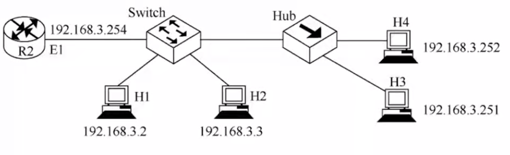
> 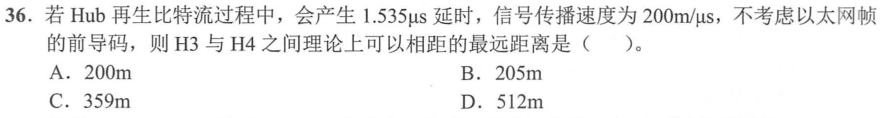
> </div>
>
>
> $解析：$
>
> 首先需要知道本题中隐含的信息
>
> - Hub默认传输速率：100Mbps
> - 以太网（不含前导码）最短帧长：64B
>
> 然后进行分析：
>
> $根据本题的已知条件，可以看出是让你通过已知的最小帧长，来求出最远传播距离$
>
> $已知，最小帧长=2*数据传输速率*总线传播时延$
>
> $由于本题中Hub也有时延，所以总线传播时延=线路播时延+Hub时延$
>
> $64B*8bit/B=2*100Mbps*总线传播时延$
>
> $\Rightarrow 总线传播时延=256*10^{-8}s=2.56\mu s$
>
> $\Rightarrow 线路传播时延=2.56 \mu s-1.535\mu s=1.025\mu s$
>
> $所以最远距离=1.025\mu s * 200m/\mu s=205m$
>
> $选D$

### CSMA/CA

#### 帧类型：

- **SIFS：**最短的帧，用来分隔两次会话间的各帧
- **PIFS：**中等长度的帧，在PCF中使用
- **DIFS：**最长的帧，当检测到空闲时刻，先发送一个DIFS。（用于异步竞争的访问时序）

<div>
  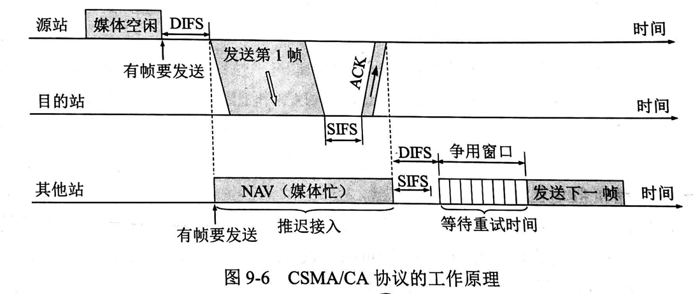
</div>

### 令牌环网络


### 以太网

#### 传输介质

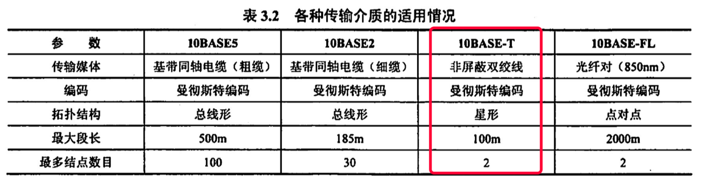

#### 以太网优化通信的方式

- **无连接**工作方式，**不可靠**服务
- **不对发送的帧编号，也不要求确认**

- **曼彻斯特编码**（所以只能保证无差错接受，并不保证服务可靠）

#### 3种高速以太网

|          | 100BASE-T                      | Gbit                           | 10Gbit   |
| -------- | ------------------------------ | ------------------------------ | -------- |
| 速率     | $100Mbps$                      | $1Gbps$                        | $10Gbps$ |
| 传输介质 | $双绞线$                       | $802.ab:双绞线\\802.z:光纤$    | $光纤$   |
| 工作方式 | $半双工+全双工(不使用CSMA/CD)$ | $半双工+全双工(不使用CSMA/CD)$ | $全双工$ |
| 最大段长 | $100米$                        |                                |          |

### IEEE802.11无线局域网

**802.11 MAC帧格式：**

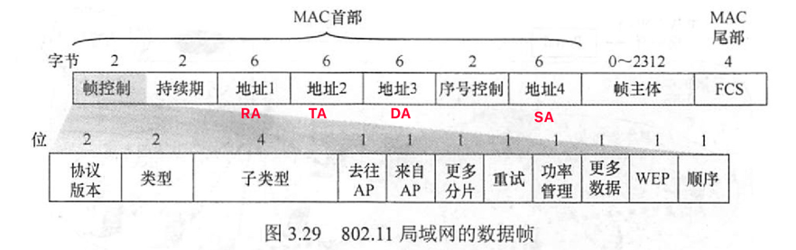

- $口诀：从地址2\rightarrow 地址1，剩下一个为地址3$

> 这句口诀的核心在于搞清楚题目所问的802.11帧（在经典两段链路中）是在**<u>哪两个设备之间传输</u>**，以及**<u>传输的方向</u>**

$例题：$

> 【17年T35】
>
> <div>
> 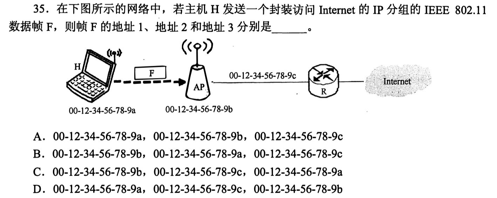
> </div>
>
>
> $解析：$
>
> $由图可知F帧从H发往AP，应用口诀：H为地址2，AP为地址1，则剩下的R为地址3$
>
> $选B$


### VLAN

- **划分方式**：

  $基于端口$

  $基于MAC$

  $基于IP$

### 数链层设备

#### 以太网交换机

- 本质：多端口的**网桥**
- 特点：独占传输媒体带宽，**带宽随着连接设备的增多而增大**（最大优点）

**交换机类型**

- 直通式：延迟小；**只检查目的MAC地址(6B)【意味着最少只需要读6B的内容即可】**
- 存储转发式：可靠性高，支持**不同速率端口**之间转换【**缺点**：延迟较大】

$例题：$

> <div>
>   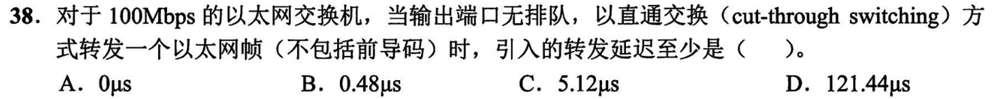
> </div>
>
> $解析：$
>
> $直通式只检查6B：\frac{6B}{100Mbps}=\frac{48b}{100Mbps}=0.48\mu s$

**以太网交换机速率计算**

- 以太网交换机端口上标注的**带宽**，就是每个连接点的**平均带宽。全双工状态下*2倍**
  - 整个交换机的总带宽是按照**接口对（一对=2个接口）**的数量来计算的。
  - $总带宽=N对接口*每个接口的平均带宽$

**以太网交换机自学习功能**

>  以太网交换机通过自学习功能来建立起”帧交换表“

交换机自学习流程如下：

① 收到帧后**登记<u>源MAC地址</u>，及<u>接口号</u>**

② 根据交换表查询结果，会有三种情况

- **明确转发：**找到了
- **盲目转发（洪泛）：**没找到，向所有端口转发
- **明确丢弃：** **目标主机**和**源主机**同一端口，直接丢弃

注：交换表中每条记录都有自己的**有效时间**，到期删除，原因：

- 交换机接口所连接的设备发生变动
- 主机更换网卡

<div STYLE="page-break-after : always;"></div>

## U4 网络层

### 记忆内容

- $网络层只向上提供：简单灵活的无连接、尽最大努力交付的数据报服务！！$

  $（不保证数据不丢失，仅检测报文头差错，且不采用CRC校验）$

- **网络层的主要目的：**任意结点之间进行数据报传输

- 0.0.0.0只能作为**源地址**（表示本网络的任意一台主机）

- **NAT转换表**只能手工配置

- AS中有哪几类路由？

> 区域边界
>
> 区域内部
>
> 自治边界

- IP分组长度单位

> 总长度1B
>
> 片偏移8B的整数倍，**乘倍前**
>
> 首部长度4B
>
> （一种八片首饰）

- RIP距离计算的时候，直达距离为1

> 【16年T37】
>
> 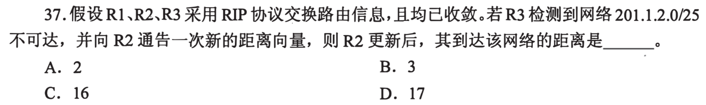
>
> $答案：B$


### SDN

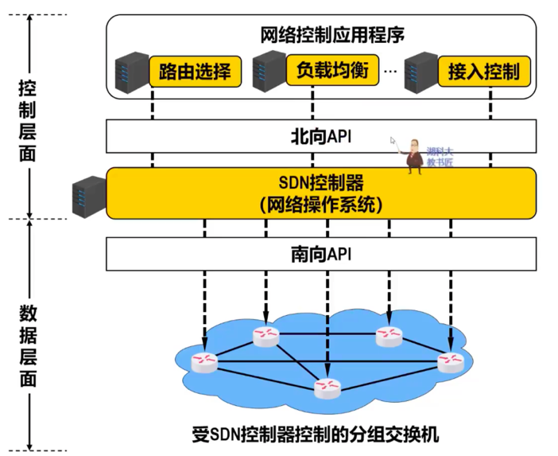


- **SDN优缺点**

| 优点                                       | 缺点                                         |
| ------------------------------------------ | -------------------------------------------- |
| 集中式控制**利于全局优化**，高性能转发     | **安全风险**，集中控制容易导致被一锅端       |
| 可编程是网络配置**更加灵活**               | 随着网络规模增大，**控制器可能称为性能瓶颈** |
| 控制层与数据层分离后，网络设备**成本降低** |                                              |

### IP首部格式

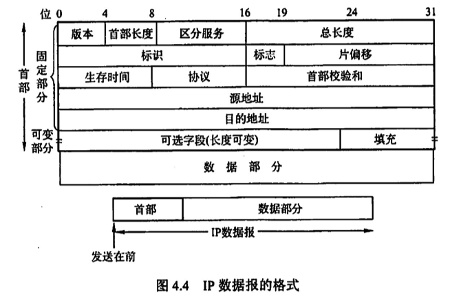

### 数据报分片

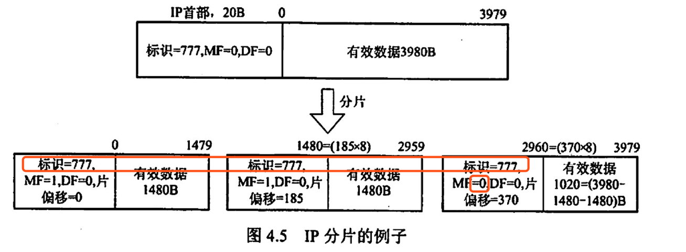

- **片偏移*8**=数据部分长度，他是小的，**==并不是==**8的倍数，不要搞混了！！！

- MUT包含首部，片偏移**不包含**首部

- $最大片长=\lfloor (MTU-首部长度)/8\rfloor$


### IP地址

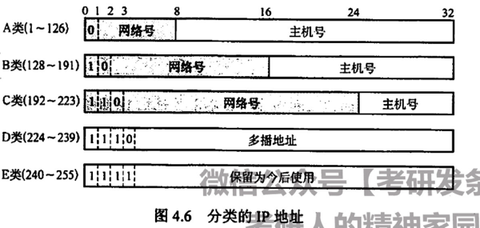

- **不用作**主机的IP地址
  - **255.255.255.255** **受限广播地址**（整个TCP/IP网络的广播）
  - **0.0.0.0**表示本网络主机（只能作为**源地址**）
  - **127**环回地址
  - 主机号**全1表示广播地址**
  - 主机号**全0表示网络号**

#### 变长子网划分 【重要⚠️】

- $一般采用画二叉树法来避免前缀编码$

**如何判断能够完整构成一个子网？**

> $构建编码二叉树，遵循以下规则：$
>
> $①\ 所画的树必须同时包含题干编码和待判定编码$
>
> $②\ 从根往下找，找到第一个分支结点T$
>
> $T之后的每个非叶结点要么啥都没有，要么儿女双全$
>
> $例题：$
>
> 【21年T35】
>
> <div>
> 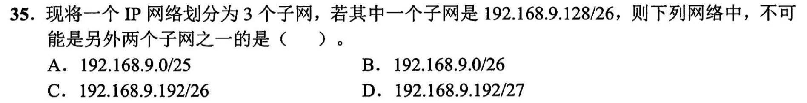
> </div>
>
>
> $解析：$
>
> $首先写出每个选项子网号有区别的部分$
>
> $由于4个选项的字子网掩码位数都>24位，所以前24位都相同，省略不写$
>
> - A：0
> - B：00
> - C：11
> - D：110
> - 题干：10
>
> 然后开始画树，画出来满足口诀且为**3个叶子结点**，则说明恰好能够划分为3个子网
>
> <div>
>   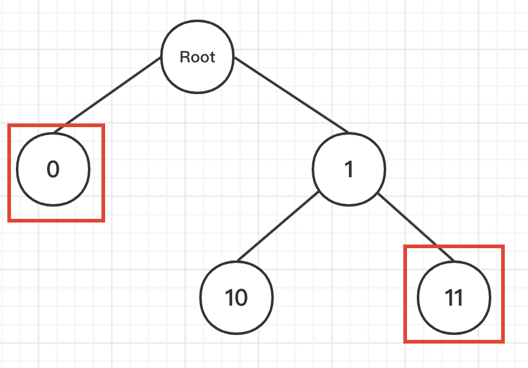
>   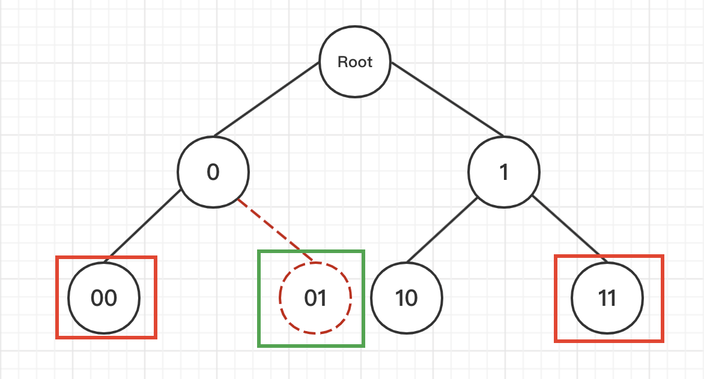
>   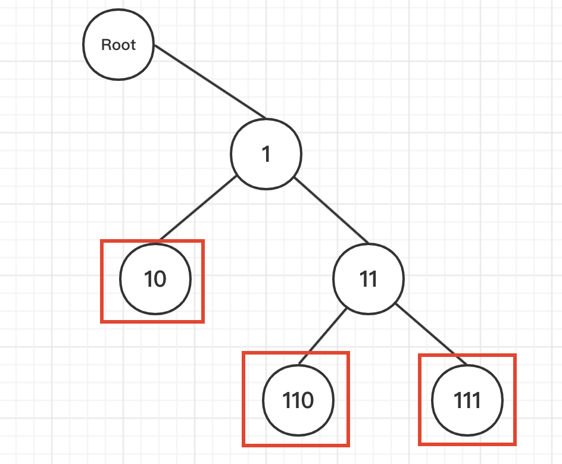
> </div>
> 
>
>
> 观察**图1**发现，0和11同时满足要求，**A,C排除**
>
> 观察**图2**发现，若引入00编码后，**为了保证儿女双全，还需加入01编码（图中虚线）**，此时二叉树存在4个叶结点，说明该种情况必须要划分为4个子网，<u>**B选项不满足要求**</u>
>
> 观察**图3**发现，10、110、111三个刚好能够聚合成一个**连续**的子网，**D选项符合要求，排除D**
>
> **选B**


### NAT

- **私有IP网段：**

  | TYPE   | ADDR                  |
  | ------ | --------------------- |
  | TYPE A | **10**.0~             |
  | TYPE B | 172.**16**~172.**31** |
  | TYPE C | 192.**168**.0~        |

- **注意点：**
  普通路由器**仅工作在网络层**：转发数据报时**不修改**源地址与目的地址

  带NAT功能的路由器转发时，需要查看**传输层**的端口号：**必须更换**源IP地址

### 主要协议

#### ARP

- **工作流程**

  ① 先查ARP高速缓存

  ②再发全F帧

  ③如果IP不在本网络，则交由默认网关请求ARP

#### DHCP

- **报文类型：**发现、提供、请求、确认

- **报文交换过程：**

  > C/S双方**目的地址**均采用**广播 255.255.255.255**
  >
  > Client 源地址均为**0.0.0.0**
  >
  > Server源地址均为**DHCP服务器本身IP**

#### ICMP

- **报文类型：**

```java
//差错报文：
		终点不可达
  	源点抑制：拥塞丢包
		改变路由（重定向）：有更好的路径
		参数问题
		时间超过：TTL=0
//询问报文：
    回送请求和回答报文：测试目的站是否可达及了解相关状态
    时间戳请求和回答报文：进行时钟同步和测量时间
    地址掩码请求和回答报文
    路由询问和通告报文
```


- **主要应用**
  - ping：（应用层，不经过传输层，直接使用网络层服务）**回送**请求与**回答**报文
  - traceroute：（网络层）时间超过型**差错**报文

#### OSPF与RIP主要区别

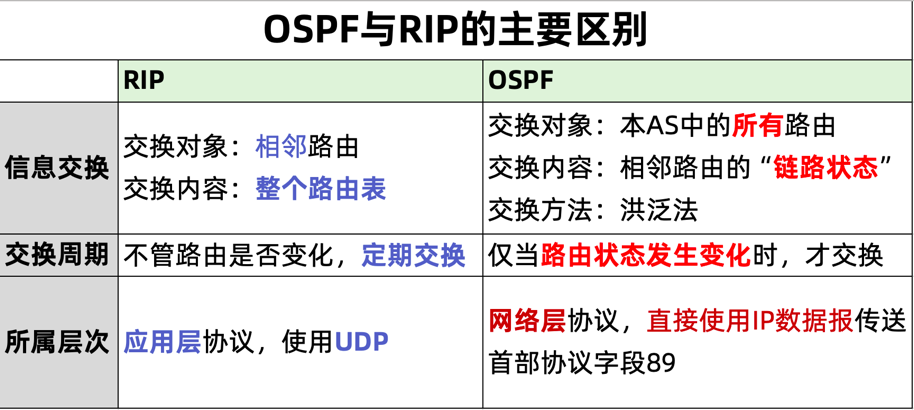

#### 协议之间的比较

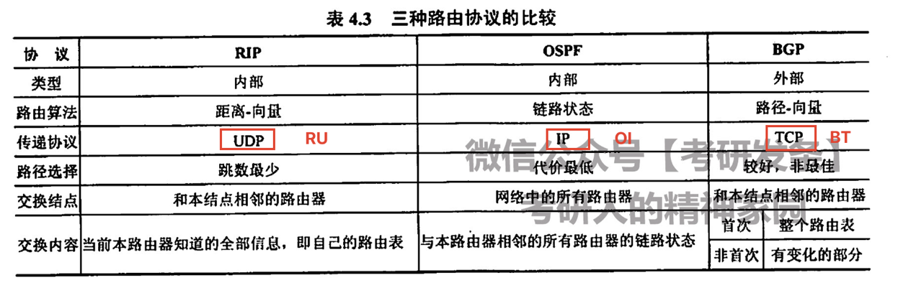

### IP组播

- **组播MAC地址：**01-00-5E开头

- **IP与MAC之间的映射**

  后23位一一对应

  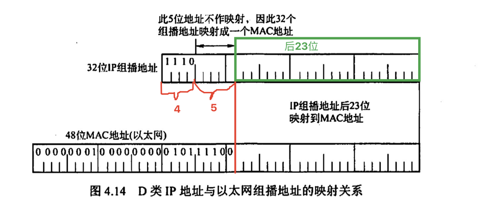

- **组播的路由选择协议：**

  - **协议无关**的组播PIM（可以建立于**任何路由协议**之上）
  - 基于**距离-向量**
  - 基于**链路状态**


### 网络层设备

#### 功能体系结构

| 路由选择           | 转发分组         |
| ------------------ | ---------------- |
| 路由**表**         | 一组**输入**端口 |
| 路由**选择协议**   | **交换**结构     |
| 路由**选择处理机** | 一组**输出**端口 |

#### 路由表与转发表

- **路由表包含：**目的IP、子网掩码、下一跳、接口
- 转发表由路由表得出，但更加精简

$当路由器监测到拥塞时，合理丢弃IP分组，并向该分组源主机发送ICMP源点抑制报文。$


<div STYLE="page-break-after: always;"></div>

## U5 传输层

### 易错点

- **网络层无法同时实现TCP和UDP**（总不能一会儿有连接一会儿无连接吧）
- 端口号仅具有**本地意义**
- $IP首部与TCP首部固定部分长度：20B$
- $TCP端口字段长度：2B，IP地址字段长度：4B，MAC地址字段长度：6B$
- **TCP与虚电路服务的区别？**

> TCP报文段**在路由中不可见**
>
> 在网络层中**若采用虚电路**，则网络层**无法提供无连接服务**，而传输层**TCP则不影响网络层提供无连接服务**

- TCP是面向字节的，每个**字节**都需要消耗一个序号

- **同一条PC中TCP与UDP的共存问题**

> **同一台计算机中**，TCP和UDP各自拥有自己的端口号，他们**互不干扰**

- **滑动窗口的作用？**

> 答：流量控制
>
> 注意区别于拥塞控制
>
> 拥塞窗口虽然确实是用来控制拥塞的，**但是拥塞窗口并不属于“滑动窗口”**。

- **判别是否需要对以太网帧填充**

> 当IP分组总长度**<46B**时，就需要对分组进行填充（**因为IP分组总长相当于MAC帧数据部分，MAC帧最小长度64B-MAC帧头尾18B=46B**）

- **两个已经建立连接的端口之间再建立连接，会怎样？**

> **建立失败**，但<u>不影响之前的链接</u>

### 常见熟知端口

| 应用程序 | FTP           | TELNET | SMTP | DNS  | TFTP | HTTP | POP3 | SNMP |
| -------- | ------------- | ------ | ---- | ---- | ---- | ---- | ---- | ---- |
| 端口号   | 21控制+20数据 | 23     | 25   | 53   | 69   | 80   | 110  | 161  |

### UDP

#### 首部格式

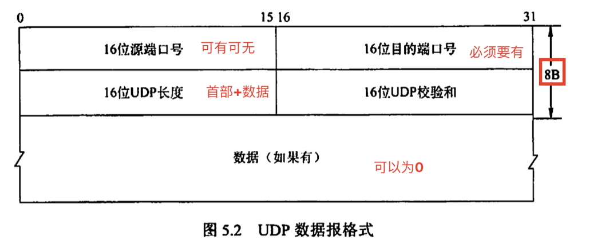

#### UDP校验

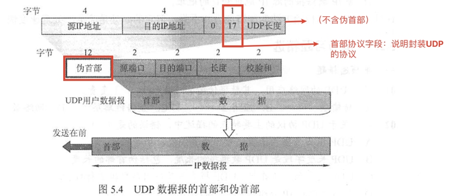

- UDP在计算校验和之前会增加12B的伪首部（仅用于计算校验和）
- UDP校验和**不仅校验首部，而且校验数据**

- UDP的校验和不是必须的
  - 禁用：全0
  - 恰好=0：全1

### TCP

#### 首部格式

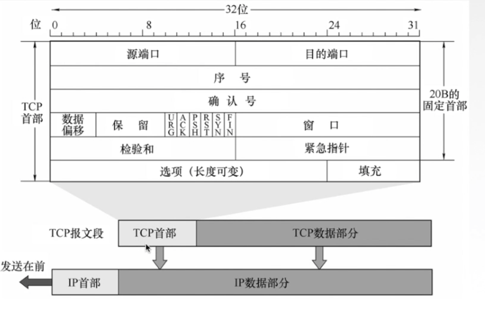

#### 三次握手

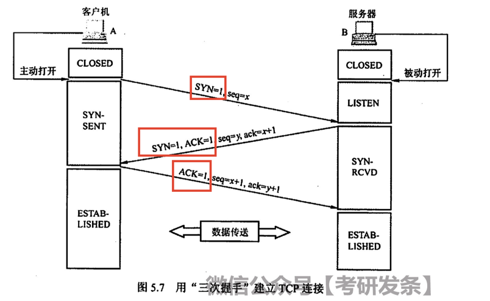

- 第三次握手就已经可以允许携带数据

- 服务器端的资源的在**第二次握手**时分配

- 客户端资源在**第三次握手**时分配

- 这使得服务器容易遭受**SYN洪泛攻击**
  - 指攻击者对服务器发送SYN后**不进行确认**，使得服务器的会话**一直处于挂起状态，资源得不到释放**


#### 四次挥手

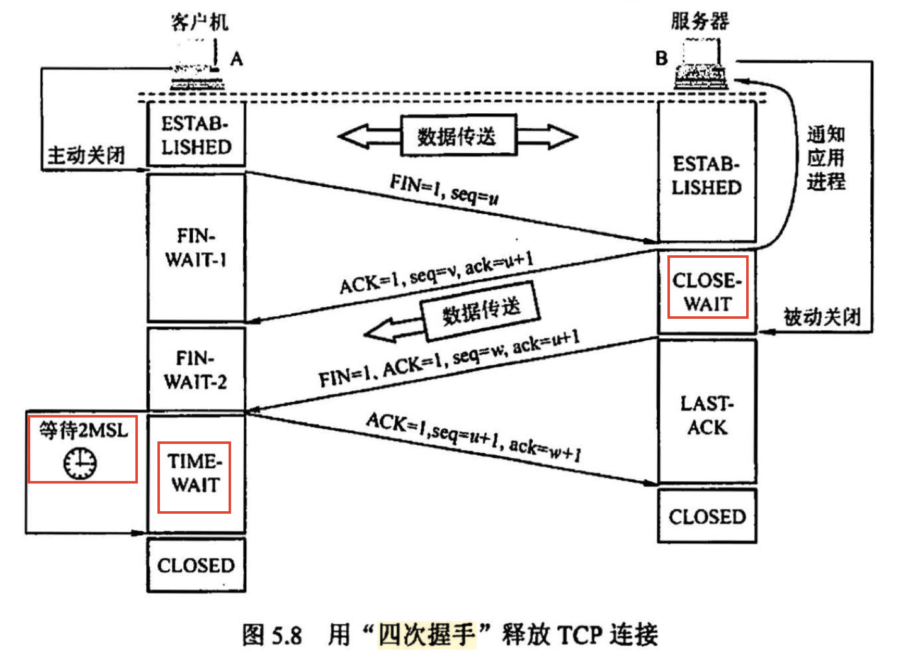

- 为什么客户端要等待2MSL后再关闭？

> 因为如果客户端发送的最后一次确认**没有成功送达，则服务器会超时重传**FIN=1的通知，**而2MSL的时间内足够客户端超时重传了**


<div STYLE="page-break-after: always;"></div>

## U6 应用层

### 易错点

- 问你最多查询次数的时候别忘了com之上还有根（注意区分是迭代还是递归）

> $例题：$
>
> <div>
> 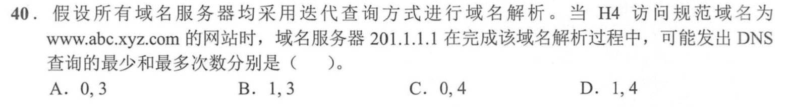
> </div>
>
>
> $解析：$
>
> $最少肯定是0次$
>
> $本地域名服务器最多分别访问：根、com、abc、xyz\ 一共4次$
>
> $根千万别忘了！！$

### HTTP

#### HTTP报文结构

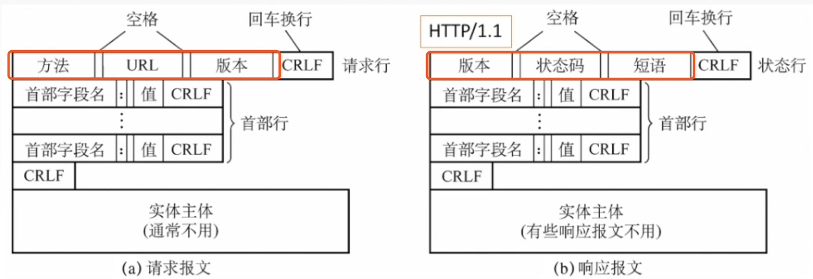


#### 连接方式

**非持久连接：**每次有新的请求都需要<u>重新建立</u>连接

**持久连接（HTTP 1.1默认支持）:**<u>无需</u>重新建立连接

**非流水线：**客户端在收到前一个响应之后才能发出下一个请求

**流水线：**类似于指令流水线

# DS冲刺背诵手册

## 线性表

#### 顺序表与链表的关系

|                          | 顺序表                        | 链表                         |
| ------------------------ | ----------------------------- | ---------------------------- |
| **是否需要连续存储单元** | 需要                          | 不需要                       |
| **存取方式**             | 顺序、**随机**存取            | 顺序                         |
| **删除和插入**           | 需要挪动**大量元素**          | 不需要移动元素，仅需修改指针 |
| **空间分配**             | 静态分配、或动态分配+挪动元素 | 动态分配、灵活高效           |
| **存储密度**             | 1                             | <1                           |


## 栈

### 卡特兰级数

$n个不同的元素进栈，出栈元素的所有可能排列情况共\frac{1}{n+1}C^{n}_{2n}种。$

### 求逆波兰表达式

$1、从左到右依次读取$

$2、操作数直接送往结果$

$3、左括号(：入运算符栈$

$4、运算符：$

​	$\bullet \ 若栈空则入栈$

​	$\bullet \ 优先级>栈顶，入栈$

​	$\bullet \ 优先级≤栈顶，重复弹出高优先级运算符(直至遇到优先级<自己的)\to 结果，再入栈$

$5、右括号)：重复弹栈\to 结果，直到左括号为止$

$口诀：$

$左弧入栈，右弧弹栈至左弧$

$栈空入栈，高入低弹至低入$

## 队列

### 双端队列

**双端队列：**允许队列的两端同时出入的队列

**输入受限的双端队列：**允许两端出队，一端入队

**输出受限的双端队列：**允许两端入队，一端出队

### 考点：受限的双端队列输出序列的合法性

主要思路：首先判断这个序列在栈中能否合法出栈，如果栈都不能，那受限双端队列一定也不能（因为如果将双端队列限制为仅允许同侧出入队，那双端队列就刚好退化为了**<u>栈</u>**）

接下来分受限类型来解题：

1. **输入受限：**

   这个相对简单点，直接根据序列把第一个要输出的元素入队后，接下依次出队，看看能否满足要求

2. **输出受限：**

   由于输出受限，所以先根据序列直接在队列中入队，看看能不能凑出和序列相同的队列。

   例子：如下图所示，如果输入顺序为1234，则2314在输出受限的双端队列中是不合法的。1入队后，接下来入队的一定是2，无论是从哪一端入队都无法得到3或4。所以不合法。

   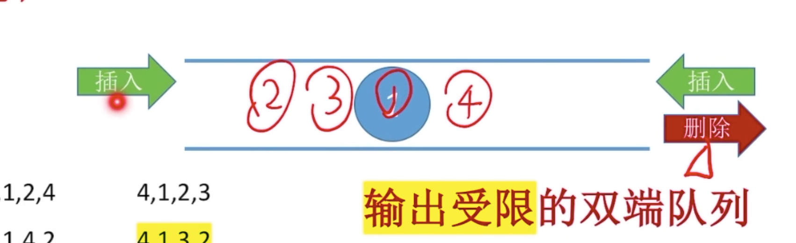

## 矩阵

### 矩阵的压缩存储

#### 三角矩阵

仅存储三角区所有元素（包括主对角线）+非三角区**常数项**，常数项<u>通常存在最后</u>

<div>
  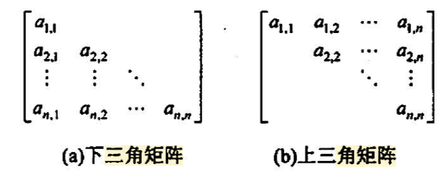
  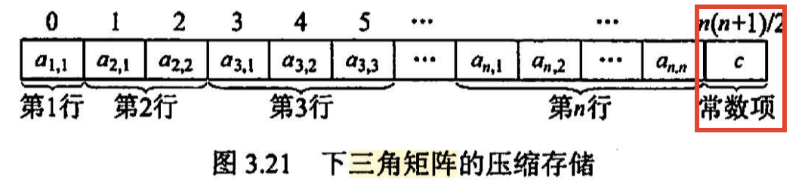
</div>


#### 三对角矩阵（带状矩阵）

仅存储带状区，不存常量

<div>
  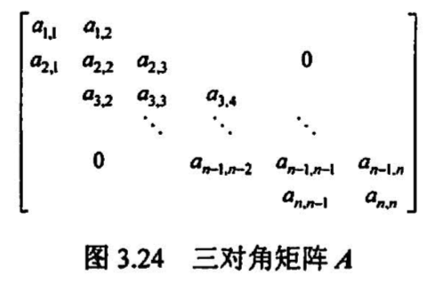
  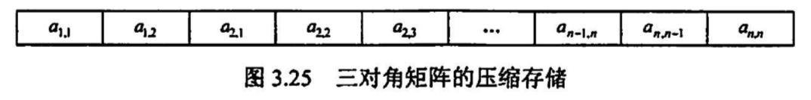
</div>


### 稀疏矩阵

采用**三元组（常用）**或**十字链表**存储

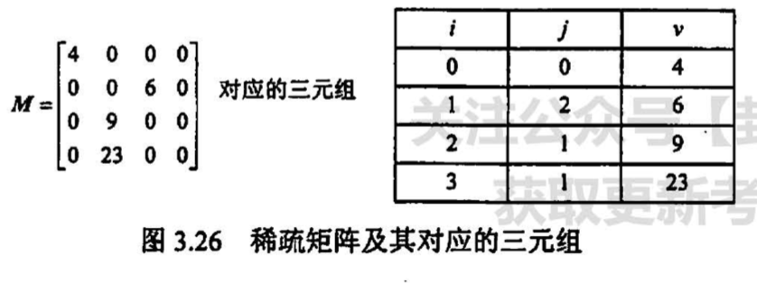


## 串

### KMP算法

**2种next[j]数组的计算：**

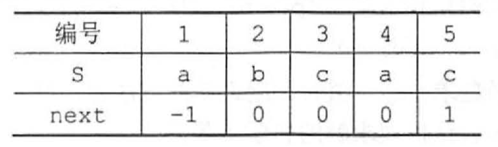

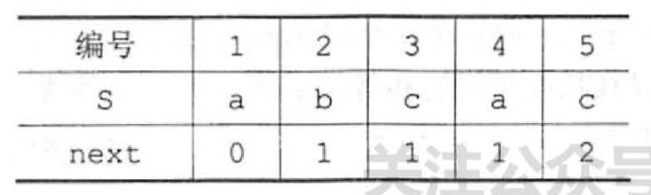

选择题的时候看答案有哪个就选哪个

Tips：**真题好像第一种较多**（细节：匹配失败后，j=next[j], i不动，然后直接开始比较）

> KMP比较次数的细节：每匹配失败一次，next指针回溯后，**<u>匹配失败的位置会多比较一次</u>**
>
> $例题：$
>
> 【19年T9】
>
> <div>
> 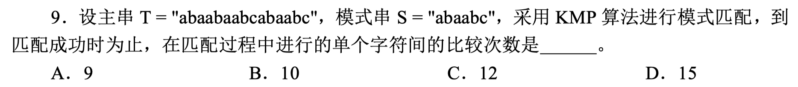
> </div>
>
> 
>
> $解析：$
>
> $首先计算模式串next[\ ]数组$
>
> | j           | a    | b    | a    | a    | b    | c    |
> | ----------- | ---- | ---- | ---- | ---- | ---- | ---- |
> | **next[j]** | -1   | 0    | 0    | 1    | 1    | 2    |
>
> $然后开始比较：$
>
> abaab**<u>a</u>**abcabaabc
>
> abaab**<u>c</u>**
>
> T[5]处出错，模式串回溯到next[5]=2=>S[2]，然后从**S[2]开始先匹配**（就是这一次导致多出了一次重复匹配，因为这个位置第一次比较已经出错了）
>
> abaabaabcabaabc
>
> ​      abaab**<u>c</u>**
>
> 出错前比较6次，出错回溯后比较4次，共比较10次
>
> B

## 树

### 普通树

#### 性质：

- $总结点数=总度数+1$

- $度为m的树，第i层最多m^{i-1}个结点(i\ge1)$

- $高度为h的m叉树最多有\frac{(m^h-1)}{(m-1)}个结点$
  - $推导过程：画出满m叉树，等比求和一下$

- $具有n个结点的m叉树的最小高度为\lceil\log_m(n(m-1)+1)\rceil$

  - $推导过程：$

  - $(左边不能取等号是因为n代表的是树高为h的m叉树的结点数量范围，取等号树高就变成h-1了)$
  
    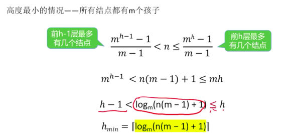

### 普通二叉树

#### 性质：

- $n_0=n_2+1(由下面两个式子推导而来)$

- $n=n_0+n_1+n_2(总结点数=所有结点之和)$

- $n=n_1+2n_2+1 \ (总结点数=各结点度之和+1)$

- $非空二叉树的第i层最多有2^{i-1}个结点（k\ge1）$

- $高度为h的二叉树最多有2^h-1个结点(h\ge1),此时为满二叉$


#### 树和森林的遍历关系

| 树   | 森林 | 二叉树 |
| ---- | ---- | ------ |
| 先根 | 先序 | 先序   |
| 后根 | 中序 | 中序   |

> 反正记住两点：①树没有中根遍历、②森林遍历顺序与二叉树遍历顺序相同

### 完全二叉树

#### 性质：

- **度**与**结点**之间的关系

> - $2k个结点$
>
>   $k_0=k,\ k_1=1,\ k_2=k-1$
>
> - $2k-1个结点$
>
>   $k_0=k,\ k_1=0,\ k_2=k-1$

$具有n个(n\ge1)结点的完全二叉树高度为 \lceil\log_2(n+1)\rceil 或 \lfloor \log_2n \rfloor +1$

#### 二叉树的顺序存储

- **基本操作**

  $取左孩子:2i$

  $取右孩子:2i+1$

  $取父节点:\lfloor i/2 \rfloor$

  $求当前所在层次:\lceil\log_2(i+1)\rceil 或 \lfloor \log_2i \rfloor +1$

  $（实际上求实完全二叉的高度）$

- **判断操作**

  $是否有左孩子:2i \le n\ (n为数组长度)$

  $是否有右孩子:2i+1\le n$

  $i是否为分支结点:i>\lfloor n/2 \rfloor$

### 哈夫曼树的应用

#### 判定两个

### BST二叉搜索树

#### 定义：

- $数据的中序遍历呈有序排列(可升序可降序)$

#### **插入操作：**

常规中序搜索

#### 删除操作：

- **叶结点：**直接删除

- **单子树：**用孩子代替自己的位置

  <div>
    
  </div>

- **双子树：**用中序遍历中的**前驱（或后继）**代替自己的位置

  <div>
    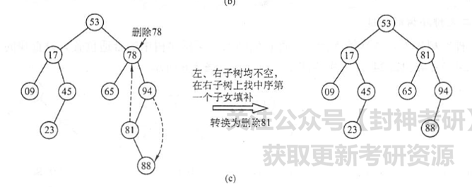
  </div>

#### 查找效率分析：

- **最优：**$O(log_2n)$  (平衡二叉树)
- **最差：**$O(n)$  (单分支树)

#### 【考点】BST树的删除再插入

- 如果被删除的**是叶结点**，重新插入后**<u>一定相同</u>**
- 如果被删除的**不是叶结点**，重新插入后**<u>一定不同</u>**

$例题：$

> 【13年T6】
>
> <div>
>   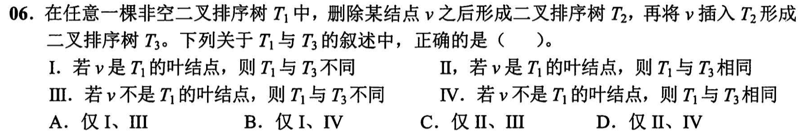
> </div>
>
> $答案：C$


### AVL平衡二叉树

#### 定义：

- $每个结点的|平衡因子|≤1$

> 平衡因子：左右子树的**高度差**

#### 插入操作☆：

核心就是从上往下找到**第一个不平衡的结点**，然后判断这个结点的哪一个子孙引起了不平衡，根据与子孙的相对位置，有着不同的插入操作

- **LL：**右单旋

  <div>
    
  </div>

- **RR：**左单旋

  <div>
    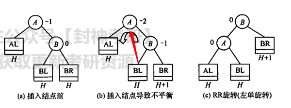
  </div>

- **LR：**左右双旋

  <div>
    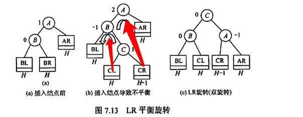
  </div>

- **RL：**右左双旋

  <div>
    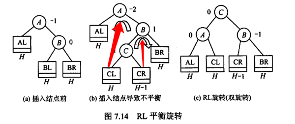
  </div>

#### 删除操作☆：

**原则：**先删除再调平，删除规则同BST，顶替结点的时候，**仅复制结点值，分支关系不动**

**调平步骤☆：**

- ① 从删除结点开始一路向北，搜索<u>最近</u>**不平衡结点（大哥）**【如果没有，则完结撒花】

- ② 找到【大哥】下面个头最高的【儿子】和【孙子】

  <div>
    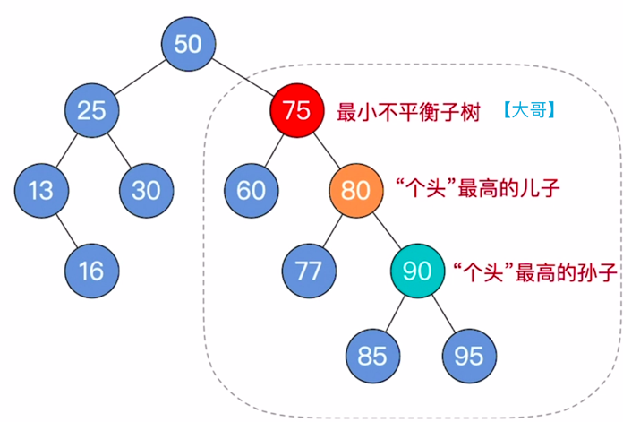
  </div>

- ③ 观察【孙子】与【大哥】之间的位置

  > LL：右单旋
  >
  > RR：左单旋
  >
  > LR：左右双旋
  >
  > RL：右左双旋

- ④ 如果不平衡向上传导，则重复①


#### 【考点】AVL树的删除再插入

**牢记核心：**在AVL树中，<u>无论什么情况都是有可能的</u>！！！⚠️

$例题:$

> 【2019年T4】
>
> <div>
> 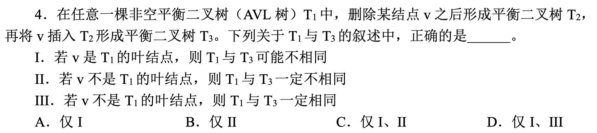
> </div>
>
>
> $解析：$
>
> I .✅：AVL树中**什么情况都是有可能的**
>
> II.反例：
>
> <div>
> 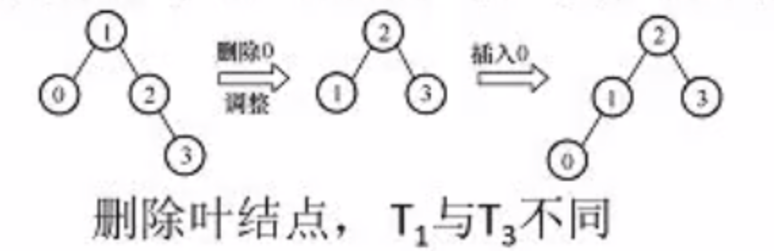
> </div>
>
> III.经典反例，可以记一下：
>
> <div>
> 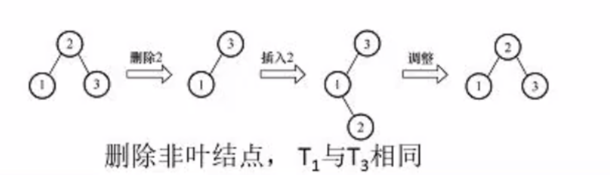
> </div>
>
> 所以最后答案选A

#### AVL的树高⚠️

$重要公式：n_h=n_{h-1}+n_{h-2}+1$

$含义：高为h的AVL含有的最少结点数$


### RBT红黑树

#### **定义：**

$口诀：左根右，根叶黑，不红红，黑路同$

- 根节点为黑

- 叶结点逻辑上为黑（物理上是NULL）

- 不存在相邻的红结点

- 整棵树中，**任意结点**的**黑高相同**

  > 黑高：从某一结点出发（不含该结点），**到达空叶结点**的路径上**黑结点的个数**

**重要结论**

> ① **根**到**叶结点**的**最长路径**≤**2\*最短路径**
>
> ② **只含有黑结点**的RBT一定是一颗**满二叉树**
>
> ③ 有n个内部结点（非叶结点）的红黑树高度 $h≤2log_2(n+1)$
>
> $推导过程：$
>
> - $一颗高为h的红黑树，黑高一定≥h/2$
> - $因此由性质②可得该红黑树结点数n≥2^{\frac{h}{2}}-1$
> - $化简后得到h≤2\log_2{(n+1)}$

#### 插入操作☆：

① 先查找，确定插入位置并插入

② 确定新结点类型

- 根节点：**染黑**
- 非根：**<u>染红</u>**

③ 观察插入后是否满足红黑树定义

- 满足：完结撒花
- 不满足：④

④ 看【叔叔】脸色形式

> 【叔叔】：父节点的兄弟结点

- **黑叔：**(判断**<u>爷孙位置</u>**)
  - LL：右单旋，**父换爷**+染色
  - RR：左单旋，**父换爷**+染色
  - LR：左右双旋，<u>儿换爷</u>+染色
  - RL：右左双旋，<u>儿换爷</u>+染色
- **<u>红叔</u>：**染色+变新；叔父爷染色，爷爷变新（**<u>把爷爷当做新结点后重复②</u>**）

#### 【红黑树重要考点】

- **红黑树删除时间复杂度？**：$O(log_2 n)$

- 红黑树删除结点的操作和BST的删除一样

- 删除结点后同样有可能破坏“红黑树特性”，需要再次调整


### B树

$B树又称"多路平衡二叉查找树"$

> 多路：每个结点都有多条路径向下查找
>
> 平衡：每个结点**每个子树高度都相同**

- B树的阶：每个结点**孩子个数的最大值**

#### m阶B树的性质：

- 每个结点最多m棵子树（等同于**m-1**个关键字）
- 若根节点**不是终端节点**，则最少可以**仅拥有2棵**子树

- 除**根节点**外，==**剩余的所有非叶结点**==至少有$\lceil m/2 \rceil$棵子树
- 所有叶结点都在**同一层次**上，且不带信息（**这里的叶结点类似于红黑树的NULL虚拟结点**）

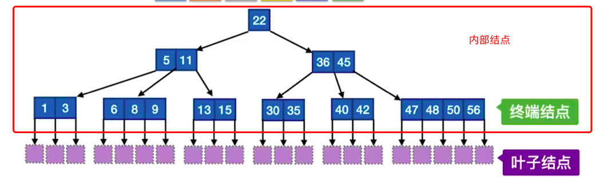

#### B树高度

- （首先需要知道，B树的**存取次数**与树的高度成正比）
- 与红黑树相同，**树高不含叶结点**
- **重要性质：**
  $n个关键字的B树必有n+1个叶子节点$

- **高度为h的m阶B树**

  $最小高度：h≥log_m(n+1)$

  $最大高度：h\le \log_{\lceil m/2 \rceil}(\frac{n+1}{2})+1$

#### B树查找

- 按照常规顺序查找

​	①在B数中找结点

​	②在结点内找关键字

#### B树插入

- 确定插入位置：利用“B树查找”确定插入位置

- 插入后判断**关键字数量**

  - $≤ m-1：插入结束$
  - $> m-1:从中间位置(\lceil m/2 \rceil)分裂，中间位置结点抬升至父节点$
  
  <div>
    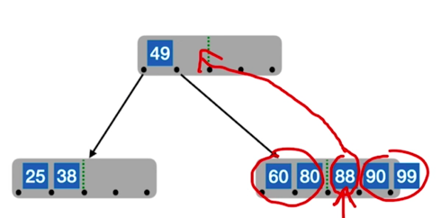
  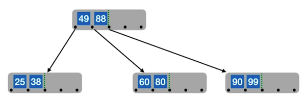
  </div>
  
- 检查>m-1是否**向上传递**，如果向上传递则继续分裂

#### B树删除

$①删除后依然用前驱/后继来代替$

$②如果删除后满足B树定义，结束；否则\to ③$

$③查看兄弟是否够借$

​	$\bullet \ 够借：$

​	$兄弟抬升，父节点下降(以借右兄弟为例)$

<div>
	  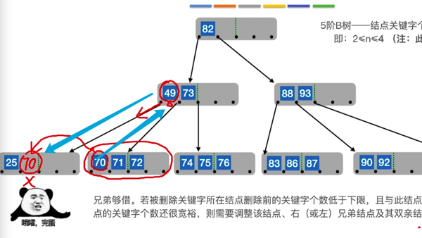
    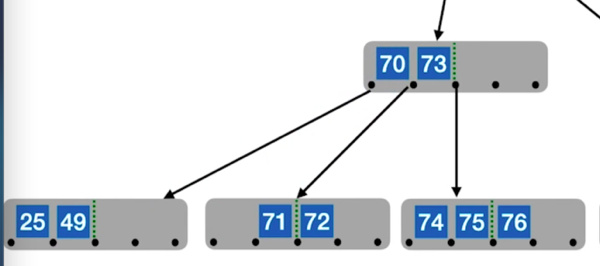
	</div>


​	$\bullet \ 不够借：$

​	$本身+全部兄弟+一个父节点，全合并$

<div style="margin-left:30px;">
	  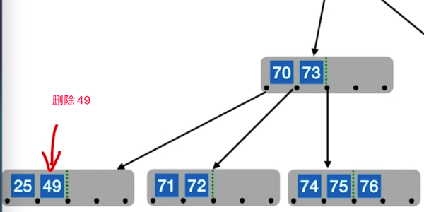
	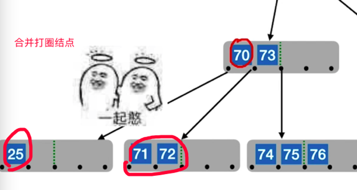
	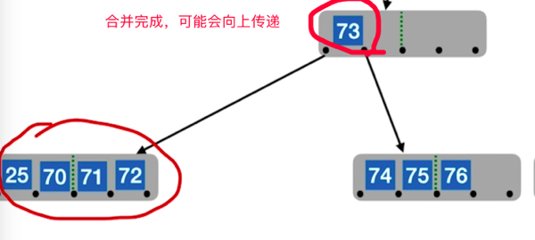
	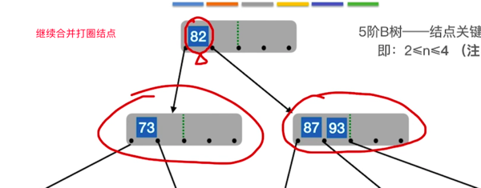
	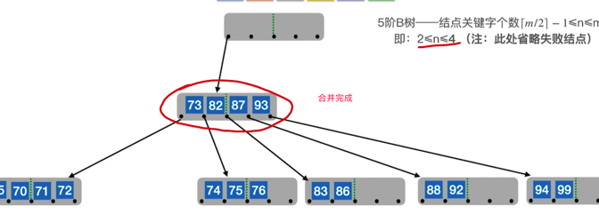
	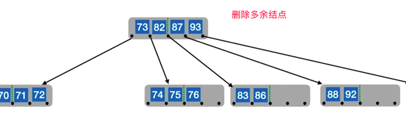
</div>


### B+树

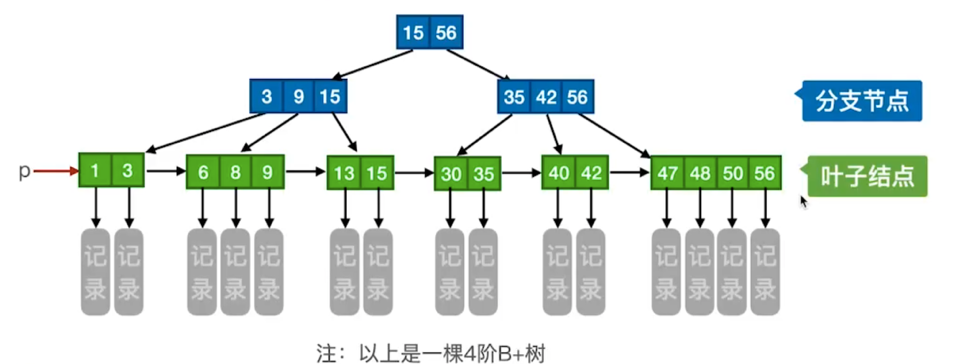

#### m阶B+树的性质：

- B+树的叶子结点是一整块，而不是其中某一个（如下图所示）

<div>
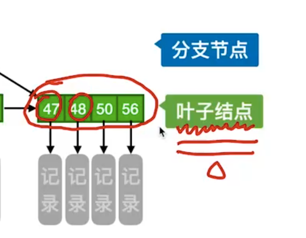
</div>


- 每个分支结点最多**<u>m个key</u>**（vs. B树最多m颗子树）
- **非叶根结点**至少两棵子树，**剩余分支结点**至少$\lceil m/2 \rceil$棵子树

- > - 所有叶结点（块）都应该包含**块中全部的key**，以及**指向对应记录的指针。**
  > - **叶结点中的key有序排列。**
  > - **相邻叶结点有序链接**（这也就意味着B+树**支持顺序查找**）

- 所有**分支结点仅包含子节点中的最大key**以及指向该子节点的指针

#### B树与B+树的比较：

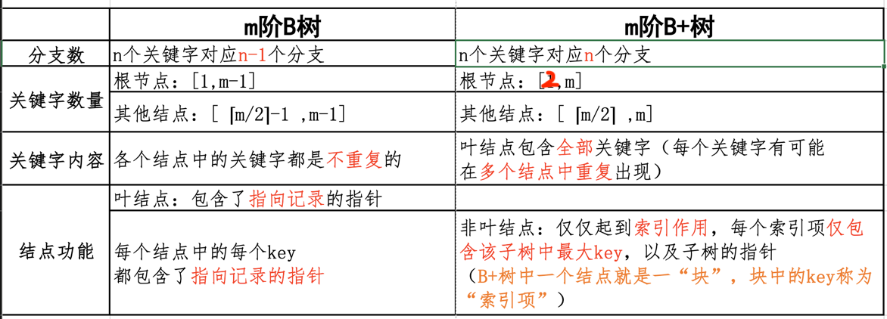

#### B+树的应用

> 牢记：B+树相比于B树，更加适合于**文件系统的索引数据库的<u>索引</u>**，磁盘读写代价更低。

### 树的WPL/ASL计算：

$WPL=节点权值*路径（注意不是层数）的累加$

注意：普通树的WPL需要计算**<u>所有结点</u>**，而HFM树仅需计算**<u>叶结点</u>**

#### ASL成功情况计算

计算方法：直接使用每个结点的**层高**进行计算（根节点层高为1，因为ASL本质上计算的就是比较次数）

$ASL_{成功}=\frac{每个成功结点的层高之和}{总成功结点数}=每个成功结点层高的加权平均$

$ASL_{失败}=\frac{(每个失败结点的层高-1)之和}{总失败结点数}；$

$(因为实际上失败结点是个空指针，访问空指针并不算是一次比较，所以失败结点的层高要减1)$

> 例：计算该树的成功ASL及失败ASL
>
> <div>
>   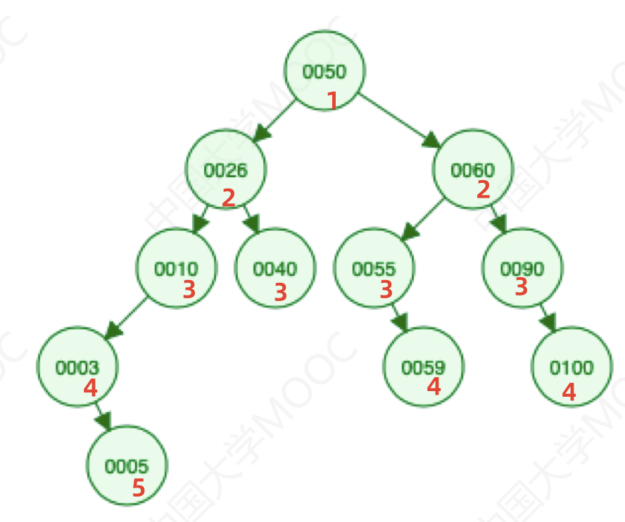
>   
> </div>
>
> 
>
> 答：
>
> $ASL_{成功}=\frac{1}{11}(1*1+2*2+4*3+3*4+1*5)=\frac{34}{11}$
>
> $ASL_{失败}=\frac{1}{12}[5*(4-1)+5*(5-1)+2*(6-1)]=\frac{45}{12}$

### 并查集

存储结构：树的双亲表示法

#### Find()时间复杂度

|            | 无优化 | Union优化                                  | 压缩路径                                                   |
| ---------- | ------ | ------------------------------------------ | ---------------------------------------------------------- |
| **复杂度** | $O(n)$ | $O(\log_2n)$                               | $O(\alpha(n))$                                             |
| **原理**   |        | 在合并的时候总是将较矮的树合并到较高的树下 | 查找的时候先找到根，然后再将查找路径上的所有结点都挂到根上 |


## 图

#### 易混概念

**概念：连通（无向图）**

- 连通：两个顶点之间有路径存在，则称这两个顶点连通
- 连通图：G中任意两个顶点都是连通的
- 无向图中的**极大连通子图**

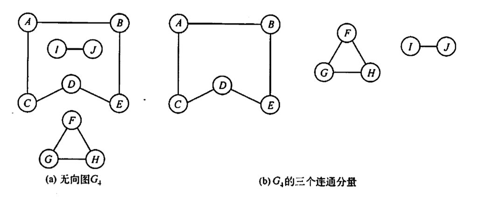

**概念：强连通（有向图）**

- 强连通：两个顶点之间，**双向连通**
- 强连通图：有向图中任意两个顶点之间**强连通**

**概念：路径**

- 路径：两个顶点之间所经过路线构成的**顶点序列（包含头尾顶点）**
- 路径长度：路径上**边的数目**
- 简单路径：顶点**不重复出现**的路径


#### 图的存储

$无向图邻接矩阵A^m中，第i行j列元素的含义：从顶点i到j，长度为m的路径条数。$

**邻接矩阵**

- 邻接矩阵的表示方法唯一
- 在绘制邻接矩阵的时候，注意顶点本身-本身的点数值是0而不是∞
- 确定两个顶点**是否相连**很容易，但确定边的**总数**需要完整遍历
- $空间复杂度:O(|V|^2)$

**邻接表**

- 判断边的**总数**很容易，但很难确定**两点之间是否相连**

- $空间复杂度$

  $无向图：O(V+2E)$

  $有向图：O(V+E)$

**十字链表**

**邻界多重表**

（十有邻无）

#### 图的遍历

**BFS**

$空间复杂：O(V)$ 需要一个辅助队列，大小与v个数有关

$时间复杂：矩阵O(V^2)，表O(V+E)$

**DFS**

$空间复杂：O(V)$ 空间开销主要来自函数调用栈，递归深度为V

$时间复杂：矩阵O(V^2)，表O(V+E)$

#### 图的应用

**最小生成树**

- 只有**连通图**才能生成最小生成树，非连通图只有最小生成**森林**

| （时间复杂度） | Prim     | Kruskal                                               |
| -------------- | -------- | ----------------------------------------------------- |
| 邻接矩阵       | $O(V^2)$ |                                                       |
| 邻接表         | $O(V+E)$ |                                                       |
| 堆             |          | $O(ElogE)\\扫描E轮,O(E)，每轮使用并查集判断，O(LogE)$ |

**最短路径**

|            | Dijkstra | Floyd    | BFS              |
| ---------- | -------- | -------- | ---------------- |
| 时间复杂度 | $O(V^2)$ | $O(V^3)$ | $O(V^2)或O(V+E)$ |
| 空间复杂度 |          | $O(V^2)$ | $O(V)$           |

**总结**


#### **☆求缩短整体工期的活动：**

- 首先求出工程中的所有关键路径
- 然后看选项中哪些活动加起来能够囊括所有关键路径，即为正确选项

> $例题：$
>
> <div>
>   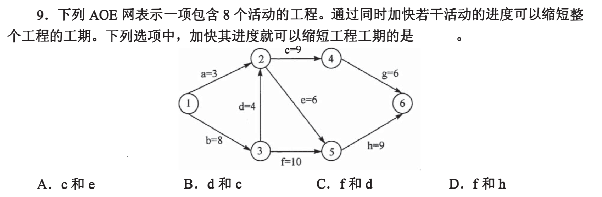
> </div>
>
> $解析：$
>
> $通过计算能够得出图中存在三条关键路径：$
>
> $(b,d,c,g)$
>
> $(b,d,e,h)$
>
> $(b,f,h)$
>
> $经过检验发现，只有C选项能够把三条路径都包括进去。$

#### ☆求关键路径：

- $先求顶点(事件)的最早发生事件ve(k)与最迟发生时间vl(k),【取大】$
- $再求边(活动)的最早开始时间e(i)与最迟开始时间l(i)【取小】$

- $计算l(i)与e(i)差额，差额为0表示关键路径$

  - $e(a_{i \to j})=ve(i)$

  - $l(a_{i \to j})=vl(j)-路径权值$

    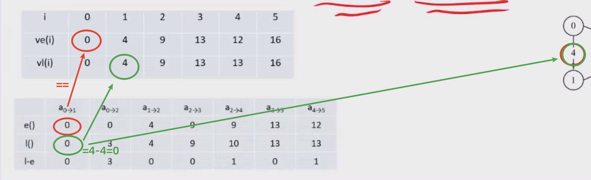

> $例题：$
>
> 
>
> $第(3)问解析：$
>
> $1、首先画出(2)的带权图$
>
> <div>
>   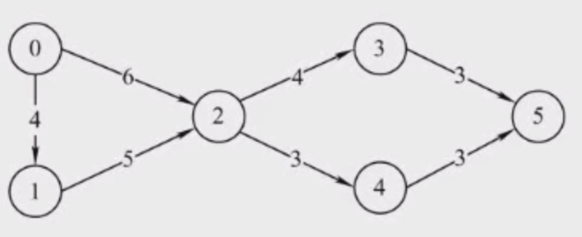
> </div>
>
> $2、计算ve()与vl()$
>
> | i     | 0    |  1   |  2   |  3   |  4   |  5   |
> | ----- | ---- | :--: | :--: | :--: | :--: | :--: |
> | ve(i) | 0    |  4   |  9   |  13  |  12  |  16  |
> | vl(i) | 0    |  4   |  9   |  13  |  13  |  16  |
>
> $3、计算e()与l()$
>
> | i    | $a_{0\to 1}$ | $a_{0\to2}$ | $a_{1\to2}$ | $a_{2\to3}$ | $a_{2\to4}$ | $a_{3\to5}$ | $a_{4\to5}$ |
> | ---- | ------------ | ----------- | ----------- | ----------- | ----------- | ----------- | ----------- |
> | e(i) | 0            | 0           | 4           | 9           | 9           | 13          | 12          |
> | l(i) | 0            | 3           | 4           | 9           | 10          | 13          | 13          |
> | l-e  | 0            | 3           | 0           | 0           | 1           | 0           | 1           |
>
> $4、l-e=0的即为关键路径$
>
> ​	$所以关键路径为：a_{0\to 1}、a_{1\to 2}、a_{2\to 3}、a_{3\to 5}$


## 查找

### 折半查找

- $二分查找 失败最多比较次数：\lfloor \log_2n\rfloor+1$
- $ASL_{成功}\approx log_2(n+1)-1$

#### **折半查找判定树的判别：**

- 做这类题的核心就是在同一棵折半判定树中，中间结点是向上取整还是向下取整是固定的，**<u>所以树中每个结点的左右孩子数量应该统一保持”左少右多“或”左多右少“</u>**，但凡这两种情况同时出现在同一棵树中，那肯定是错的。

> 【17年T8】
>
> <div>
> 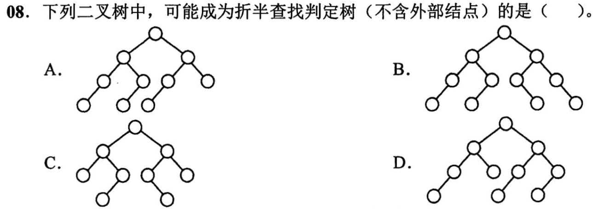
> </div>
>
>
> $解析：$
>
> <div>
> 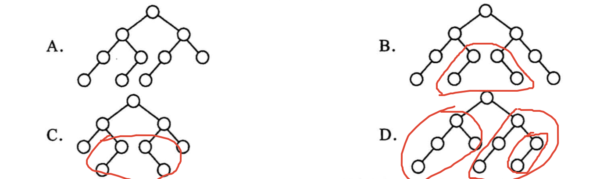
> </div>
>
>
> B、C都同时出现了<u>左1右0</u>和<u>左0右1</u>
>
> D：大圈左4右5，小圈左1右0
>
> 所以A正确


### 分块查找

- 块内无序，块间有序
- 索引表中存放的是：每个分块中**最大**的关键字，和查找区间

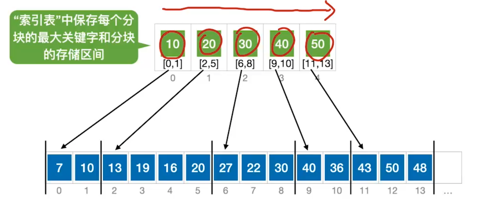

#### **查找策略：**

索引表可顺序，可折半

块内只能顺序

> 注意：索引表采用折半时，最终会在**low所指向**的位置进行查找。
>
> 还有一种情况是low下标越界，也说明查找失败

#### **怎样分块效率最高？**

> $将n个元素分为 \sqrt{n}块，每块对应\sqrt{n}个元素$
>
> $此时的ASL_{最小}=\sqrt{n}+1$


### 散列查找（Hash）

#### **基本概念：**

- **冲突：**散列函数将两个或两个以上**不同的关键字**映射到**同一地址**，这种情况称为“冲突”

- **同义词：**发生“冲突”的不同关键字

- **聚集：**

- - **同义词冲突≠聚集！！！**

  - 聚集指的是在**”线性探测法”**中，大量的元素**都探测到了相邻或相同的散列地址**，从而出现**地址争夺**的现象

    $讲人话就是，你要往一个空位上放东西，但是空位满了，于是你向下找一个位置。$

    $结果又满了，于是不停地向下找，这个不停多次向下找的过程，称为'聚集'$

- > 易错题：
  >
  > $拉链法会导致严重的'聚集'\ \ （\times ）$
  >
  > 解答：
  >
  > 拉链法从图片看上去虽然是把一堆同义词都堆在了一个地方，但是这个**堆放的过程**，都是一次性完成的，**<u>并没有出现重复向下查找</u>**的现象，所以并不是**“聚集”**


## 排序

### 选择排序

#### 堆排序

**建堆（“调整”操作）：**从最后一个非叶结点开始检查，将所有不满足条件的

**插入：**统一插入到堆底尾部（从存储结构看也就是列表末尾），然后执行一次“调整”操作。

**删除：**删除后，用堆底元素代替被删除的元素，然后逐一比较“下坠”。

### 比较排序

- $对任意n个关键字进行基于比较的排序，至少需要进行\lceil \log_{2}(n!) \rceil 次两两比较$
- $希尔排序内排：直接插入$


### 外部排序

- $h(树高)-1=\lceil \log _k r \rceil=归并的趟数S\ (r个初始段，k路归并)$

#### 最佳归并树

- **多叉哈夫曼树“虚段”数量推导：**

  $由于k路归并树一定是一棵严格k叉树，所以可以得出两个性质：$

  $n=n_0+n_k(整棵树中只有叶子结点和满孩子结点)$

  $n=kn_k+1(同二叉树性质)$

  $=>\ n_0=n-n_k=(k-1)n_k+1$

  $=>\ n_k=\frac{n_0-1}{n_k-1} (n_0即为待排序元素数量)$
  
- **如何判断是否需要添加虚段？**

  $计算(n_0-1)\%(k-1)$

  - $=0则表示无需添加$
  - $=u则表示需添加k-u-1个虚段$

### 排序总结：

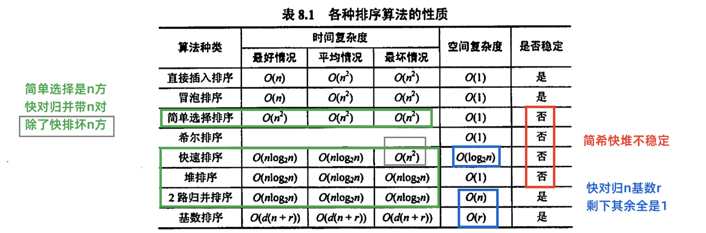

> - 简单选择是n方
> - 快堆归并nlog
> - 除了快排坏n方
>
> - 快对归n基数r
> - 剩下其余全是1
> - 简希块堆不稳定
> - 【选堆归基时无关】
>
> $注：基数排序中，d表示关键字位数，r表示每个关键字可能出现的情况，n表示关键字总数$

**选择排序时应该考虑的因素：**

> - 数据初始状态
> - 数据规模
> - 稳定性
> - 数据存储结构
> - 时空效率

### 排序分类☆

**根据元素最终位置分类:**

> - 最终有序：选择、冒泡、堆
> - 局部有序：直接插入
> - 枢轴最终：快排

**根据初始状态分类:**

> - **时间复杂度** 与 初始状态**无关**：选择、堆、归并、基数
> - **比较次数** 与 初始状态**无关**：选择、基数
> - **移动次数** 与 初始状态**无关**：归并、基数
> - **总趟数** 与 初始状态**有关**：快排、冒泡h


# DS算法复习

## 数组类算法

### 数组常用操作

#### 数组翻转

```c
//翻转数组A中下标[L,R]区间内的元素
void Reverse(int A[], int L, int R) {
    int m = (L + R) / 2;           			//将数组从中间分开
    int t;                          		//交换元素用的临时变量
    for (int i = 0; i <= m - L; ++i) {  //从头到尾逐一交换元素
        t = A[L + i];
        A[L + i] = A[R - i];
        A[R - i] = t;
    }
}
```

#### 删除数组中值为x的所有元素

```c
/*
算法思想：用k记录=x的元素个数，边扫描边统计k，并将不等于x的元素前移k个位置
*/
//删除数组中值为x的元素,n为表长
void DeleteX(int A[], int x, int n) {
    int k = 0;     //k用于统计值=x的元素数量
    for (int i = 0; i < n; ++i) {
        if (A[i] == x) k++;
        else A[i - k] = A[i];
    }
}
```


## 链表类算法

### 基础操作

#### 链表遍历

```c
void visitLink(Link S) {
    Link p = S;
    while (p) {
        printf("%d ", p->data);
        p = p->next;
    }
    printf("\n");
}
```

#### 原地逆置链表（头插法）

```c
void ZeroReverse(LNode *L) {
    LNode *p = L, *q = L->next, *r;
    //p指向逆置首元素
    //q作为摘取遍历指针
    //r暂存
    p->next = NULL;
    while (q) {
        r = q->next;
        q->next = p->next;
        p->next = q;
        q = r;			//向后继续移动指针
    }
}
```

#### 合并两个有序链表（尾插）

```c++
void MergeList(List &A, List &B) {
    List r = A; //取A的头结点作为最终结果的链头,r为尾插法辅助结点
    List a = A->next, b = B->next; //a,b分别指向AB的首元素
    while (a && b) {   //每次摘取a、b中值更小的结点链接到r之后
        if (a->data <= b->data) {
            r->next = a;
            r = a;
            a = a->next;
        } else {
            r->next = b;
            r = b;
            b = b->next;
        }
    }
    if (a) r->next = a; //链接剩余结点
    if (b) r->next = b;
    free(B);            //释放B的头结点
}
```


## 栈

### 顺序栈

#### 定义

```c
typedef struct SqStack {   
    int data[MAXSIZE];
    int top;
} SqStack;
//top指向下一个待存放元素
```

#### 初始化

```c++
void InitStack(&SqStack S) {
    S.top = 0;
    for (int i = 0; i < MAXSIZE; ++i) S.data[i] = 0;
}
```

#### 入栈

```c++
void Push(SqStack &S, int e) {
    if (S.top == MAXSIZE) return;   //栈满
    S.data[S.top++] = e;
}
```

#### 出栈

```c++
void Pop(SqStack &S, int &e) {
    if (S.top == 0) return;   //栈空
    e = S.data[--S.top];
}
```

### 链栈（无头结点）

#### 定义

```c
typedef struct StackNode {
    int data;
    struct StackNode *next;
}StackNode, *LStack;
```

#### 初始化

```c
void InitLinkStack(LStack &S) {
    S = NULL;
}
```

#### 入栈

```c
void PushL(LStack &S, int e) {
    LStack s = (LStack) malloc(sizeof(StackNode));
    s->data = e;
    s->next = S;
    S = s;    //头插
}
```

#### 出栈

```c
void PopL(LStack &S, int &e) {
    if (!S) return;     //栈空
    LStack p = S->next;
    e = S->data;
    free(S);
    S = p;
}
```


##  树

#### 二叉链表定义

```c
typedef struct BTNode {
    int data;
    struct BTNode *lchild, *rchild;
} BTNode;
```

#### 双亲表示法

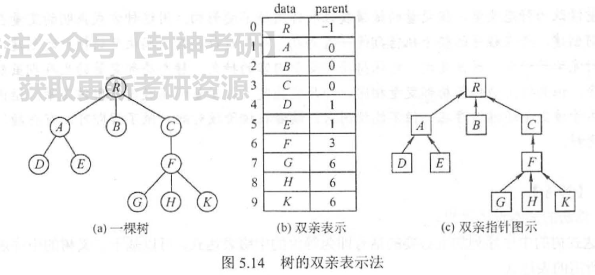

```c
#define MAX_SIZE 100
typedef struct PTNode {
    int parent;
    int data;
} PTNode;
typedef struct {
    PTNode nodes[MAX_SIZE];
    int n;          //结点数量
} PTree;
```

#### 孩子表示法

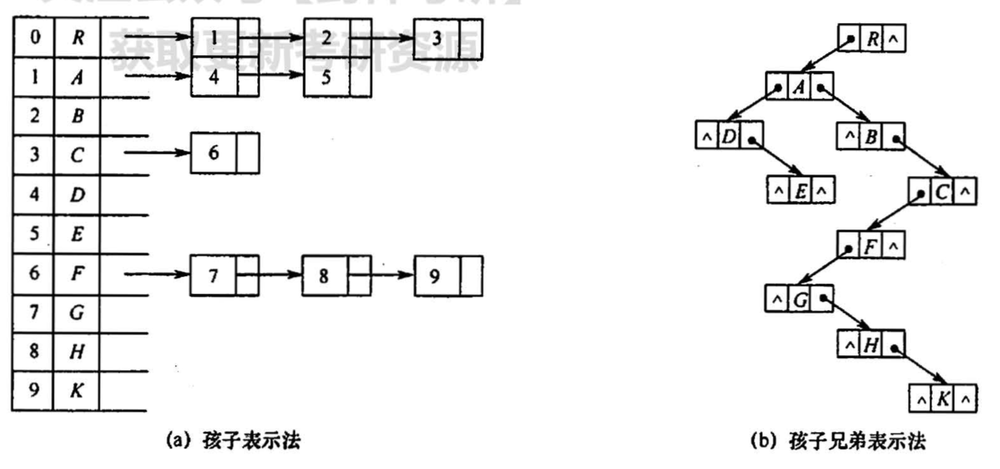

```c
#define MAX_SIZE 100
typedef struct CHNode {
    int index;      //该结点的数组下标
    struct CHNode *next;
} CHNode;
typedef struct TreeNode{
  	char data;			//结点内容
  	CHNode *firstchild;	//指向第一个孩子
}TreeNode;
typedef struct {
    TreeNode child[MAX_SIZE];
    int n;          //结点数
} CHTree;
```


#### 孩子兄弟表示法

```c
typedef struct CSNode {
    int data;
    struct CSNode *firstchild, *nextbro;
} CSNode;
```


## 图

#### 数据结构定义：邻接矩阵

```c
#define MaxVertexNum 100    //最大顶点数
typedef int VertexType;    //顶点内容的类型
typedef int EdgeType;       //边的权值类型
typedef struct{
    VertexType Vex[MaxVertexNum];   //顶点表
    EdgeType  Edge[MaxVertexNum][MaxVertexNum]; //邻接矩阵
    int vexnum, arcnum;             //定点数，弧数
}MGraph;

```

#### 数据结构定义：邻接表

```c
#define MaxVertexNum 100    //最大顶点数
typedef int VertexType;    //顶点内容的类型
typedef int EdgeType;       //边的权值类型
typedef struct ArcNode {     //边表结点
    VertexType data;        //顶点信息
    ArcNode *next;
} ArcNode;
typedef struct VNode {      //顶点表结点
    VertexType data;     //顶点信息
    ArcNode *first;      //该顶点指向的后一个结点
} VNode;
typedef struct {
    VNode ver[MaxVertexNum];    //邻接表
    int vexnum, arcnum;          //顶点数与弧数
};

```


## 查找
#### 二分查找

```c++
int BSearch(int A[], int L, int R, int e) {
    //折半查找：A用于存放数据，e为要查找的元素 LR为边界
    int m;                              //m用于存放折半位置的元素
    while (L <= R) {
        m = (L + R) / 2;                //计算折半值，向下取整
        if (A[m] < e) L = m + 1;        //继续查找右半部分
        else if (A[m] > e) R = m - 1;   //继续查找左半部分
        else return m;                  //找到则直接输出所在位置
    }
    return -1;                          //查找失败返回-1
}
```

#### 拓扑排序：文字描述

1. 从AVO网中选择一个入度为0的顶点
2. 删除**该顶点**和所有**以该顶点为起点**的有向边
3. 重复①和②直至AVO网为空，或AVO中不存在入度为0的点


## 排序

### 模板整理

#### 快排

```c++
//单函数快排
void Qsort(int A[], int L, int R) {    //快速排序，数组A保存数据，LR为边界
    if (L >= R) return;                //当前区间个数<=1则退出
    int pivot = A[L], i = L, j = R;
    //pivot为枢轴元素，i，j为数组下标
    while (i < j) {                       //以枢轴元素作为基准值划分区间
        while (i < j && A[j] >= pivot) j--;
        A[i] = A[j];
        while (i < j && A[i] <= pivot) i++;
        A[j] = A[i];
    }
    A[j] = pivot;           //将枢轴元素存入正确位置
    Qsort(A, L, i);         //递归处理左区间
    Qsort(A, i + 1, R);     //递归处理右区间
}
```
#### 归并排序

```c
void Merg(int A[], int B[], int L, int M, int R) {
    //归并子函数，A存放数组，B为辅助数组，M为中间位置，LR为边界
    int i, j, k;
    //i、j数组指针分别指向B的左半边和右半边，k指向B数组起始位置
    for (k = L; k <= R; ++k)      //将所有元素移到B数组中
        B[k] = A[k];
    for (i = L, j = M + 1, k = i; i <= M && j <= R; ++k) {
        //比较左半边和右半边，取较小的元素存回A
        if (B[i] <= B[j]) A[k] = B[i++];
        else A[k] = B[j++];
    }
    while (i <= M) A[k++] = B[i++];         //将剩余元素移回A[]
    while (k <= R) A[k++] = B[j++];

}

void MergSort(int A[], int B[], int L, int R) {
    //归并排序主函数，A存放数据，B为辅助数组，LR为边界
    if (L < R) {
        int m = (L + R) / 2;            //从中间划分子序列
        MergSort(A, B, L, m);           //递归归并左半边
        MergSort(A, B, m + 1, R);     //递归归并右半边
        Merg(A, B, L, m, R);            //归并为完整序列
    }
}
```


# 408专有名词解释


## CO

**机器字长：**

> 一台计算机所能够**同时处理**的二进制数据的**位数**

**基准程序：**

> 专门用户评估性能的一组程序

**系列机：**

> 具有基本相同体系结构、相同基本指令系统的不同型号计算机所组成的一个产品系列

**阵列乘法器：**

> 纯硬件实现的乘法电路，相比于传统ALU实现方式，不需要进行多次加法和移位判断，一次运算，**一个时钟周期内**直接出结果。（阵列除法器同理）

**溢出自陷指令：**

> 该指令使得CPU自动查询PSW中符合溢出条件的标志位，当满足溢出条件时，执行自陷中断。

**地址映射表：**

> 地址映射表中存放的是标记阵列（Tag+各种位）

**存储周期：**

> 这里指一个存储体的存储周期，也成“存取周期”，即**从本次访问储体，到能够再次访问该存储体**的时间间隔

**各种寄存器：**

```c
/*
指令寄存器
多路选择器
移位寄存器：实现乘除功能
加法器
标志寄存器
符号拓展器：用于两个长度不等的机器数运算时，将较短的运算符进行补位
*/
```

**磁盘条带化：**

> 把连续的数据分割成相同大小的数据块存到阵列中的不同磁盘中（**提高读写效率，而非安全性**）

**三态门：**

> CPU内部设计中非常重要的一个**“开关”**部件，用于控制某个部件与数据通路间的**连通与断开**

**乱序发射：**

> 指的是CPU在指令流水线的**多发技术**（超标量技术）中的一种**功能**，支持该功能的CPU能够允许编译器随意调整指令顺序。

**动态调度技术：**

> 指通过**<u>乱序发射、乱序完成</u>**等技术来重新编排流水线中指令的执行顺序，从而提高流水线之间的并行程度（**多用于超标量流水线**）

**LSB和MSB 与 大小端存储：**

- LSB（最低有效字节）：表示数据中**权重最小**的字节
- MSB（最高有效字节）：表示数据中**权重最大**的字节
- 小端存储：LSB作初始地址
- 大端存储：MSB作初始地址

**地址复用技术:**

> 地址线**减半**，但是片选线会变为（行通选+列通选）
>
> 隐含条件：**DRAM默认使用**，SRAM不适用
>
> 因此DRAM采用**两次传址**

**Cache抖动**

>  Cache块频繁换入换出


## OS

**并行 & 并发**

> **并行：**一个处理器**<u>在同一时刻</u>**处理多个任务。
>
> **并发：**一个处理器**<u>在同一时间间隔内</u>**处理多个任务。

**命令接口**

> - 联机命令接口=**交互式命令接口**
> - 脱机命令接口=**批处理命令接口**

**记录成组分解技术：**

> 该种技术下单条记录**不可跨越盘块**存储。

**存取控制矩阵（Access Control Matrix）：**

> 功能和**访问控制表**（ACL，Access Control List）类似，ACL是在ACM的基础上删除了一些冗余的信息

**页面抖动/颠簸**

> 刚刚换入的页面又要换出，刚刚换出的页面又要换入（核心原因是因为内存不够）

**MBR（Master Boot Record）：**

> 主引导记录


## DS


## NC

**数据服务单元SDU：**

> 用户要传送的数据

**协议控制单元PCI：**

> 控制协议操作的信息

**协议数据单元PDU：**

> 对等层次之间传送的数据单位

**SAP（Service Access Point）:**服务访问点

**分波器&合波器：**

> WDM波分多路复用中的设备

**多路复用器：**

**NIC（Network Interface Card）：**

> 又称网络适配器 或 网络接口卡 是计算机与外界局域网通信的接口

**RTO（Retransmission Time-Out）:**  超时重传时间

**带外传送：**

> 一种数据传输方式，通常用于FTP协议控制信息的传送

**累积确认：**

> 滑动窗口协议中的一种确认方式。启用累积确认后，当收到Ack=n的确认帧时，表示对方已经正确接收**seq=n之前的所有帧**

**捎带确认：**

> 滑动窗口协议中的一种确认方式。启用捎带确认后，双方不再单独发送ACK确认帧，而是**将确认信息放在下一个要发送的帧中一并送出。**（累积确认与捎带确认并不冲突）

#### 信道类：

**信道<u>传输</u>速率：**= 信道**发送**速率

**信道<u>传播</u>速率：**= 真正在信道中传输的速度

**调制速率：**= 码元传输的速率

**理想低通信道**：

> 就是信号的所有低频分量，只要其频率不超过某个上限值，都能够不失真地通过此信道。
>
> 而频率超过该上限值的所有高频分量都不能通过该信道。**"理想低通"**$\approx$**"无噪声"**

