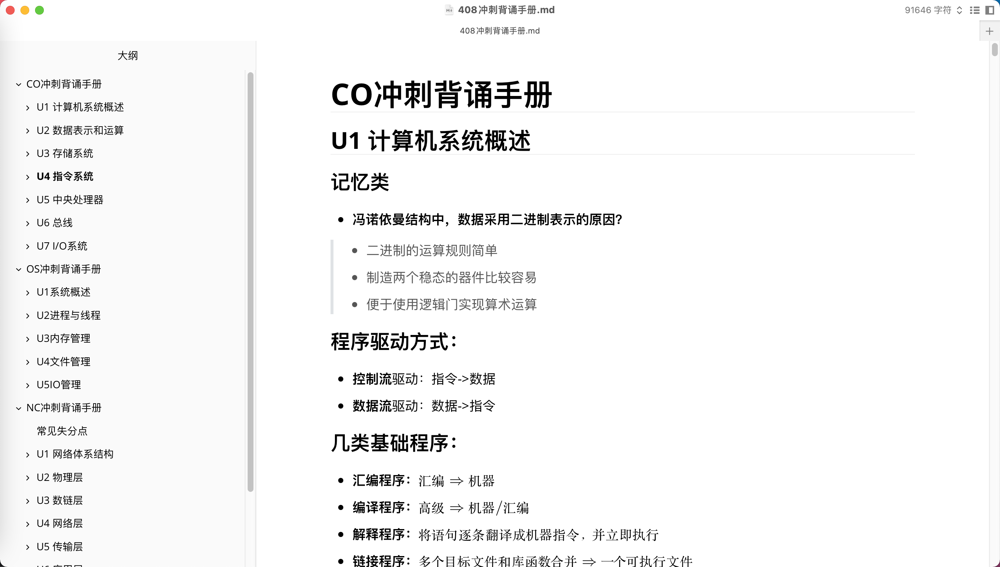
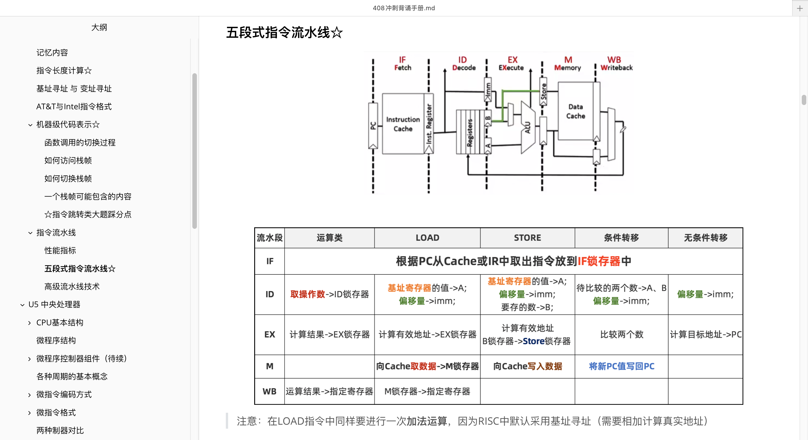
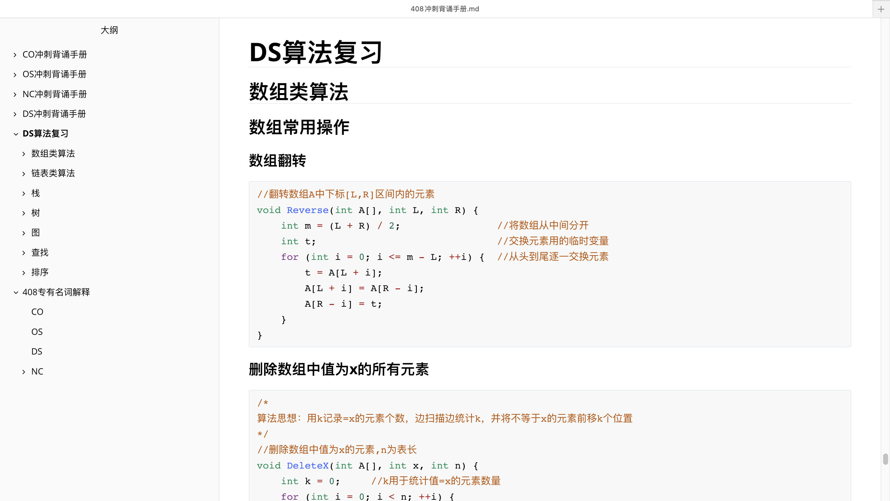

# 408-master

#### 介绍
项目名称：考研408背诵冲刺手册（408-master）

该项目为本人学习全国硕士研究生统一入学考试科目：**计算机专业基础综合（科目代码：408）**时所记录的笔记，在帮助自己复习巩固的同时，希望能够帮助到更多需要的人，同时祝大家考试顺利，一战成硕！

#### 项目结构 
```
408-master
\--- 408背诵冲刺手册.md	# 笔记主体
\--- 408背诵冲刺手册.assets	# 笔记图片文件
\--- README.md	# 介绍文档
\--- README.assets	# 介绍文档图片文件
```

#### 项目内容

408背诵冲刺手册是本人在学习时，以《王道考研复习手册》为基础，对其中的重点内容加以提炼和理解所编写而成，其中包含以下内容：

- 计算机组成原理（CO）重点知识
- 操作系统（OS）重点知识
- 数据结构（DS）重点知识
- 计算机网络（NC）重点知识
- 部分常考题型解题技巧
- 部分经典例题及解析（加以自己的理解）
- DS常考算法模板
- 408常见专有名词解释

#### 使用说明

- 将项目克隆或下载到本地后，直接使用markdown软件打开即可食用（使用Typora打开，设置主题为：Github 效果最佳）
- 笔记全程采用`Typora`书写
- 笔记图片无法显示请确保`408背诵冲刺手册.md` 与 `408背诵冲刺手册.assets`处于同一个目录中

#### 截图预览






